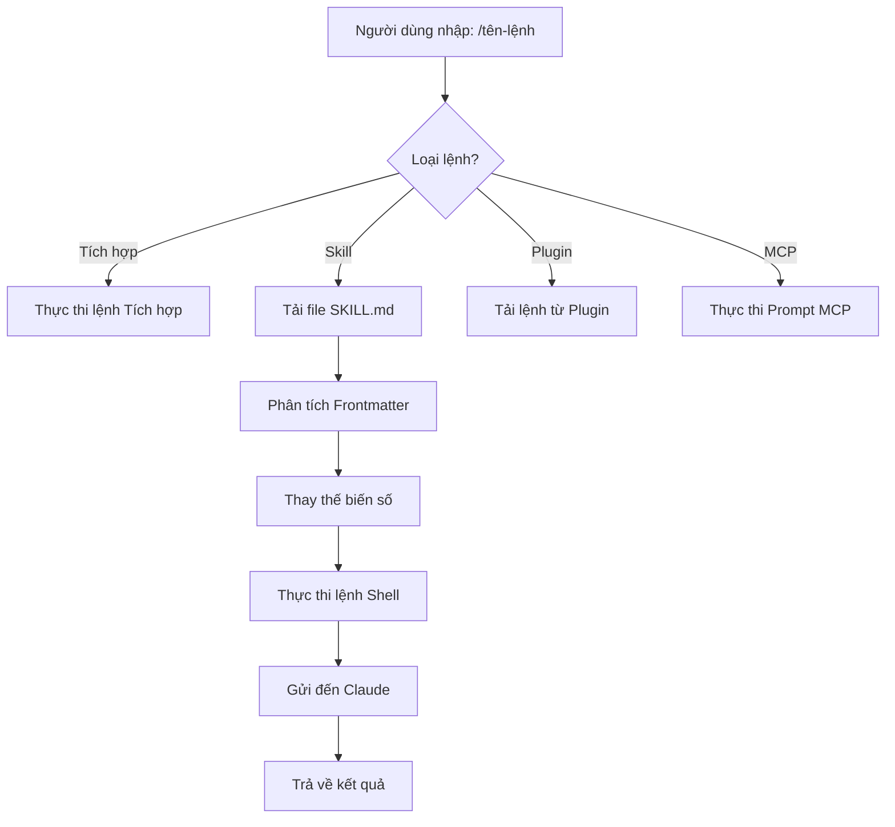
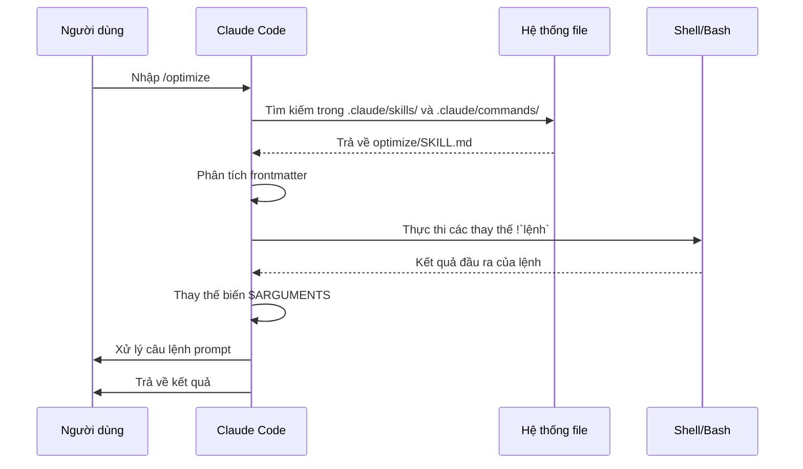

<picture>
  <source media="(prefers-color-scheme: dark)" srcset="../resources/logos/claude-howto-logo-dark.svg">
  
</picture>

# Lệnh Slash (Slash Commands)

## Tổng quan

Lệnh slash là các phím tắt điều khiển hành vi của Claude trong một phiên làm việc tương tác. Chúng bao gồm một số loại:

- **Lệnh tích hợp (Built-in)**: Do Claude Code cung cấp (`/help`, `/clear`, `/model`)
- **Skills**: Các lệnh do người dùng định nghĩa được tạo dưới dạng file `SKILL.md` (`/optimize`, `/pr`)
- **Lệnh Plugin**: Các lệnh từ các plugin đã cài đặt (`/frontend-design:frontend-design`)
- **MCP prompts**: Các lệnh từ các máy chủ MCP (`/mcp__github__list_prs`)

> **Lưu ý**: Các lệnh slash tùy chỉnh đã được gộp vào Skills. Các file trong `.claude/commands/` vẫn hoạt động, nhưng Skills (`.claude/skills/`) hiện là cách tiếp cận được khuyến nghị. Cả hai đều tạo ra các phím tắt dạng `/ten-lenh`. Xem [Hướng dẫn về Skills](../03-skills/) để biết tài liệu tham khảo đầy đủ.

## Tra cứu các lệnh tích hợp

Các lệnh tích hợp là phím tắt cho các hành động phổ biến. Hiện có **hơn 55 lệnh tích hợp** và **5 skills đi kèm** sẵn có. Nhập `/` trong Claude Code để xem danh sách đầy đủ, hoặc nhập `/` kèm theo bất kỳ chữ cái nào để lọc.

| Lệnh | Mục đích |
|---------|---------|
| `/add-dir <path>` | Thêm thư mục làm việc |
| `/agents` | Quản lý cấu hình agent |
| `/branch [name]` | Nhánh hội thoại sang một phiên mới (bí danh: `/fork`). Lưu ý: `/fork` được đổi tên thành `/branch` từ v2.1.77 |
| `/btw <question>` | Đặt câu hỏi bên lề mà không thêm vào lịch sử |
| `/chrome` | Cấu hình tích hợp trình duyệt Chrome |
| `/clear` | Xóa hội thoại (bí danh: `/reset`, `/new`) |
| `/color [color\|default]` | Đặt màu cho thanh nhập liệu (prompt bar) |
| `/compact [instructions]` | Nén hội thoại với các hướng dẫn tập trung tùy chọn |
| `/config` | Mở Cài đặt (bí danh: `/settings`) |
| `/context` | Trực quan hóa việc sử dụng ngữ cảnh dưới dạng lưới màu |
| `/copy [N]` | Sao chép phản hồi của trợ lý vào clipboard; `w` để ghi vào file |
| `/cost` | Hiển thị thống kê sử dụng token |
| `/desktop` | Tiếp tục trong ứng dụng Desktop (bí danh: `/app`) |
| `/diff` | Trình xem diff tương tác cho các thay đổi chưa commit |
| `/doctor` | Chẩn đoán sức khỏe bản cài đặt |
| `/effort [low\|medium\|high\|max\|auto]` | Thiết lập mức độ nỗ lực (effort). `max` yêu cầu Opus 4.6 |
| `/exit` | Thoát khỏi REPL (bí danh: `/quit`) |
| `/export [filename]` | Xuất hội thoại hiện tại ra file hoặc clipboard |
| `/extra-usage` | Cấu hình mức sử dụng thêm khi gặp giới hạn tốc độ (rate limits) |
| `/fast [on\|off]` | Bật/tắt chế độ nhanh (fast mode) |
| `/feedback` | Gửi phản hồi (bí danh: `/bug`) |
| `/help` | Hiển thị trợ giúp |
| `/hooks` | Xem cấu hình các hook |
| `/ide` | Quản lý tích hợp IDE |
| `/init` | Khởi tạo `CLAUDE.md`. Đặt `CLAUDE_CODE_NEW_INIT=true` cho luồng tương tác |
| `/insights` | Tạo báo cáo phân tích phiên làm việc |
| `/install-github-app` | Thiết lập ứng dụng GitHub Actions |
| `/install-slack-app` | Cài đặt ứng dụng Slack |
| `/keybindings` | Mở cấu hình phím tắt |
| `/login` | Chuyển đổi tài khoản Anthropic |
| `/logout` | Đăng xuất khỏi tài khoản Anthropic |
| `/mcp` | Quản lý các server MCP và OAuth |
| `/memory` | Sửa `CLAUDE.md`, bật/tắt tự động ghi nhớ (auto-memory) |
| `/mobile` | Mã QR cho ứng dụng di động (bí danh: `/ios`, `/android`) |
| `/model [model]` | Chọn model (dùng mũi tên trái/phải để chọn nỗ lực) |
| `/passes` | Chia sẻ tuần sử dụng miễn phí Claude Code |
| `/permissions` | Xem/cập nhật quyền hạn (bí danh: `/allowed-tools`) |
| `/plan [description]` | Vào chế độ lập kế hoạch (plan mode) |
| `/plugin` | Quản lý các plugin |
| `/pr-comments [PR]` | Lấy các bình luận PR từ GitHub |
| `/privacy-settings` | Cài đặt quyền riêng tư (chỉ dành cho Pro/Max) |
| `/release-notes` | Xem nhật ký thay đổi (changelog) |
| `/reload-plugins` | Tải lại các plugin đang hoạt động |
| `/remote-control` | Điều khiển từ xa từ claude.ai (bí danh: `/rc`) |
| `/remote-env` | Cấu hình môi trường từ xa mặc định |
| `/rename [name]` | Đổi tên phiên làm việc |
| `/resume [session]` | Tiếp tục hội thoại (bí danh: `/continue`) |
| `/review` | **Hết hạn (Deprecated)** — hãy cài đặt plugin `code-review` thay thế |
| `/rewind` | Quay lại hội thoại và/hoặc mã nguồn (bí danh: `/checkpoint`) |
| `/sandbox` | Bật/tắt chế độ sandbox |
| `/schedule [description]` | Tạo/quản lý các tác vụ định kỳ |
| `/security-review` | Phân tích nhánh để tìm lỗ hổng bảo mật |
| `/skills` | Liệt kê các skills hiện có |
| `/stats` | Trực quan hóa mức sử dụng hàng ngày, các phiên, chuỗi ngày (streaks) |
| `/status` | Hiển thị phiên bản, model, tài khoản |
| `/statusline` | Cấu hình dòng trạng thái (status line) |
| `/tasks` | Liệt kê/quản lý các tác vụ nền |
| `/terminal-setup` | Cấu hình phím tắt terminal |
| `/theme` | Thay đổi chủ đề màu sắc |
| `/vim` | Bật/tắt chế độ Vim/Normal |
| `/voice` | Bật/tắt đọc chính tả bằng giọng nói (push-to-talk) |

### Các Skills đi kèm (Bundled Skills)

Các skills này đi kèm với Claude Code và được gọi như các lệnh slash:

| Skill | Mục đích |
|-------|---------|
| `/batch <instruction>` | Điều phối các thay đổi song song quy mô lớn bằng worktrees |
| `/claude-api` | Tải tài liệu tham khảo Claude API cho ngôn ngữ dự án |
| `/debug [description]` | Bật ghi nhật ký gỡ lỗi (debug logging) |
| `/loop [interval] <prompt>` | Chạy câu lệnh lặp lại theo khoảng thời gian |
| `/simplify [focus]` | Rà soát các file đã ## Lệnh tùy chỉnh (Hiện là Skills)

Các lệnh slash tùy chỉnh hiện đã được **gộp vào skills**. Cả hai cách tiếp cận đều tạo ra các lệnh mà bạn có thể gọi bằng `/ten-lenh`:

| Cách tiếp cận | Vị trí | Trạng thái |
|----------|----------|--------|
| **Skills (Khuyên dùng)** | `.claude/skills/<tên>/SKILL.md` | Tiêu chuẩn hiện tại |
| **Lệnh cũ (Legacy)** | `.claude/commands/<tên>.md` | Vẫn hoạt động |

Nếu một skill và một lệnh cũ có cùng tên, **skill sẽ được ưu tiên**. Ví dụ, khi cả `.claude/commands/review.md` và `.claude/skills/review/SKILL.md` đều tồn tại, phiên bản skill sẽ được sử dụng.

### Lộ trình di cư (Migration)

Các file `.claude/commands/` hiện có của bạn vẫn tiếp tục hoạt động mà không cần thay đổi. Để di cư sang skills:

**Trước đây (Lệnh):**
```
.claude/commands/optimize.md
```

**Sau này (Skill):**
```
.claude/skills/optimize/SKILL.md
```

### Tại sao lại là Skills?

Skills cung cấp các tính năng bổ sung so với các lệnh cũ:

- **Cấu trúc thư mục**: Đóng gói các script, template và file tham chiếu
- **Tự động kích hoạt (Auto-invocation)**: Claude có thể tự động kích hoạt skills khi thấy phù hợp
- **Kiểm soát việc gọi lệnh**: Chọn xem người dùng, Claude hay cả hai có thể gọi lệnh
- **Thực thi Subagent**: Chạy skills trong các ngữ cảnh cô lập với `context: fork`
- **Tiết lộ dần dần**: Chỉ tải thêm các file khi cần thiết

### Tạo một lệnh tùy chỉnh dưới dạng Skill

Tạo một thư mục với file `SKILL.md`:

```bash
mkdir -p .claude/skills/my-command
```

**File:** `.claude/skills/my-command/SKILL.md`

```yaml
---
name: my-command
description: Lệnh này làm gì và khi nào nên sử dụng nó
---

# Lệnh của tôi (My Command)

Các hướng dẫn để Claude làm theo khi lệnh này được gọi.

1. Bước đầu tiên
2. Bước thứ hai
3. Bước thứ ba
```

### Tham chiếu Frontmatter

| Trường | Mục đích | Mặc định |
|-------|---------|---------|
| `name` | Tên lệnh (trở thành `/tên`) | Tên thư mục |
| `description` | Mô tả ngắn gọn (giúp Claude biết khi nào nên dùng) | Đoạn văn đầu tiên |
| `argument-hint` | Gợi ý tham số mong đợi để tự động hoàn thành | Không có |
| `allowed-tools` | Các công cụ lệnh có thể dùng mà không cần hỏi quyền | Kế thừa |
| `model` | Model cụ thể để sử dụng | Kế thừa |
| `disable-model-invocation` | Nếu `true`, chỉ người dùng mới có thể gọi (Claude không tự gọi) | `false` |
| `user-invocable` | Nếu `false`, ẩn khỏi menu `/` | `true` |
| `context` | Đặt thành `fork` để chạy trong subagent cô lập | Không có |
| `agent` | Loại agent khi sử dụng `context: fork` | `general-purpose` |
| `hooks` | Các hook trong phạm vi skill (PreToolUse, PostToolUse, Stop) | Không có |

### Tham số (Arguments)

Các lệnh có thể nhận tham số:

**Tất cả tham số với `$ARGUMENTS`:**

```yaml
---
name: fix-issue
description: Sửa một lỗi GitHub theo số hiệu
---

Sửa lỗi #$ARGUMENTS tuân theo các tiêu chuẩn lập trình của chúng ta
```

Cách dùng: `/fix-issue 123` → `$ARGUMENTS` trở thành "123"

**Các tham số riêng lẻ với `$0`, `$1`, v.v.:**

```yaml
---
name: review-pr
description: Review một PR với độ ưu tiên
---

Review PR #$0 với độ ưu tiên $1
```

Cách dùng: `/review-pr 456 high` → `$0`="456", `$1`="high"

### Ngữ cảnh động với lệnh Shell

Thực thi các lệnh bash trước khi đưa ra câu lệnh bằng cách sử dụng `!`lệnh``:

```yaml
---
name: commit
description: Tạo một git commit với ngữ cảnh
allowed-tools: Bash(git *)
---

## Ngữ cảnh (Context)

- Trạng thái git hiện tại: !`git status`
- Diff git hiện tại: !`git diff HEAD`
- Nhánh hiện tại: !`git branch --show-current`
- Các commit gần đây: !`git log --oneline -5`

## Nhiệm vụ của bạn

Dựa trên các thay đổi ở trên, hãy tạo một git commit duy nhất.
```

### Tham chiếu file

Bao gồm nội dung file bằng cách sử dụng `@`:

```markdown
Review việc triển khai trong @src/utils/helpers.js
So sánh @src/old-version.js với @src/new-version.js
```

## Lệnh Plugin

Các plugin có thể cung cấp các lệnh tùy chỉnh:

```
/tên-plugin:tên-lệnh
```

Hoặc đơn giản là `/tên-lệnh` khi không có xung đột tên gọi.

**Ví dụ:**
```bash
/frontend-design:frontend-design
/commit-commands:commit
```

## Prompt MCP dưới dạng lệnh

Các server MCP có thể để lộ các prompt dưới dạng lệnh slash:

```
/mcp__<tên-server>__<tên-prompt> [tham số]
```

**Ví dụ:**
```bash
/mcp__github__list_prs
/mcp__github__pr_review 456
/mcp__jira__create_issue "Tiêu đề lỗi" high
```

### Cú pháp quyền hạn MCP

Kiểm soát quyền truy cập server MCP trong phần quyền hạn (permissions):

- `mcp__github` - Truy cập toàn bộ server GitHub MCP
- `mcp__github__*` - Truy cập đại diện (wildcard) cho tất cả công cụ
- `mcp__github__get_issue` - Truy cập công cụ cụ thể

## Kiến trúc lệnh (Command Architecture)



## Vòng đời lệnh (Command Lifecycle)



## Các lệnh có sẵn trong thư mục này

Các lệnh ví dụ này có thể được cài đặt dưới dạng skills hoặc các lệnh cũ (legacy).

### 1. `/optimize` - Tối ưu hóa mã nguồn

Phân tích mã nguồn để tìm các vấn đề về hiệu năng, rò rỉ bộ nhớ và các cơ hội tối ưu hóa.

**Cách dùng:**
```
/optimize
[Dán mã của bạn vào đây]
```

### 2. `/pr` - Chuẩn bị Pull Request

Hướng dẫn thực hiện danh sách kiểm tra chuẩn bị PR bao gồm linting, testing và định dạng commit.

**Cách dùng:**
```
/pr
```

**Ảnh chụp màn hình:**


### 3. `/generate-api-docs` - Trình tạo tài liệu API

Tạo tài liệu API toàn diện từ mã nguồn.

**Cách dùng:**
```
/generate-api-docs
```

### 4. `/commit` - Git Commit với ngữ cảnh

Tạo một git commit với ngữ cảnh động từ kho lưu trữ của bạn.

**Cách dùng:**
```
/commit [thông điệp tùy chọn]
```

### 5. `/push-all` - Stage, Commit và Push

Stage tất cả các thay đổi, tạo commit và push lên remote với các bước kiểm tra an toàn.

**Cách dùng:**
```
/push-all
```

**Kiểm tra an toàn:**
- Bí mật (Secrets): `.env*`, `*.key`, `*.pem`, `credentials.json`
- API Keys: Phát hiện key thật so với placeholder
- File lớn: `>10MB` mà không dùng Git LFS
- Sản phẩm build: `node_modules/`, `dist/`, `__pycache__/`

### 6. `/doc-refactor` - Tái cấu trúc tài liệu

Tái cấu trúc tài liệu dự án để đảm bảo sự rõ ràng và dễ tiếp cận.

**Cách dùng:**
```
/doc-refactor
```

### 7. `/setup-ci-cd` - Thiết lập Pipeline CI/CD

Triển khai các pre-commit hooks và GitHub Actions để đảm bảo chất lượng.

**Cách dùng:**
```
/setup-ci-cd
```

### 8. `/unit-test-expand` - Mở rộng độ bao phủ kiểm thử

Tăng độ bao phủ kiểm thử (test coverage) bằng cách nhắm vào các nhánh chưa được kiểm thử và các trường hợp biên (edge cases).

**Cách dùng:**
```
/unit-test-expand
```

## Cài đặt

### Dưới dạng Skills (Khuyên dùng)

Sao chép vào thư mục skills của bạn:

```bash
# Tạo thư mục skills
mkdir -p .claude/skills

# Đối với mỗi file lệnh, tạo một thư mục skill tương ứng
for cmd in optimize pr commit; do
  mkdir -p .claude/skills/$cmd
  cp 01-slash-commands/$cmd.md .claude/skills/$cmd/SKILL.md
done
```

### Dưới dạng lệnh cũ (Legacy Commands)

Sao chép vào thư mục commands của bạn:

```bash
# Cho toàn bộ dự án (team)
mkdir -p .claude/commands
cp 01-slash-commands/*.md .claude/commands/

# Cho sử dụng cá nhân
mkdir -p ~/.claude/commands
cp 01-slash-commands/*.md ~/.claude/commands/
```

## Tạo lệnh của riêng bạn

### Template cho Skill (Khuyên dùng)

Tạo file `.claude/skills/my-command/SKILL.md`:

```yaml
---
name: my-command
description: Lệnh này làm gì. Sử dụng khi [điều kiện kích hoạt].
argument-hint: [tham-so-tuy-chon]
allowed-tools: Bash(npm *), Read, Grep
---

# Tiêu đề lệnh

## Ngữ cảnh (Context)

- Nhánh hiện tại: !`git branch --show-current`
- Các file liên quan: @package.json

## Hướng dẫn

1. Bước đầu tiên
2. Bước thứ hai với tham số: $ARGUMENTS
3. Bước thứ ba

## Định dạng đầu ra

- Cách định dạng câu trả lời
- Cần bao gồm những gì
```

### Lệnh chỉ dành cho người dùng (Không tự động kích hoạt)

Đối với các lệnh có tác dụng phụ (side effects) mà Claude không nên tự động kích hoạt:

```yaml
---
name: deploy
description: Deploy lên production
disable-model-invocation: true
allowed-tools: Bash(npm *), Bash(git *)
---

Deploy ứng dụng lên production:

1. Chạy kiểm thử (tests)
2. Build ứng dụng
3. Push lên mục tiêu deployment
4. Xác minh việc deploy
```

## Thực hành tốt nhất (Best Practices)

| Nên làm | Không nên làm |
|------|---------|
| Sử dụng tên rõ ràng, hướng hành động | Tạo lệnh cho các tác vụ chỉ dùng một lần |
| Bao gồm `description` với các điều kiện kích hoạt | Xây dựng logic phức tạp trong các lệnh |
| Giữ các lệnh tập trung vào một tác vụ duy nhất | Viết cứng (hardcode) các thông tin nhạy cảm |
| Sử dụng `disable-model-invocation` cho các tác dụng phụ | Bỏ qua trường mô tả (description) |
| Sử dụng tiền tố `!` cho ngữ cảnh động | Giả định rằng Claude biết trạng thái hiện tại |
| Tổ chức các file liên quan trong thư mục skill | Đưa tất cả mọi thứ vào một file duy nhất |

## Xử lý sự cố (Troubleshooting)

### Không tìm thấy lệnh (Command Not Found)

**Giải pháp:**
- Kiểm tra lại file có nằm trong `.claude/skills/<tên>/SKILL.md` hoặc `.claude/commands/<tên>.md` không
- Xác minh trường `name` trong frontmatter có khớp với tên lệnh mong đợi không
- Khởi động lại phiên làm việc Claude Code
- Chạy `/help` để xem danh sách các lệnh hiện có

### Lệnh không thực thi như mong đợi

**Giải pháp:**
- Thêm các hướng dẫn cụ thể hơn
- Bao gồm các ví dụ trong file skill
- Kiểm tra `allowed-tools` nếu sử dụng lệnh bash
- Kiểm tra với các đầu vào đơn giản trước

### Xung đột giữa Skill và Command

Nếu cả hai tồn tại cùng tên, **skill sẽ được ưu tiên**. Hãy xóa một cái hoặc đổi tên.

## Các hướng dẫn liên quan

- **[Skills](../03-skills/)** - Tham chiếu đầy đủ về skills (các khả năng tự kích hoạt)
- **[Memory](../02-memory/)** - Ngữ cảnh bền vững với CLAUDE.md
- **[Subagents](../04-subagents/)** - Các tác nhân AI được ủy quyền
- **[Plugins](../07-plugins/)** - Các bộ sưu tập lệnh được đóng gói
- **[Hooks](../06-hooks/)** - Tự động hóa dựa trên sự kiện

## Tài nguyên bổ sung

- [Tài liệu chính thức về Chế độ tương tác](https://code.claude.com/docs/en/interactive-mode) - Tham chiếu các lệnh tích hợp
- [Tài liệu chính thức về Skills](https://code.claude.com/docs/en/skills) - Tham chiếu đầy đủ về skills
- [Tham chiếu CLI](https://code.claude.com/docs/en/cli-reference) - Các tùy chọn dòng lệnh

---

*Nằm trong chuỗi hướng dẫn [Claude How To](../)*
