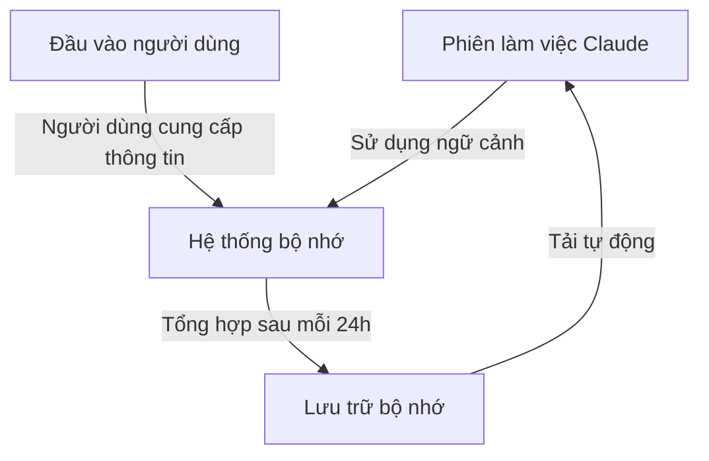
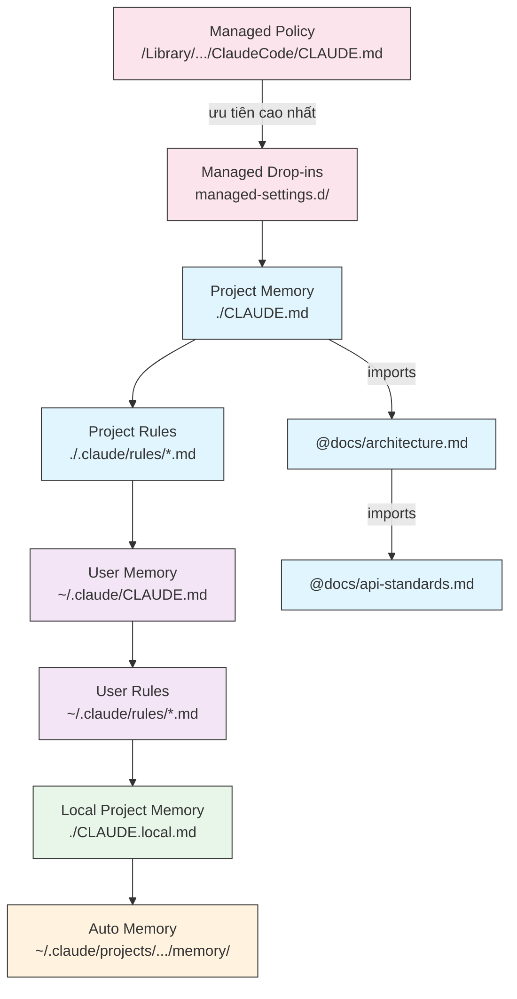
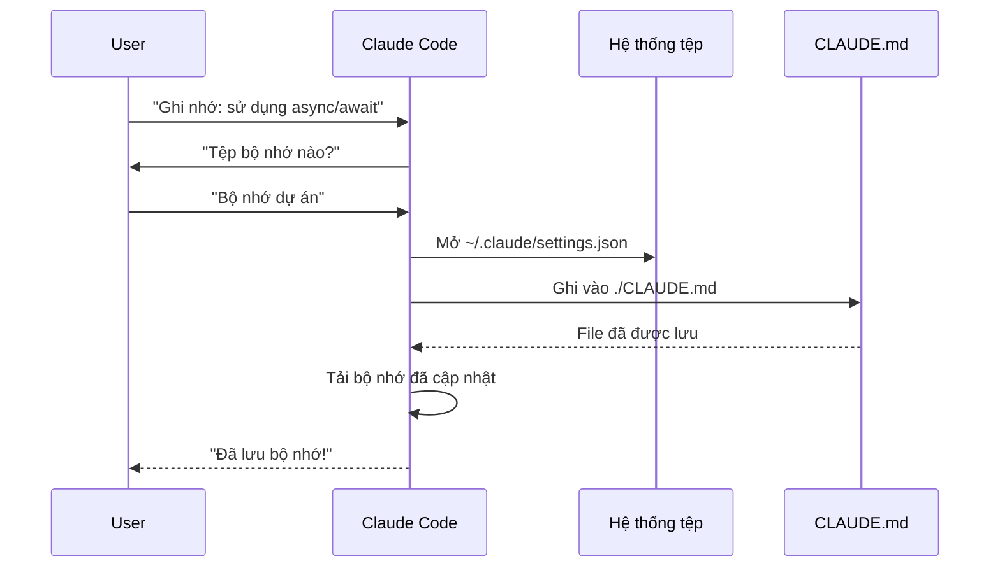
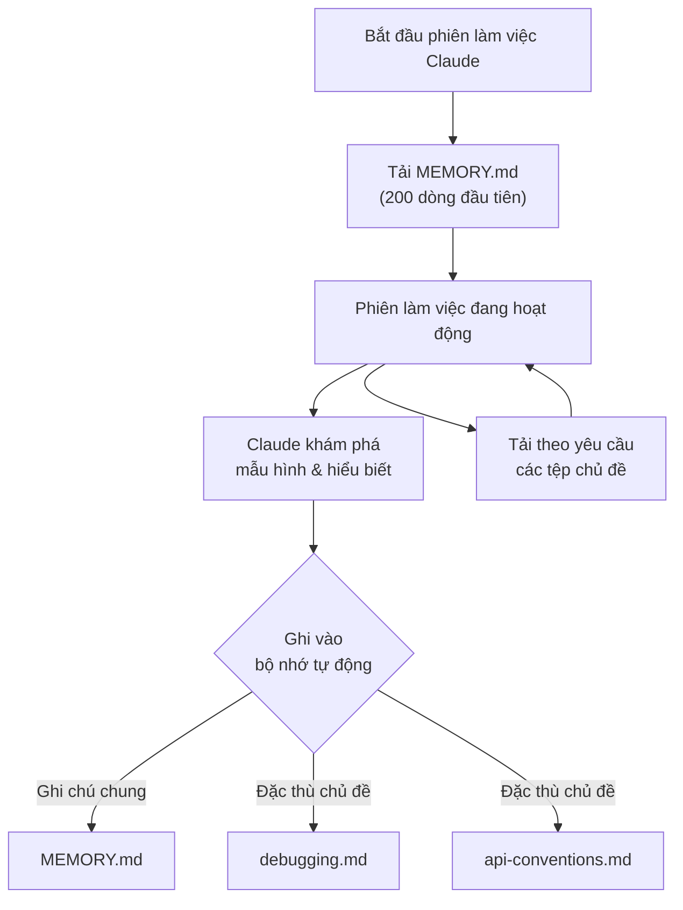

<picture>
  <source media="(prefers-color-scheme: dark)" srcset="../resources/logos/claude-howto-logo-dark.svg">
  
</picture>

# Hướng dẫn về Bộ nhớ (Memory Guide)

Bộ nhớ (Memory) cho phép Claude lưu giữ ngữ cảnh qua các phiên làm việc và các cuộc hội thoại. Nó tồn tại dưới hai dạng: tổng hợp tự động trên claude.ai và dựa trên hệ thống tệp tin (CLAUDE.md) trong Claude Code.

## Tổng quan

Bộ nhớ trong Claude Code cung cấp ngữ cảnh bền vững xuyên suốt nhiều phiên làm việc và cuộc hội thoại. Không giống như các cửa sổ ngữ cảnh tạm thời, các tệp bộ nhớ cho phép bạn:

- Chia sẻ các tiêu chuẩn dự án trong toàn đội ngũ của bạn
- Lưu trữ các sở thích phát triển cá nhân
- Duy trì các quy tắc và cấu hình đặc thù cho từng thư mục
- Nhập (Import) các tài liệu bên ngoài
- Quản lý phiên bản bộ nhớ như một phần của dự án

Hệ thống bộ nhớ hoạt động ở nhiều cấp độ, từ các tùy chọn cá nhân toàn cầu cho đến các thư mục cụ thể, cho phép kiểm soát chi tiết về những gì Claude ghi nhớ và cách nó áp dụng kiến thức đó.

## Bảng tra cứu nhanh các lệnh Bộ nhớ

| Lệnh | Mục đích | Cách dùng | Khi nào sử dụng |
|---------|---------|-------|-------------|
| `/init` | Khởi tạo bộ nhớ dự án | `/init` | Khi bắt đầu dự án mới, thiết lập CLAUDE.md lần đầu |
| `/memory` | Chỉnh sửa các tệp bộ nhớ trong trình soạn thảo | `/memory` | Khi cần cập nhật lớn, tổ chức lại, hoặc xem lại nội dung |
| Tiền tố `#` | Thêm bộ nhớ nhanh một dòng | `# Quy tắc của bạn ở đây` | Thêm các quy tắc nhanh trong lúc hội thoại |
| `# new rule into memory` | Thêm bộ nhớ rõ ràng | `# new rule into memory<br/>Quy tắc chi tiết của bạn` | Thêm các quy tắc phức tạp nhiều dòng |
| `# remember this` | Thêm bộ nhớ bằng ngôn ngữ tự nhiên | `# remember this<br/>Hướng dẫn của bạn` | Cập nhật bộ nhớ theo phong cách hội thoại |
| `@path/to/file` | Nhập nội dung bên ngoài | `@README.md` hoặc `@docs/api.md` | Tham chiếu tài liệu hiện có vào CLAUDE.md |

## Bắt đầu nhanh: Khởi tạo Bộ nhớ

### Lệnh `/init`

Lệnh `/init` là cách nhanh nhất để thiết lập bộ nhớ dự án trong Claude Code. Nó khởi tạo một tệp CLAUDE.md với các tài liệu nền tảng của dự án.

**Cách dùng:**

```bash
/init
```

**Nó làm gì:**

- Tạo một tệp CLAUDE.md mới trong dự án của bạn (thường tại `./CLAUDE.md` hoặc `./.claude/CLAUDE.md`)
- Thiết lập các quy ước và hướng dẫn của dự án
- Tạo nền tảng cho việc duy trì ngữ cảnh qua các phiên làm việc
- Cung cấp cấu trúc mẫu để tài liệu hóa các tiêu chuẩn dự án của bạn

**Chế độ tương tác nâng cao:** Thiết lập `CLAUDE_CODE_NEW_INIT=true` để bật luồng tương tác đa giai đoạn hướng dẫn bạn thiết lập dự án từng bước một:

```bash
CLAUDE_CODE_NEW_INIT=true claude
/init
```

**Khi nào nên dùng `/init`:**

- Bắt đầu một dự án mới với Claude Code
- Thiết lập các tiêu chuẩn và quy ước lập trình cho đội ngũ
- Tạo tài liệu về cấu trúc mã nguồn của bạn
- Thiết lập phân cấp bộ nhớ cho việc phát triển cộng tác

**Ví dụ quy trình:**

```markdown
# Trong thư mục dự án của bạn
/init

# Claude tạo CLAUDE.md với cấu trúc như:
# Cấu hình dự án (Project Configuration)
## Tổng quan dự án (Project Overview)
- Tên: Dự án của bạn
- Công nghệ: [Các công nghệ của bạn]
- Quy mô đội ngũ: [Số lượng lập trình viên]

## Tiêu chuẩn phát triển (Development Standards)
- Các tùy chọn phong cách lập trình
- Yêu cầu kiểm thử
- Quy ước quy trình Git
```

### Cập nhật bộ nhớ nhanh với `#`

Bạn có thể nhanh chóng thêm thông tin vào bộ nhớ trong bất kỳ cuộc hội thoại nào bằng cách bắt đầu tin nhắn với ký tự `#`:

**Cú pháp:**

```markdown
# Quy tắc hoặc hướng dẫn bộ nhớ của bạn ở đây
```

**Ví dụ:**

```markdown
# Luôn sử dụng chế độ strict mode của TypeScript trong dự án này

# Ưu tiên sử dụng async/await thay vì chuỗi promise

# Chạy npm test trước mỗi lần commit

# Sử dụng kebab-case cho tên file
```

**Cách hoạt động:**

1. Bắt đầu tin nhắn của bạn với `#` kèm theo quy tắc của bạn
2. Claude nhận diện đây là một yêu cầu cập nhật bộ nhớ
3. Claude hỏi bạn muốn cập nhật tệp bộ nhớ nào (dự án hay cá nhân)
4. Quy tắc sẽ được thêm vào tệp CLAUDE.md phù hợp
5. Các phiên làm việc trong tương lai sẽ tự động tải ngữ cảnh này

**Các mẫu thay thế:**

```markdown
# new rule into memory
Luôn xác thực đầu vào người dùng bằng Zod schemas

# remember this
Sử dụng semantic versioning cho tất cả các bản phát hành

# add to memory
Các bản di chuyển cơ sở dữ liệu (Database migrations) phải có khả năng hoàn tác (reversible)
```

### Lệnh `/memory`

Lệnh `/memory` cung cấp truy cập trực tiếp để chỉnh sửa các tệp bộ nhớ CLAUDE.md của bạn trong các phiên làm việc của Claude Code. Nó mở các tệp bộ nhớ trong trình soạn thảo hệ thống của bạn để chỉnh sửa toàn diện.

**Cách dùng:**

```bash
/memory
```

**Nó làm gì:**

- Mở các tệp bộ nhớ trong trình soạn thảo mặc định của hệ thống
- Cho phép bạn thực hiện các bổ sung, sửa đổi và tổ chức lại trên diện rộng
- Cung cấp truy cập trực tiếp vào tất cả các tệp bộ nhớ trong hệ thống phân cấp
- Cho phép bạn quản lý ngữ cảnh bền vững qua các phiên làm việc

**Khi nào nên dùng `/memory`:**

- Xem lại nội dung bộ nhớ hiện có
- Thực hiện cập nhật lớn cho các tiêu chuẩn dự án
- Tổ chức lại cấu trúc bộ nhớ
- Thêm tài liệu hoặc hướng dẫn chi tiết
- Bảo trì và cập nhật bộ nhớ khi dự án của bạn phát triển

**So sánh: `/memory` và `/init`**

| Khía cạnh | `/memory` | `/init` |
|--------|-----------|---------|
| **Mục đích** | Chỉnh sửa các tệp bộ nhớ hiện có | Khởi tạo CLAUDE.md mới |
| **Khi nào dùng** | Cập nhật/sửa đổi ngữ cảnh dự án | Bắt đầu dự án mới |
| **Hành động** | Mở trình soạn thảo để thay đổi | Tạo bản mẫu khởi đầu |
| **Quy trình** | Bảo trì liên tục | Thiết lập một lần |

**Ví dụ quy trình:**

```markdown
# Mở bộ nhớ để chỉnh sửa
/memory

# Claude hiển thị các tùy chọn:
# 1. Managed Policy Memory (Bộ nhớ chính sách quản lý)
# 2. Project Memory (./CLAUDE.md - Bộ nhớ dự án)
# 3. User Memory (~/.claude/CLAUDE.md - Bộ nhớ người dùng)
# 4. Local Project Memory (Bộ nhớ dự án cục bộ)

# Chọn tùy chọn 2 (Project Memory)
# Trình soạn thảo mặc định của bạn mở ra với nội dung của ./CLAUDE.md

# Thực hiện thay đổi, lưu và đóng trình soạn thảo
# Claude tự động tải lại bộ nhớ đã cập nhật
```

**Sử dụng Memory Imports:**

Các tệp CLAUDE.md hỗ trợ cú pháp `@path/to/file` để bao gồm nội dung bên ngoài:

```markdown
# Tài liệu dự án
Xem @README.md để biết tổng quan về dự án
Xem @package.json để biết các lệnh npm hiện có
Xem @docs/architecture.md để biết thiết kế hệ thống

# Nhập từ thư mục home bằng đường dẫn tuyệt đối
@~/.claude/my-project-instructions.md
```

**Các tính năng của Import:**

- Hỗ trợ cả đường dẫn tương đối và tuyệt đối (ví dụ: `@docs/api.md` hoặc `@~/.claude/my-project-instructions.md`)
- Hỗ trợ nhập đệ quy với độ sâu tối đa là 5
- Lần đầu nhập từ các vị trí bên ngoài sẽ kích hoạt hộp thoại phê duyệt vì lý do bảo mật
- Các chỉ thị nhập không được đánh giá bên trong các khối mã markdown (vì vậy việc ghi tài liệu về chúng trong ví dụ là an toàn)
- Giúp tránh trùng lặp bằng cách tham chiếu đến các tài liệu hiện có
- Tự động bao gồm nội dung được tham chiếu vào ngữ cảnh của Claude

## Kiến trúc Bộ nhớ

Bộ nhớ trong Claude Code tuân theo một hệ thống phân cấp nơi các phạm vi khác nhau phục vụ các mục đích khác nhau:



## Phân cấp Bộ nhớ trong Claude Code

Claude Code sử dụng hệ thống bộ nhớ phân cấp nhiều tầng. Các tệp bộ nhớ được tự động tải khi Claude Code khởi chạy, với các tệp ở cấp cao hơn sẽ có mức độ ưu tiên lớn hơn.

**Phân cấp bộ nhớ đầy đủ (theo thứ tự ưu tiên):**

1. **Managed Policy (Chính sách quản lý)** - Các hướng dẫn áp dụng trong toàn tổ chức
   - macOS: `/Library/Application Support/ClaudeCode/CLAUDE.md`
   - Linux/WSL: `/etc/claude-code/CLAUDE.md`
   - Windows: `C:\Program Files\ClaudeCode\CLAUDE.md`

2. **Managed Drop-ins** - Các tệp chính sách được hợp nhất theo thứ tự bảng chữ cái (v2.1.83+)
   - Thư mục `managed-settings.d/` nằm cạnh tệp CLAUDE.md của chính sách quản lý
   - Các tệp được hợp nhất theo thứ tự bảng chữ cái để quản lý chính sách theo module

3. **Project Memory (Bộ nhớ dự án)** - Ngữ cảnh được chia sẻ trong đội ngũ (được quản lý phiên bản)
   - `./.claude/CLAUDE.md` hoặc `./CLAUDE.md` (trong thư mục gốc của repository)

4. **Project Rules (Quy tắc dự án)** - Các hướng dẫn dự án theo module và chủ đề cụ thể
   - `./.claude/rules/*.md`

5. **User Memory (Bộ nhớ người dùng)** - Các sở thích cá nhân (áp dụng cho mọi dự án)
   - `~/.claude/CLAUDE.md`

6. **User-Level Rules (Quy tắc cấp người dùng)** - Các quy tắc cá nhân (áp dụng cho mọi dự án)
   - `~/.claude/rules/*.md`

7. **Local Project Memory (Bộ nhớ dự án cục bộ)** - Các sở thích cá nhân đặc thù cho từng dự án
   - `./CLAUDE.local.md`

> **Lưu ý**: `CLAUDE.local.md` không còn được nhắc đến trong [tài liệu chính thức](https://code.claude.com/docs/en/memory) tính đến tháng 3 năm 2026. Nó có thể vẫn hoạt động như một tính năng di sản. Đối với các dự án mới, hãy cân nhắc sử dụng `~/.claude/CLAUDE.md` (cấp người dùng) hoặc `.claude/rules/` (cấp dự án, theo phạm vi đường dẫn).

8. **Auto Memory (Bộ nhớ tự động)** - Các ghi chú và bài học tự động của Claude
   - `~/.claude/projects/<project>/memory/`

**Hành vi phát hiện Bộ nhớ:**

Claude tìm kiếm các tệp bộ nhớ theo thứ tự này, với các vị trí sớm hơn sẽ có mức độ ưu tiên lớn hơn:



## Loại trừ các tệp CLAUDE.md với `claudeMdExcludes`

Trong các monorepo lớn, một số tệp CLAUDE.md có thể không liên quan đến công việc hiện tại của bạn. Thiết lập `claudeMdExcludes` cho phép bạn bỏ qua các tệp CLAUDE.md cụ thể để chúng không được tải vào ngữ cảnh:

```jsonc
// Trong ~/.claude/settings.json hoặc .claude/settings.json
{
  "claudeMdExcludes": [
    "packages/legacy-app/CLAUDE.md",
    "vendors/**/CLAUDE.md"
  ]
}
```

Các mẫu (patterns) được khớp với các đường dẫn tương đối so với thư mục gốc của dự án. Điều này đặc biệt hữu ích cho:

- Monorepo với nhiều dự án con, nơi chỉ một số dự án là liên quan
- Các repository chứa các tệp CLAUDE.md của bên thứ ba hoặc nhà cung cấp (vendored)
- Giảm thiểu sự nhiễu trong cửa sổ ngữ cảnh của Claude bằng cách loại trừ các hướng dẫn cũ hoặc không liên quan

## Phân cấp tệp Thiết lập (Settings File Hierarchy)

Các thiết lập của Claude Code (bao gồm `autoMemoryDirectory`, `claudeMdExcludes`, và các cấu hình khác) được giải quyết từ hệ thống phân cấp năm cấp độ, với các cấp cao hơn sẽ có mức độ ưu tiên lớn hơn:

| Cấp độ | Vị trí | Phạm vi |
|-------|----------|-------|
| 1 (Cao nhất) | Managed policy (cấp hệ thống) | Áp dụng bắt buộc trong toàn tổ chức |
| 2 | `managed-settings.d/` (v2.1.83+) | Các phần bổ sung chính sách theo module, hợp nhất theo bảng chữ cái |
| 3 | `~/.claude/settings.json` | Sở thích người dùng |
| 4 | `.claude/settings.json` | Cấp dự án (được commit vào git) |
| 5 (Thấp nhất) | `.claude/settings.local.json` | Các giá trị ghi đè cục bộ (bị git bỏ qua) |

**Cấu hình đặc thù theo nền tảng (v2.1.51+):**

Các thiết lập cũng có thể được cấu hình thông qua:
- **macOS**: Các tệp Property list (plist)
- **Windows**: Windows Registry

Các cơ chế gốc của nền tảng này được đọc cùng với các tệp thiết lập JSON và tuân theo các quy tắc ưu tiên tương tự.

## Hệ thống Quy tắc theo Module (Modular Rules System)

Tạo các quy tắc có tính tổ chức và đặc thù cho từng đường dẫn bằng cách sử dụng cấu trúc thư mục `.claude/rules/`. Các quy tắc có thể được định nghĩa ở cả cấp dự án và cấp người dùng:

```
your-project/
├── .claude/
│   ├── CLAUDE.md
│   └── rules/
│       ├── code-style.md
│       ├── testing.md
│       ├── security.md
│       └── api/                  # Hỗ trợ thư mục con
│           ├── conventions.md
│           └── validation.md

~/.claude/
├── CLAUDE.md
└── rules/                        # Quy tắc cấp người dùng (mọi dự án)
    ├── personal-style.md
    └── preferred-patterns.md
```

Các quy tắc được phát hiện đệ quy bên trong thư mục `rules/`, bao gồm bất kỳ thư mục con nào. Các quy tắc cấp người dùng tại `~/.claude/rules/` được tải trước quy tắc cấp dự án, cho phép các thiết lập cá nhân mặc định mà dự án có thể ghi đè.

### Các quy tắc theo đường dẫn cụ thể với YAML Frontmatter

Định nghĩa các quy tắc chỉ áp dụng cho các đường dẫn tệp cụ thể:

```markdown
---
paths: src/api/**/*.ts
---

# Quy tắc phát triển API

- Tất cả các endpoint API phải bao gồm xác thực đầu vào
- Sử dụng Zod để xác thực schema
- Tài liệu hóa tất cả các tham số và kiểu dữ liệu phản hồi
- Bao gồm xử lý lỗi cho tất cả các hoạt động
```

**Ví dụ về Glob Pattern:**

- `**/*.ts` - Tất cả các file TypeScript
- `src/**/*` - Tất cả các file trong thư mục src/
- `src/**/*.{ts,tsx}` - Nhiều phần mở rộng file
- `{src,lib}/**/*.ts, tests/**/*.test.ts` - Nhiều mẫu đường dẫn

### Thư mục con và Symlinks

Các quy tắc trong `.claude/rules/` hỗ trợ hai tính năng tổ chức:

- **Thư mục con**: Các quy tắc được phát hiện đệ quy, vì vậy bạn có thể tổ chức chúng thành các thư mục theo chủ đề (ví dụ: `rules/api/`, `rules/testing/`, `rules/security/`)
- **Symlinks**: Các liên kết tượng trưng (symlinks) được hỗ trợ để chia sẻ quy tắc qua nhiều dự án. Ví dụ, bạn có thể tạo một symlink từ một tệp quy tắc dùng chung ở một vị trí trung tâm vào thư mục `.claude/rules/` của mỗi dự án

## Bảng vị trí Bộ nhớ

| Vị trí | Phạm vi | Ưu tiên | Chia sẻ | Truy cập | Phù hợp nhất cho |
|----------|-------|----------|--------|--------|----------|
| `/Library/Application Support/ClaudeCode/CLAUDE.md` (macOS) | Chính sách quản lý | 1 (Cao nhất) | Tổ chức | Hệ thống | Chính sách toàn công ty |
| `/etc/claude-code/CLAUDE.md` (Linux/WSL) | Chính sách quản lý | 1 (Cao nhất) | Tổ chức | Hệ thống | Tiêu chuẩn tổ chức |
| `C:\Program Files\ClaudeCode\CLAUDE.md` (Windows) | Chính sách quản lý | 1 (Cao nhất) | Tổ chức | Hệ thống | Hướng dẫn tập đoàn |
| `managed-settings.d/*.md` (cùng vị trí chính sách) | Managed Drop-ins | 1.5 | Tổ chức | Hệ thống | Các file chính sách theo module (v2.1.83+) |
| `./CLAUDE.md` hoặc `./.claude/CLAUDE.md` | Bộ nhớ dự án | 2 | Đội ngũ | Git | Tiêu chuẩn đội ngũ, kiến trúc dùng chung |
| `./.claude/rules/*.md` | Quy tắc dự án | 3 | Đội ngũ | Git | Quy tắc theo đường dẫn, theo module |
| `~/.claude/CLAUDE.md` | Bộ nhớ người dùng | 4 | Cá nhân | Hệ thống tệp | Sở thích cá nhân (cho mọi dự án) |
| `~/.claude/rules/*.md` | Quy tắc người dùng | 5 | Cá nhân | Hệ thống tệp | Quy tắc cá nhân (cho mọi dự án) |
| `./CLAUDE.local.md` | Dự án cục bộ | 6 | Cá nhân | Git (bỏ qua) | Sở thích cá nhân đặc thù cho từng dự án |
| `~/.claude/projects/<project>/memory/` | Bộ nhớ tự động | 7 (Thấp nhất) | Cá nhân | Hệ thống tệp | Các ghi chú và bài học tự động của Claude |

## Vòng đời cập nhật Bộ nhớ

Dưới đây là cách các cập nhật bộ nhớ luân chuyển qua các phiên làm việc Claude Code của bạn:



## Bộ nhớ tự động (Auto Memory)

Bộ nhớ tự động là một thư mục bền vững nơi Claude tự động ghi lại các bài học, mẫu hình và hiểu biết khi làm việc với dự án của bạn. Khác với các tệp CLAUDE.md mà bạn tự viết và bảo trì thủ công, bộ nhớ tự động được chính Claude viết trong các phiên làm việc.

### Cách Bộ nhớ tự động hoạt động

- **Vị trí**: `~/.claude/projects/<project>/memory/`
- **Điểm nhập (Entrypoint)**: `MEMORY.md` đóng vai trò là tệp chính trong thư mục bộ nhớ tự động
- **Các tệp chủ đề (Topic files)**: Các tệp bổ sung tùy chọn cho các chủ đề cụ thể (ví dụ: `debugging.md`, `api-conventions.md`)
- **Hành vi tải**: 200 dòng đầu tiên của `MEMORY.md` được tải vào lời nhắc hệ thống (system prompt) khi bắt đầu phiên làm việc. Các tệp chủ đề được tải theo yêu cầu, không phải lúc khởi động.
- **Đọc/Ghi**: Claude đọc và ghi vào các tệp bộ nhớ trong suốt phiên làm việc khi nó khám phá ra các mẫu hình và kiến thức đặc thù của dự án

### Kiến trúc Bộ nhớ tự động



### Cấu trúc thư mục Bộ nhớ tự động

```
~/.claude/projects/<project>/memory/
├── MEMORY.md              # Điểm nhập (200 dòng đầu tiên được tải lúc khởi động)
├── debugging.md           # Tệp chủ đề (tải theo yêu cầu)
├── api-conventions.md     # Tệp chủ đề (tải theo yêu cầu)
└── testing-patterns.md    # Tệp chủ đề (tải theo yêu cầu)
```

### Yêu cầu phiên bản

Bộ nhớ tự động yêu cầu **Claude Code v2.1.59 hoặc mới hơn**. Nếu bạn đang sử dụng phiên bản cũ hơn, hãy nâng cấp lên:

```bash
npm install -g @anthropic-ai/claude-code@latest
```

### Tùy chỉnh thư mục Bộ nhớ tự động

Mặc định, bộ nhớ tự động được lưu trữ tại `~/.claude/projects/<project>/memory/`. Bạn có thể thay đổi vị trí này bằng cách sử dụng cài đặt `autoMemoryDirectory` (có sẵn từ phiên bản **v2.1.74**):

```jsonc
// Trong ~/.claude/settings.json hoặc .claude/settings.local.json (chỉ dành cho cài đặt người dùng/cục bộ)
{
  "autoMemoryDirectory": "/path/to/custom/memory/directory"
}
```

> **Lưu ý**: `autoMemoryDirectory` chỉ có thể được thiết lập trong cài đặt cấp người dùng (`~/.claude/settings.json`) hoặc cài đặt cục bộ (`.claude/settings.local.json`), không phải trong cài đặt dự án hoặc chính sách quản lý.

Điều này hữu ích khi bạn muốn:

- Lưu trữ bộ nhớ tự động ở một vị trí chung hoặc được đồng bộ hóa
- Tách bộ nhớ tự động khỏi thư mục cấu hình mặc định của Claude
- Sử dụng một đường dẫn đặc thù cho dự án nằm ngoài hệ thống phân cấp mặc định

### Chia sẻ giữa Worktree và Repository

Tất cả các worktree và thư mục con trong cùng một git repository đều chia sẻ một thư mục bộ nhớ tự động duy nhất. Điều này có nghĩa là việc chuyển đổi giữa các worktree hoặc làm việc trong các thư mục con khác nhau của cùng một repo sẽ đọc và ghi vào cùng một tệp bộ nhớ.

### Bộ nhớ của Subagent (Subagent Memory)

Các subagent (được tạo ra qua các công cụ như Task hoặc thực thi song song) có thể có ngữ cảnh bộ nhớ riêng. Sử dụng trường frontmatter `memory` trong định nghĩa subagent để chỉ định phạm vi bộ nhớ nào cần tải:

```yaml
memory: user      # Chỉ tải bộ nhớ cấp người dùng
memory: project   # Chỉ tải bộ nhớ cấp dự án
memory: local     # Chỉ tải bộ nhớ cục bộ
```

Điều này cho phép các subagent hoạt động với ngữ cảnh tập trung thay vì kế thừa toàn bộ hệ thống phân cấp bộ nhớ.

### Kiểm soát Bộ nhớ tự động

Bộ nhớ tự động có thể được kiểm soát thông qua biến môi trường `CLAUDE_CODE_DISABLE_AUTO_MEMORY`:

| Giá trị | Hành vi |
|-------|----------|
| `0` | Bắt buộc **bật** bộ nhớ tự động |
| `1` | Bắt buộc **tắt** bộ nhớ tự động |
| *(chưa đặt)* | Hành vi mặc định (bộ nhớ tự động được bật) |

```bash
# Tắt bộ nhớ tự động cho một phiên làm việc
CLAUDE_CODE_DISABLE_AUTO_MEMORY=1 claude

# Bật bộ nhớ tự động một cách rõ ràng
CLAUDE_CODE_DISABLE_AUTO_MEMORY=0 claude
```

## Thêm các thư mục bổ sung với `--add-dir`

Cờ `--add-dir` cho phép Claude Code tải các tệp CLAUDE.md từ các thư mục bổ sung ngoài thư mục làm việc hiện tại. Điều này hữu ích cho các monorepo hoặc các thiết lập đa dự án nơi ngữ cảnh từ các thư mục khác là liên quan.

Để bật tính năng này, hãy đặt biến môi trường:

```bash
CLAUDE_CODE_ADDITIONAL_DIRECTORIES_CLAUDE_MD=1
```

Sau đó khởi động Claude Code với cờ:

```bash
claude --add-dir /path/to/other/project
```

Claude sẽ tải CLAUDE.md từ thư mục bổ sung được chỉ định cùng với các tệp bộ nhớ từ thư mục làm việc hiện tại của bạn.

## Các ví dụ thực tế

### Ví dụ 1: Cấu trúc Bộ nhớ dự án

**Tệp:** `./CLAUDE.md`

```markdown
# Cấu hình dự án (Project Configuration)

## Tổng quan dự án (Project Overview)
- **Tên**: Nền tảng thương mại điện tử
- **Công nghệ**: Node.js, PostgreSQL, React 18, Docker
- **Quy mô đội ngũ**: 5 lập trình viên
- **Thời hạn**: Quý 4 năm 2025

## Kiến trúc
@docs/architecture.md
@docs/api-standards.md
@docs/database-schema.md

## Tiêu chuẩn phát triển

### Phong cách lập trình (Code Style)
- Sử dụng Prettier để định dạng
- Sử dụng ESLint với cấu hình airbnb
- Độ dài dòng tối đa: 100 ký tự
- Sử dụng thụt lề 2 khoảng trắng

### Quy ước đặt tên (Naming Conventions)
- **Tệp (Files)**: kebab-case (user-controller.js)
- **Lớp (Classes)**: PascalCase (UserService)
- **Hàm/Biến (Functions/Variables)**: camelCase (getUserById)
- **Hằng số (Constants)**: UPPER_SNAKE_CASE (API_BASE_URL)
- **Bảng cơ sở dữ liệu (Database Tables)**: snake_case (user_accounts)

### Quy trình Git (Git Workflow)
- Tên nhánh: `feature/description` hoặc `fix/description`
- Thông điệp commit: Tuân theo conventional commits
- Yêu cầu PR trước khi merge
- Tất cả các kiểm tra CI/CD phải vượt qua
- Yêu cầu tối thiểu 1 phê duyệt

### Yêu cầu kiểm thử (Testing Requirements)
- Độ bao phủ code tối thiểu 80%
- Tất cả các đường dẫn quan trọng phải có bài kiểm thử
- Sử dụng Jest cho unit tests
- Sử dụng Cypress cho E2E tests
- Tên file kiểm thử: `*.test.ts` hoặc `*.spec.ts`

### Tiêu chuẩn API (API Standards)
- Chỉ sử dụng các endpoint RESTful
- Yêu cầu/Phản hồi dạng JSON
- Sử dụng mã trạng thái HTTP đúng cách
- Gán phiên bản cho API endpoint: `/api/v1/`
- Tài liệu hóa tất cả các endpoint kèm theo ví dụ

### Cơ sở dữ liệu (Database)
- Sử dụng migration cho các thay đổi schema
- Không bao giờ để lộ thông tin xác thực (credentials)
- Sử dụng kết nối theo cụm (connection pooling)
- Bật nhật ký truy vấn (query logging) trong môi trường phát triển
- Yêu cầu sao lưu định kỳ

### Triển khai (Deployment)
- Triển khai dựa trên Docker
- Điều phối bằng Kubernetes
- Chiến lược triển khai Blue-green
- Tự động hoàn tác (rollback) khi thất bại
- Chạy migrations cơ sở dữ liệu trước khi triển khai

## Các lệnh thông dụng

| Lệnh | Mục đích |
|---------|---------|
| `npm run dev` | Bắt đầu server phát triển |
| `npm test` | Chạy bộ kiểm thử |
| `npm run lint` | Kiểm tra phong cách lập trình |
| `npm run build` | Build cho production |
| `npm run migrate` | Chạy các bản di chuyển cơ sở dữ liệu |

## Liên hệ đội ngũ
- Trưởng nhóm kỹ thuật (Tech Lead): Sarah Chen (@sarah.chen)
- Quản lý sản phẩm: Mike Johnson (@mike.j)
- DevOps: Alex Kim (@alex.k)

## Các vấn đề đã biết & Cách khắc phục
- Kết nối PostgreSQL bị giới hạn ở mức 20 trong giờ cao điểm
- Cách khắc phục: Triển khai hàng đợi truy vấn (query queuing)
- Vấn đề tương thích Safari 14 với async generators
- Cách khắc phục: Sử dụng trình chuyển đổi Babel

## Các dự án liên quan
- Dashboard Phân tích: `/projects/analytics`
- Ứng dụng Di động: `/projects/mobile`
- Bảng Quản trị: `/projects/admin`
```

### Ví dụ 2: Bộ nhớ đặc thù thư mục

**Tệp:** `./src/api/CLAUDE.md`

```markdown
# Tiêu chuẩn Module API

Tệp này ghi đè tệp CLAUDE.md gốc cho tất cả các nội dung trong /src/api/

## Các tiêu chuẩn đặc thù cho API

### Xác thực yêu cầu (Request Validation)
- Sử dụng Zod cho xác thực schema
- Luôn xác thực đầu vào
- Trả về mã 400 kèm theo các lỗi xác thực
- Bao gồm chi tiết lỗi ở mức độ trường dữ liệu

### Xác thực người dùng (Authentication)
- Tất cả các endpoint đều yêu cầu mã JWT (JWT token)
- Token nằm trong header Authorization
- Token hết hạn sau 24 giờ
- Triển khai cơ chế refresh token

### Định dạng phản hồi

Tất cả các phản hồi phải tuân theo cấu trúc này:

```json
{
  "success": true,
  "data": { /* dữ liệu thực tế */ },
  "timestamp": "2025-11-06T10:30:00Z",
  "version": "1.0"
}
```

Phản hồi lỗi:
```json
{
  "success": false,
  "error": {
    "code": "VALIDATION_ERROR",
    "message": "Thông báo cho người dùng",
    "details": { /* lỗi theo từng trường */ }
  },
  "timestamp": "2025-11-06T10:30:00Z"
}
```

### Phân trang (Pagination)
- Sử dụng phân trang dựa trên con trỏ (cursor-based pagination), không dùng offset
- Bao gồm biến boolean `hasMore`
- Giới hạn kích thước trang tối đa là 100
- Kích thước trang mặc định: 20

### Giới hạn tốc độ (Rate Limiting)
- 1000 yêu cầu mỗi giờ cho người dùng đã xác thực
- 100 yêu cầu mỗi giờ cho các endpoint công khai
- Trả về mã 429 khi vượt quá giới hạn
- Bao gồm header retry-after

### Ghi nhớ đệm (Caching)
- Sử dụng Redis để lưu trữ session
- Thời gian lưu trữ mặc định: 5 phút
- Hủy bỏ cache (invalidate) khi có các hoạt động ghi
- Gắn thẻ (tag) cho các khóa cache theo loại tài nguyên
```

### Example 3: Personal Memory

**File:** `~/.claude/CLAUDE.md`

```markdown
# My Development Preferences

## About Me
- **Experience Level**: 8 years full-stack development
- **Preferred Languages**: TypeScript, Python
- **Communication Style**: Direct, with examples
- **Learning Style**: Visual diagrams with code

## Code Preferences

### Error Handling
I prefer explicit error handling with try-catch blocks and meaningful error messages.
Avoid generic errors. Always log errors for debugging.

### Comments
Use comments for WHY, not WHAT. Code should be self-documenting.
Comments should explain business logic or non-obvious decisions.

### Testing
I prefer TDD (test-driven development).
Write tests first, then implementation.
Focus on behavior, not implementation details.

### Architecture
I prefer modular, loosely-coupled design.
Use dependency injection for testability.
Separate concerns (Controllers, Services, Repositories).

## Debugging Preferences
- Use console.log with prefix: `[DEBUG]`
- Include context: function name, relevant variables
- Use stack traces when available
- Always include timestamps in logs

## Communication
- Explain complex concepts with diagrams
- Show concrete examples before explaining theory
- Include before/after code snippets
- Summarize key points at the end

## Project Organization
I organize my projects as:

   project/
   ├── src/
   │   ├── api/
   │   ├── services/
   │   ├── models/
   │   └── utils/
   ├── tests/
   ├── docs/
   └── docker/

## Tooling
- **IDE**: VS Code with vim keybindings
- **Terminal**: Zsh with Oh-My-Zsh
- **Format**: Prettier (100 char line length)
- **Linter**: ESLint with airbnb config
- **Test Framework**: Jest with React Testing Library
```

_My Test_
Ask Claude to save a new rule


Claude has not save the rule because I did not have any `Claude.md` file anywhere. Then asked Claude to confirm the location.


### Example 4: Memory Update During Session

You can add new rules to memory during an active Claude Code session. There are two ways to do this:

#### Method 1: Direct Request

```markdown
User: Remember that I prefer using React hooks instead of class components
     for all new components.

Claude: I'm adding that to your memory. Which memory file should this go in?
        1. Project memory (./CLAUDE.md)
        2. Personal memory (~/.claude/CLAUDE.md)

User: Project memory

Claude: ✅ Memory saved!

Added to ./CLAUDE.md:
---

### Component Development
- Use functional components with React Hooks
- Prefer hooks over class components
- Custom hooks for reusable logic
- Use useCallback for event handlers
- Use useMemo for expensive computations
```

#### Method 2: Using "# new rule into memory" Pattern

You can also use the explicit pattern "# new rule into memory" to trigger memory updates:

```markdown
User: # new rule into memory
      Always validate user input with Zod schemas before processing.

Claude: I'm saving this rule to memory. Which memory file should I use?
        1. Project memory (./CLAUDE.md)
        2. Personal memory (~/.claude/CLAUDE.md)

User: Project memory

Claude: ✅ Memory saved!

Added to ./CLAUDE.md:
---

### Input Validation
- Always validate user input with Zod schemas before processing
- Define schemas at the top of each API handler file
- Return 400 status with validation errors
```

#### Tips for Adding Memory

- Be specific and actionable in your rules
- Group related rules together under a section header
- Update existing sections instead of duplicating content
- Choose the appropriate memory scope (project vs. personal)

## Memory Features Comparison

| Feature | Claude Web/Desktop | Claude Code (CLAUDE.md) |
|---------|-------------------|------------------------|
| Auto-synthesis | ✅ Every 24h | ❌ Manual |
| Cross-project | ✅ Shared | ❌ Project-specific |
| Team access | ✅ Shared projects | ✅ Git-tracked |
| Searchable | ✅ Built-in | ✅ Through `/memory` |
| Editable | ✅ In-chat | ✅ Direct file edit |
| Import/Export | ✅ Yes | ✅ Copy/paste |
| Persistent | ✅ 24h+ | ✅ Indefinite |

### Memory in Claude Web/Desktop

#### Memory Synthesis Timeline


**Example Memory Summary:**

```markdown
## Claude's Memory of User

### Professional Background
- Senior full-stack developer with 8 years experience
- Focus on TypeScript/Node.js backends and React frontends
- Active open source contributor
- Interested in AI and machine learning

### Project Context
- Currently building e-commerce platform
- Tech stack: Node.js, PostgreSQL, React 18, Docker
- Working with team of 5 developers
- Using CI/CD and blue-green deployments

### Communication Preferences
- Prefers direct, concise explanations
- Likes visual diagrams and examples
- Appreciates code snippets
- Explains business logic in comments

### Current Goals
- Improve API performance
- Increase test coverage to 90%
- Implement caching strategy
- Document architecture
```

## Best Practices

### Do's - What To Include

- **Be specific and detailed**: Use clear, detailed instructions rather than vague guidance
  - ✅ Good: "Use 2-space indentation for all JavaScript files"
  - ❌ Avoid: "Follow best practices"

- **Keep organized**: Structure memory files with clear markdown sections and headings

- **Use appropriate hierarchy levels**:
  - **Managed policy**: Company-wide policies, security standards, compliance requirements
  - **Project memory**: Team standards, architecture, coding conventions (commit to git)
  - **User memory**: Personal preferences, communication style, tooling choices
  - **Directory memory**: Module-specific rules and overrides

- **Leverage imports**: Use `@path/to/file` syntax to reference existing documentation
  - Supports up to 5 levels of recursive nesting
  - Avoids duplication across memory files
  - Example: `See @README.md for project overview`

- **Document frequent commands**: Include commands you use repeatedly to save time

- **Version control project memory**: Commit project-level CLAUDE.md files to git for team benefit

- **Review periodically**: Update memory regularly as projects evolve and requirements change

- **Provide concrete examples**: Include code snippets and specific scenarios

### Don'ts - What To Avoid

- **Don't store secrets**: Never include API keys, passwords, tokens, or credentials
- **Don't include sensitive data**: Không bao gồm khóa API, mật khẩu, mã thông báo hoặc thông tin xác thực.

- **Don't include sensitive data**: Không bao gồm PII, thông tin cá nhân hoặc bí mật độc quyền.

- **Don't duplicate content**: Sử dụng các tệp nhập (`@path`) để tham chiếu tài liệu hiện có thay vì sao chép nội dung.

- **Don't be vague**: Tránh các tuyên bố chung chung như "tuân theo các phương pháp hay nhất" hoặc "viết mã tốt".

### Ví dụ 3: Bộ nhớ cá nhân (Personal Memory)

**Tệp:** `~/.claude.md` (hoặc cấu hình tương đương)

```markdown
# Sở thích cá nhân của Lập trình viên

Tệp này cung cấp ngữ cảnh về cách tôi (người dùng) thích làm việc trên tất cả các dự án.

## Phong cách giao tiếp
- Trình bày ngắn gọn, đi thẳng vào vấn đề
- Giải thích các quyết định kiến trúc quan trọng
- Luôn hiển thị các thay đổi quan trọng trong mã nguồn
- Sử dụng biểu tượng cảm xúc (emoji) một cách chừng mực để tăng tính dễ đọc

## Sở thích kỹ thuật
- Luôn ưu tiên sử dụng TypeScript hơn JavaScript
- Thích các hàm thuần túy (pure functions) và tính bất biến (immutability)
- Sử dụng async/await thay vì promises hoặc callbacks
- Viết JSDoc cho tất cả các hàm công khai (public functions)
- Ưu tiên sử dụng Tailwind CSS cho các thành phần UI
- Sử dụng các hook tùy chỉnh cho logic phức tạp trong React

## Quy trình làm việc (Workflow)
- Luôn chạy kiểm thử (tests) trước khi hoàn thành nhiệm vụ
- Tự động định dạng mã nguồn trước khi lưu
- Tạo danh sách kiểm tra (checklist) cho các tác vụ lớn
- Cung cấp tóm tắt các thay đổi sau mỗi phiên làm việc

## Công cụ & Phím tắt
- Sử dụng VS Code làm trình soạn thảo chính
- Sử dụng phím tắt iTerm2 để điều hướng nhanh
- Thích sử dụng git bằng dòng lệnh (CLI)
```

### Ví dụ 4: Quy tắc theo Module (Module-specific Rules)

**Tệp:** `./src/components/CLAUDE.md`

```markdown
# Quy tắc thành phần UI (UI Component Rules)

Tệp này áp dụng cho tất cả các thành phần trong thư mục components.

## Tiêu chuẩn thành phần
- Mỗi thành phần phải nằm trong thư mục riêng
- Cấu trúc: `ComponentName/index.tsx`, `ComponentName/styles.css`, `ComponentName/types.ts`
- Luôn sử dụng Functional Components với React.FC
- Định nghĩa PropTypes/Interfaces một cách rõ ràng
- Tránh sử dụng 'any' bằng mọi giá trị

## Quy tắc thiết kế (Design Rules)
- Sử dụng các biến hệ thống thiết kế (design system tokens) cho màu sắc
- Đảm bảo tính khả dụng (accessibility) - sử dụng thuộc tính aria khi cần
- Kiểm tra tính đáp ứng (responsive) cho thiết bị di động đầu tiên (mobile-first)
- Sử dụng Framer Motion cho các hiệu ứng chuyển động (animations)

## Xử lý trạng thái (State Management)
- Sử dụng `useState` cho trạng thái cục bộ
- Sử dụng `useContext` cho trạng thái chia sẻ trong module
- Giữ cho trạng thái càng gần nơi sử dụng càng tốt (lifting state up chỉ khi cần)
```

## Các mẹo và Thực hành tốt nhất (Best Practices)

Để tận dụng tối đa hệ thống bộ nhớ của Claude, hãy tuân theo các hướng dẫn sau:

1.  **Càng cụ thể càng tốt**: Tránh các hướng dẫn mơ hồ. Thay vì nói "Viết mã nguồn sạch", hãy nói "Sử dụng quy tắc đặt tên camelCase và giới hạn hàm dưới 20 dòng".
2.  **Sử dụng Đường dẫn Tuyệt đối cho Tài liệu**: Khi tham chiếu các tệp tài liệu trong CLAUDE.md, hãy sử dụng đường dẫn tương đương từ gốc dự án (ví dụ: `@docs/setup.md`).
3.  **Kết hợp CLAUDE.md với Auto Memory**: Sử dụng CLAUDE.md cho các quy tắc **bắt buộc** và Auto Memory để Claude tự học các **mẫu hình** (patterns) thực tế.
4.  **Phân cấp hóa**: Đừng đưa mọi thứ vào tệp gốc `CLAUDE.md`. Hãy chia nhỏ các quy tắc vào các thư mục con để Claude chỉ tải những gì cần thiết.
5.  **Cập nhật Định kỳ**: Khi dự án tiến triển, hãy cập nhật các tệp CLAUDE.md để phản ánh những thay đổi trong công nghệ hoặc quy trình của đội ngũ.
6.  **Sử dụng Markdown rõ ràng**: Sử dụng tiêu đề (headers), danh sách (lists) và bảng (tables) để Claude dễ dàng phân tích cấu trúc thông tin.
7.  **Giới hạn Dung lượng**: Cố gắng giữ phần quan trọng nhất của `MEMORY.md` hoặc `CLAUDE.md` trong khoảng 200 dòng đầu tiên để đảm bảo nó luôn được tải.

## Khắc phục sự cố (Troubleshooting)

### Claude không tuân theo các quy tắc
- **Nguyên nhân**: Tệp CLAUDE.md quá lớn hoặc quy tắc bị xung đột. 
- **Giải pháp**: Kiểm tra xem tài liệu có vượt quá giới hạn tải không. Sử dụng `/config` để xem dự án đang nhận diện tệp nào. Làm cho quy tắc rõ ràng hơn hoặc di chuyển chúng vào thư mục con liên quan.

### Auto Memory không hoạt động
- **Nguyên nhân**: Phiên bản Claude Code cũ hoặc biến môi trường `CLAUDE_CODE_DISABLE_AUTO_MEMORY=1`.
- **Giải pháp**: Chạy `npm install -g @anthropic-ai/claude-code@latest` để cập nhật. Đảm bảo biến môi trường không bị tắt.

### Xung đột giữa các mức độ bộ nhớ
- **Nguyên nhân**: Quy tắc ở cấp độ cá nhân (`~/.claude.md`) xung đột với quy tắc dự án.
- **Giải pháp**: Quy tắc ở cấp độ sâu hơn (thư mục con > dự án > cá nhân) sẽ được ưu tiên. Hãy kiểm tra xem bạn có vô tình override quy tắc quan trọng nào không.

### Claude tải quá nhiều thông tin
- **Nguyên nhân**: Sử dụng quá nhiều `@filename` tham chiếu cùng lúc.
- **Giải pháp**: Chỉ tham chiếu những tệp thực sự cần thiết cho ngữ cảnh chung. Đối với các tài liệu lớn, hãy hướng dẫn Claude tìm kiếm chúng khi cần thay vì tải tự động.

---

## Kết luận (Conclusion)

Hệ thống bộ nhớ của Claude Code là một công cụ mạnh mẽ giúp biến một AI thông dụng thành một "cộng sự" am hiểu sâu sắc về dự án và sở thích của bạn. Bằng cách kết hợp giữa quản lý thủ công (CLAUDE.md) và học máy tự động (Auto Memory), bạn có thể duy trì một môi trường phát triển hiệu quả, nhất quán và thông minh.

Hãy bắt đầu bằng việc tạo một tệp `CLAUDE.md` cơ bản ở gốc dự án của bạn ngay hôm nay!

---

| [Trang trước: 01-Slash Commands](../01-slash-commands/README.md) | [Mục lục](../INDEX.md) | [Trang tiếp theo: 03-Skills](../03-skills/README.md) |
|:---:|:---:|:---:|
| [Sổ tay Lệnh Slash](../01-slash-commands/README.md) | [Hướng dẫn sử dụng](../README.md) | [Kỹ năng Claude](../03-skills/README.md) |

- **Don't make it too long**: Keep individual memory files focused and under 500 lines

- **Don't over-organize**: Use hierarchy strategically; don't create excessive subdirectory overrides

- **Don't exceed nesting limits**: Memory imports support up to 5 levels of nesting

### Memory Management Tips

**Choose the right memory level:**

| Use Case | Memory Level | Rationale |
|----------|-------------|-----------|
| Company security policy | Managed Policy | Applies to all projects organization-wide |
| Team code style guide | Project | Shared with team via git |
| Your preferred editor shortcuts | User | Personal preference, not shared |
| API module standards | Directory | Specific to that module only |

**Quick update workflow:**

1. For single rules: Use `#` prefix in conversation
2. For multiple changes: Use `/memory` to open editor
3. For initial setup: Use `/init` to create template

**Import best practices:**

```markdown
# Good: Reference existing docs
@README.md
@docs/architecture.md
@package.json

# Avoid: Copying content that exists elsewhere
# Instead of copying README content into CLAUDE.md, just import it
```

## Installation Instructions

### Setup Project Memory

#### Method 1: Using `/init` Command (Recommended)

The fastest way to set up project memory:

1. **Navigate to your project directory:**
   ```bash
   cd /path/to/your/project
   ```

2. **Run the init command in Claude Code:**
   ```bash
   /init
   ```

3. **Claude will create and populate CLAUDE.md** with a template structure

4. **Customize the generated file** to match your project needs

5. **Commit to git:**
   ```bash
   git add CLAUDE.md
   git commit -m "Initialize project memory with /init"
   ```

#### Method 2: Manual Creation

If you prefer manual setup:

1. **Create a CLAUDE.md in your project root:**
   ```bash
   cd /path/to/your/project
   touch CLAUDE.md
   ```

2. **Add project standards:**
   ```bash
   cat > CLAUDE.md << 'EOF'
   # Project Configuration

   ## Project Overview
   - **Name**: Your Project Name
   - **Tech Stack**: List your technologies
   - **Team Size**: Number of developers

   ## Development Standards
   - Your coding standards
   - Naming conventions
   - Testing requirements
   EOF
   ```

3. **Commit to git:**
   ```bash
   git add CLAUDE.md
   git commit -m "Add project memory configuration"
   ```

#### Method 3: Quick Updates with `#`

Once CLAUDE.md exists, add rules quickly during conversations:

```markdown
# Use semantic versioning for all releases

# Always run tests before committing

# Prefer composition over inheritance
```

Claude will prompt you to choose which memory file to update.

### Setup Personal Memory

1. **Create ~/.claude directory:**
   ```bash
   mkdir -p ~/.claude
   ```

2. **Create personal CLAUDE.md:**
   ```bash
   touch ~/.claude/CLAUDE.md
   ```

3. **Add your preferences:**
   ```bash
   cat > ~/.claude/CLAUDE.md << 'EOF'
   # My Development Preferences

   ## About Me
   - Experience Level: [Your level]
   - Preferred Languages: [Your languages]
   - Communication Style: [Your style]

   ## Code Preferences
   - [Your preferences]
   EOF
   ```

### Setup Directory-Specific Memory

1. **Create memory for specific directories:**
   ```bash
   mkdir -p /path/to/directory/.claude
   touch /path/to/directory/CLAUDE.md
   ```

2. **Add directory-specific rules:**
   ```bash
   cat > /path/to/directory/CLAUDE.md << 'EOF'
   # [Directory Name] Standards

   This file overrides root CLAUDE.md for this directory.

   ## [Specific Standards]
   EOF
   ```

3. **Commit to version control:**
   ```bash
   git add /path/to/directory/CLAUDE.md
   git commit -m "Add [directory] memory configuration"
   ```

### Verify Setup

1. **Check memory locations:**
   ```bash
   # Project root memory
   ls -la ./CLAUDE.md

   # Personal memory
   ls -la ~/.claude/CLAUDE.md
   ```

2. **Claude Code will automatically load** these files when starting a session

3. **Test with Claude Code** by starting a new session in your project

## Official Documentation

For the most up-to-date information, refer to the official Claude Code documentation:

- **[Memory Documentation](https://code.claude.com/docs/en/memory)** - Complete memory system reference
- **[Slash Commands Reference](https://code.claude.com/docs/en/interactive-mode)** - All built-in commands including `/init` and `/memory`
- **[CLI Reference](https://code.claude.com/docs/en/cli-reference)** - Command-line interface documentation

### Key Technical Details from Official Docs

**Memory Loading:**

- All memory files are automatically loaded when Claude Code launches
- Claude traverses upward from the current working directory to discover CLAUDE.md files
- Subtree files are discovered and loaded contextually when accessing those directories

**Import Syntax:**

- Use `@path/to/file` to include external content (e.g., `@~/.claude/my-project-instructions.md`)
- Supports both relative and absolute paths
- Recursive imports supported with a maximum depth of 5
- First-time external imports trigger an approval dialog
- Not evaluated inside markdown code spans or code blocks
- Automatically includes referenced content in Claude's context

**Memory Hierarchy Precedence:**

1. Managed Policy (highest precedence)
2. Managed Drop-ins (`managed-settings.d/`, v2.1.83+)
3. Project Memory
4. Project Rules (`.claude/rules/`)
5. User Memory
6. User-Level Rules (`~/.claude/rules/`)
7. Local Project Memory
8. Auto Memory (lowest precedence)

## Related Concepts Links

### Integration Points
- [MCP Protocol](../05-mcp/) - Live data access alongside memory
- [Slash Commands](../01-slash-commands/) - Session-specific shortcuts
- [Skills](../03-skills/) - Automated workflows with memory context

### Related Claude Features
- [Claude Web Memory](https://claude.ai) - Automatic synthesis
- [Official Memory Docs](https://code.claude.com/docs/en/memory) - Anthropic documentation
