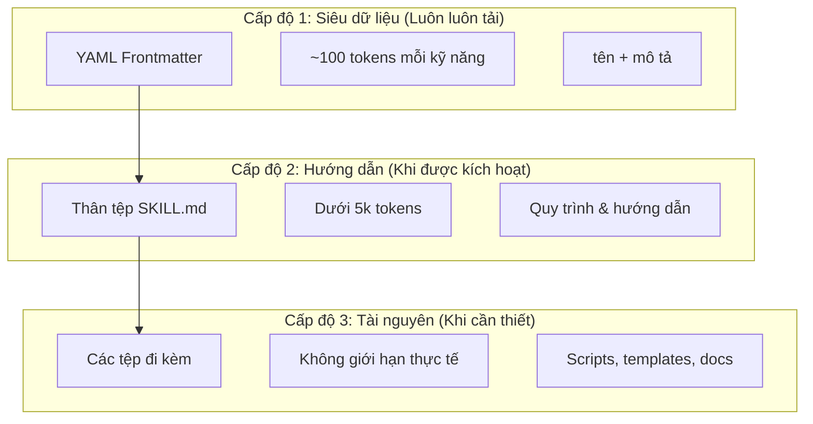
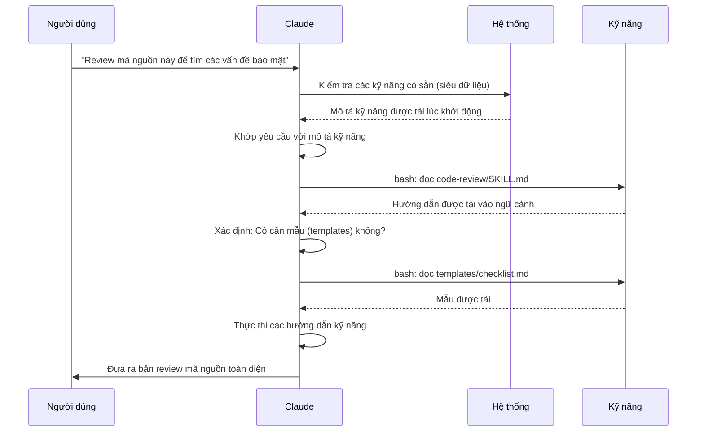

<picture>
  <source media="(prefers-color-scheme: dark)" srcset="../resources/logos/claude-howto-logo-dark.svg">
  
</picture>

# Hướng dẫn về Kỹ năng của Agent (Agent Skills Guide)

Kỹ năng của Agent (Agent Skills) là các khả năng có thể tái sử dụng, dựa trên hệ thống tệp, giúp mở rộng chức năng của Claude. Chúng đóng gói chuyên môn đặc thù của miền, quy trình làm việc và các thực hành tốt nhất thành các thành phần có thể khám phá mà Claude sẽ tự động sử dụng khi liên quan.

## Tổng quan (Overview)

**Kỹ năng của Agent** là các khả năng mô-đun giúp biến các agent đa năng thành các chuyên gia. Khác với các prompt (các hướng dẫn cấp độ hội thoại cho các tác vụ một lần), Kỹ năng được tải theo yêu cầu và loại bỏ việc phải lặp lại cùng một hướng dẫn qua nhiều cuộc hội thoại.

### Lợi ích chính (Key Benefits)

- **Chuyên môn hóa Claude**: Điều chỉnh các khả năng cho các tác vụ đặc thù của miền
- **Giảm sự lặp lại**: Tạo một lần, sử dụng tự động trong mọi cuộc hội thoại
- **Kết hợp các khả năng**: Kết hợp các Kỹ năng để xây dựng các quy trình làm việc phức tạp
- **Mở rộng quy trình**: Tái sử dụng các kỹ năng trên nhiều dự án và đội ngũ
- **Duy trì chất lượng**: Nhúng các thực hành tốt nhất trực tiếp vào quy trình làm việc của bạn

Các Kỹ năng tuân theo tiêu chuẩn mở [Agent Skills](https://agentskills.io), hoạt động trên nhiều công cụ AI. Claude Code mở rộng tiêu chuẩn này với các tính năng bổ sung như kiểm soát việc gọi kỹ năng (invocation control), thực thi subagent và tiêm ngữ cảnh động.

> **Lưu ý**: Các lệnh slash tùy chỉnh đã được hợp nhất vào kỹ năng. Các tệp trong `.claude/commands/` vẫn hoạt động và hỗ trợ các trường frontmatter tương tự. Kỹ năng được khuyến nghị cho việc phát triển mới. Khi cả hai cùng tồn tại ở cùng một đường dẫn (ví dụ: `.claude/commands/review.md` và `.claude/skills/review/SKILL.md`), kỹ năng sẽ được ưu tiên.

## Cách Kỹ năng hoạt động: Tiết lộ lũy tiến (Progressive Disclosure)

Kỹ năng tận dụng kiến trúc **tiết lộ lũy tiến**—Claude tải thông tin theo các giai đoạn khi cần thiết, thay vì tiêu thụ toàn bộ ngữ cảnh ngay từ đầu. Điều này cho phép quản lý ngữ cảnh hiệu quả trong khi vẫn duy trì khả năng mở rộng không giới hạn.

### Ba cấp độ tải



| Cấp độ | Khi nào được tải | Chi phí Token | Nội dung |
|-------|------------|------------|---------|
| **Cấp độ 1: Siêu dữ liệu** | Luôn luôn (lúc khởi động) | ~100 tokens mỗi Kỹ năng | `name` và `description` từ YAML frontmatter |
| **Cấp độ 2: Hướng dẫn** | Khi Kỹ năng được kích hoạt | Dưới 5k tokens | Thân tệp SKILL.md với các hướng dẫn và chỉ dẫn |
| **Cấp độ 3+: Tài nguyên** | Khi cần thiết | Không giới hạn thực tế | Các tệp đi kèm được thực thi qua bash mà không cần tải nội dung vào ngữ cảnh |

Điều này có nghĩa là bạn có thể cài đặt nhiều Kỹ năng mà không bị phạt về ngữ cảnh—Claude chỉ biết mỗi Kỹ năng tồn tại và khi nào nên sử dụng cho đến khi thực sự được kích hoạt.

## Quy trình tải Kỹ năng (Skill Loading Process)



## Loại Kỹ năng & Vị trí (Skill Types & Locations)

| Loại | Vị trí | Phạm vi | Chia sẻ | Tốt nhất cho |
|------|----------|-------|--------|----------|
| **Doanh nghiệp** | Cài đặt được quản lý | Tất cả người dùng tổ chức | Có | Các tiêu chuẩn toàn tổ chức |
| **Cá nhân** | `~/.claude/skills/<tên-kỹ-năng>/SKILL.md` | Cá nhân | Không | Quy trình làm việc cá nhân |
| **Dự án** | `.claude/skills/<tên-kỹ-năng>/SKILL.md` | Đội ngũ | Có (qua git) | Tiêu chuẩn của đội ngũ |
| **Plugin** | `<plugin>/skills/<tên-kỹ-năng>/SKILL.md` | Nơi được bật | Tùy thuộc | Đi kèm với các plugin |

Khi các kỹ năng trùng tên trên các cấp độ, các vị trí có độ ưu tiên cao hơn sẽ thắng: **doanh nghiệp > cá nhân > dự án**. Các kỹ năng của plugin sử dụng không gian tên `tên-plugin:tên-kỹ-năng`, vì vậy chúng không thể xung đột.

### Tự động khám phá (Automatic Discovery)

**Thư mục lồng nhau**: Khi bạn làm việc với các tệp trong thư mục con, Claude Code tự động khám phá các kỹ năng từ các thư mục `.claude/skills/` lồng nhau. Ví dụ, nếu bạn đang chỉnh sửa một tệp trong `packages/frontend/`, Claude Code cũng tìm kiếm các kỹ năng trong `packages/frontend/.claude/skills/`. Điều này hỗ trợ các thiết lập monorepo nơi các gói có kỹ năng riêng của chúng.

**Thư mục `--add-dir`**: Các kỹ năng từ các thư mục được thêm qua `--add-dir` được tải tự động với tính năng phát hiện thay đổi trực tiếp. Mọi chỉnh sửa đối với các tệp kỹ năng trong các thư mục đó sẽ có hiệu lực ngay lập tức mà không cần khởi động lại Claude Code.

**Ngân sách mô tả**: Mô tả kỹ năng (siêu dữ liệu Cấp độ 1) được giới hạn ở mức **2% cửa sổ ngữ cảnh** (mặc định: **16.000 ký tự**). Nếu bạn đã cài đặt quá nhiều kỹ năng, một số có thể bị loại trừ. Chạy `/context` để kiểm tra các cảnh báo. Ghi đè ngân sách này bằng biến môi trường `SLASH_COMMAND_TOOL_CHAR_BUDGET`.

## Tạo Kỹ năng tùy chỉnh (Creating Custom Skills)

### Cấu trúc thư mục cơ bản

```
my-skill/
├── SKILL.md           # Hướng dẫn chính (bắt buộc)
├── template.md        # Mẫu để Claude điền vào
├── examples/
│   └── sample.md      # Kết quả mẫu hiển thị định dạng mong đợi
└── scripts/
    └── validate.sh    # Script mà Claude có thể thực thi
```

### Định dạng SKILL.md

```yaml
---
name: tên-kỹ-năng-của-bạn
description: Mô tả ngắn gọn về chức năng của Kỹ năng này và khi nào nên sử dụng nó
---

# Tên Kỹ năng của Bạn

## Hướng dẫn
Cung cấp các chỉ dẫn rõ ràng, từng bước cho Claude.

## Ví dụ
Hiển thị các ví dụ cụ thể về việc sử dụng Kỹ năng này.
```

### Các trường bắt buộc

- **name**: chỉ gồm chữ cái viết thường, số, dấu gạch ngang (tối đa 64 ký tự). Không được chứa "anthropic" hoặc "claude".
- **description**: kỹ năng làm gì VÀ khi nào nên sử dụng (tối đa 1024 ký tự). Điều này rất quan trọng để Claude biết khi nào cần kích hoạt kỹ năng.

### Các trường Frontmatter tùy chọn

```yaml
---
name: my-skill
description: Kỹ năng này làm gì và khi nào nên sử dụng
argument-hint: "[tên_tệp] [định_dạng]"        # Gợi ý cho tính năng tự động hoàn thành
disable-model-invocation: true               # Chỉ người dùng mới có thể kích hoạt
user-invocable: false                        # Ẩn khỏi menu slash (/)
allowed-tools: Read, Grep, Glob              # Giới hạn quyền truy cập công cụ
model: opus                                  # Mô hình cụ thể cần sử dụng
effort: high                                 # Ghi đè mức độ nỗ lực (low, medium, high, max)
context: fork                                # Chạy trong một subagent riêng biệt
agent: Explore                               # Loại agent (kèm theo context: fork)
shell: bash                                  # Shell cho các lệnh: bash (mặc định) hoặc powershell
hooks:                                       # Các hook trong phạm vi kỹ năng
  PreToolUse:
    - matcher: "Bash"
      hooks:
        - type: command
          command: "./scripts/validate.sh"
---
```

| Trường | Mô tả |
|-------|-------------|
| `name` | Chỉ dùng chữ cái thường, số, dấu gạch ngang (tối đa 64 ký tự). Không chứa "anthropic" hoặc "claude". |
| `description` | Kỹ năng làm gì VÀ khi nào nên dùng (tối đa 1024 ký tự). Cực kỳ quan trọng để khớp kích hoạt tự động. |
| `argument-hint` | Gợi ý hiển thị trong menu tự động hoàn thành `/` (ví dụ: `"[tên_tệp] [định_dạng]"`). |
| `disable-model-invocation` | `true` = chỉ người dùng mới có thể gọi qua `/tên`. Claude sẽ không bao giờ tự động gọi. |
| `user-invocable` | `false` = ẩn khỏi menu `/`. Chỉ Claude mới có thể kích hoạt nó tự động. |
| `allowed-tools` | Danh sách các công cụ mà kỹ năng có thể dùng mà không cần hỏi quyền. |
| `model` | Ghi đè mô hình khi kỹ năng đang hoạt động (ví dụ: `opus`, `sonnet`). |
| `effort` | Ghi đè mức độ nỗ lực khi kỹ năng đang hoạt động: `low`, `medium`, `high`, hoặc `max`. |
| `context` | `fork` để chạy kỹ năng trong ngữ cảnh subagent riêng biệt với cửa sổ ngữ cảnh riêng. |
| `agent` | Loại subagent khi dùng `context: fork` (ví dụ: `Explore`, `Plan`, `general-purpose`). |
| `shell` | Shell được dùng cho các thay thế lệnh `` !`lệnh` `` và các script: `bash` (mặc định) hoặc `powershell`. |
| `hooks` | Các hook nằm trong phạm vi vòng đời của kỹ năng này (cùng định dạng với hook toàn cục). |

## Các loại nội dung Kỹ năng (Skill Content Types)

Kỹ năng có thể chứa hai loại nội dung, mỗi loại phù hợp cho các mục đích khác nhau:

### Nội dung Tham chiếu (Reference Content)

Thêm kiến thức mà Claude áp dụng cho công việc hiện tại của bạn—các quy ước, mẫu hình, hướng dẫn phong cách, kiến thức miền. Chạy trực tiếp trong ngữ cảnh hội thoại của bạn.

```yaml
---
name: api-conventions
description: Các mẫu hình thiết kế API cho mã nguồn này
---

Khi viết các endpoint API:
- Sử dụng các quy ước đặt tên RESTful
- Trả về các định dạng lỗi nhất quán
- Bao gồm xác thực yêu cầu
```

### Nội dung Tác vụ (Task Content)

 Các hướng dẫn từng bước cho các hành động cụ thể. Thường được gọi trực tiếp bằng `/tên-kỹ-năng`.

```yaml
---
name: deploy
description: Triển khai ứng dụng lên môi trường production
context: fork
disable-model-invocation: true
---

Triển khai ứng dụng:
1. Chạy bộ kiểm thử (test suite)
2. Build ứng dụng
3. Push lên mục tiêu triển khai
```

## Kiểm soát việc gọi Kỹ năng (Controlling Skill Invocation)

Theo mặc định, cả bạn và Claude đều có thể gọi bất kỳ kỹ năng nào. Hai trường frontmatter điều khiển ba chế độ gọi:

| Frontmatter | Bạn có thể gọi | Claude có thể gọi |
|---|---|---|
| (mặc định) | Có | Có |
| `disable-model-invocation: true` | Có | Không |
| `user-invocable: false` | Không | Có |

**Sử dụng `disable-model-invocation: true`** cho các quy trình làm việc có tác dụng phụ: `/commit`, `/deploy`, `/send-slack-message`. Bạn không muốn Claude tự ý quyết định triển khai chỉ vì mã nguồn của bạn trông có vẻ đã sẵn sàng.

**Sử dụng `user-invocable: false`** cho các kiến thức nền tảng không phải là một hành động có thể thực hiện như một lệnh. Một kỹ năng `legacy-system-context` giải thích cách một hệ thống cũ hoạt động—hữu ích cho Claude, nhưng không phải là một hành động có ý nghĩa đối với người dùng.

## Thay thế chuỗi (String Substitutions)

Kỹ năng hỗ trợ các giá trị động được giải quyết trước khi nội dung kỹ năng đến với Claude:

| Biến | Mô tả |
|----------|-------------|
| `$ARGUMENTS` | Tất cả các đối số được truyền khi gọi kỹ năng |
| `$ARGUMENTS[N]` hoặc `$N` | Truy cập đối số cụ thể theo chỉ mục (bắt đầu từ 0) |
| `${CLAUDE_SESSION_ID}` | ID phiên làm việc hiện tại |
| `${CLAUDE_SKILL_DIR}` | Thư mục chứa tệp SKILL.md của kỹ năng |
| `` !`lệnh` `` | Tiêm ngữ cảnh động — chạy một lệnh shell và chèn kết quả trực tiếp |

**Ví dụ:**

```yaml
---
name: fix-issue
description: Sửa một issue trên GitHub
---

Sửa issue GitHub $ARGUMENTS theo các tiêu chuẩn lập trình của chúng ta.
1. Đọc mô tả issue
2. Triển khai bản sửa lỗi
3. Viết kiểm thử
4. Tạo một commit
```

Chạy `/fix-issue 123` sẽ thay thế `$ARGUMENTS` bằng `123`.

## Tiêm ngữ cảnh động (Injecting Dynamic Context)

Cú pháp `` !`lệnh` `` chạy các lệnh shell trước khi nội dung kỹ năng được gửi tới Claude:

```yaml
---
name: pr-summary
description: Tóm tắt các thay đổi trong một pull request
context: fork
agent: Explore
---

## Ngữ cảnh pull request
- PR diff: !`gh pr diff`
- PR comments: !`gh pr view --comments`
- Changed files: !`gh pr diff --name-only`

## Tác vụ của bạn
Tóm tắt pull request này...
```

Các lệnh thực thi ngay lập tức; Claude chỉ thấy kết quả cuối cùng. Theo mặc định, các lệnh chạy trong `bash`. Đặt `shell: powershell` trong frontmatter để sử dụng PowerShell thay thế.

## Chạy Kỹ năng trong Subagents (Running Skills in Subagents)

Thêm `context: fork` để chạy một kỹ năng trong ngữ cảnh subagent riêng biệt. Nội dung kỹ năng trở thành tác vụ cho một subagent chuyên dụng với cửa sổ ngữ cảnh riêng, giữ cho cuộc hội thoại chính không bị lộn xộn.

Trường `agent` chỉ định loại agent sẽ sử dụng:

| Loại Agent | Tốt nhất cho |
|---|---|
| `Explore` | Nghiên cứu chỉ đọc (read-only), phân tích mã nguồn |
| `Plan` | Tạo các kế hoạch triển khai |
| `general-purpose` | Các nhiệm vụ rộng lớn yêu cầu tất cả các công cụ |
| Agent tùy chỉnh | Các agent chuyên biệt được định nghĩa trong cấu hình của bạn |

**Ví dụ frontmatter:**

```yaml
---
context: fork
agent: Explore
---
```

**Ví dụ kỹ năng đầy đủ:**

```yaml
---
name: deep-research
description: Nghiên cứu kỹ lưỡng một chủ đề
context: fork
agent: Explore
---

Nghiên cứu kỹ lưỡng về $ARGUMENTS:
1. Tìm các tệp liên quan bằng Glob và Grep
2. Đọc và phân tích mã nguồn
3. Tóm tắt các phát hiện với các tham chiếu tệp cụ thể
```

## Các ví dụ thực tế (Practical Examples)

### Ví dụ 1: Kỹ năng Review mã nguồn (Code Review Skill)

**Cấu trúc thư mục:**

```
~/.claude/skills/code-review/
├── SKILL.md
├── templates/
│   ├── review-checklist.md
│   └── finding-template.md
└── scripts/
    ├── analyze-metrics.py
    └── compare-complexity.py
```

**Tệp:** `~/.claude/skills/code-review/SKILL.md`

```yaml
---
name: code-review-specialist
description: Review mã nguồn toàn diện với phân tích bảo mật, hiệu năng và chất lượng. Sử dụng khi người dùng yêu cầu review code, phân tích chất lượng code, đánh giá pull request, hoặc đề cập đến code review, phân tích bảo mật, hoặc tối ưu hóa hiệu năng.
---

# Kỹ năng Chuyên gia Review Mã nguồn

Kỹ năng này cung cấp các khả năng review mã nguồn toàn diện tập trung vào:

1. **Phân tích Bảo mật (Security Analysis)**
   - Các vấn đề xác thực/phân quyền
   - Rủi ro lộ dữ liệu
   - Các lỗ hổng Injection
   - Điểm yếu về mã hóa (cryptographic)

2. **Review Hiệu năng (Performance Review)**
   - Hiệu quả thuật toán (phân tích Big O)
   - Tối ưu hóa bộ nhớ
   - Tối ưu hóa truy vấn cơ sở dữ liệu
   - Các cơ hội ghi nhớ đệm (caching)

3. **Chất lượng mã nguồn (Code Quality)**
   - Các nguyên tắc SOLID
   - Các mẫu thiết kế (design patterns)
   - Các quy ước đặt tên
   - Độ bao phủ kiểm thử

4. **Khả năng bảo trì (Maintainability)**
   - Khả năng đọc của mã nguồn
   - Kích thước hàm (nên < 50 dòng)
   - Độ phức tạp vòng đời (cyclomatic complexity)
   - Tính an toàn của kiểu dữ liệu (type safety)

## Mẫu Review (Review Template)

Đối với mỗi đoạn mã được review, hãy cung cấp:

### Tóm tắt (Summary)
- Đánh giá chất lượng tổng thể (1-5)
- Số lượng phát hiện chính
- Các khu vực ưu tiên được khuyến nghị

### Các vấn đề nghiêm trọng (nếu có)
- **Vấn đề**: Mô tả rõ ràng
- **Vị trí**: Tệp và số dòng
- **Tác động**: Tại sao điều này lại quan trọng
- **Mức độ nghiêm trọng**: Nghiêm trọng/Cao/Trung bình
- **Bản sửa lỗi**: Ví dụ mã nguồn

Để biết danh sách kiểm tra chi tiết, hãy xem [templates/review-checklist.md](templates/review-checklist.md).
```

### Ví dụ 2: Kỹ năng Trực quan hóa Mã nguồn (Codebase Visualizer Skill)

Một kỹ năng tạo ra các hình ảnh trực quan HTML có khả năng tương tác:

**Cấu trúc thư mục:**

```
~/.claude/skills/codebase-visualizer/
├── SKILL.md
└── scripts/
    └── visualize.py
```

**Tệp:** `~/.claude/skills/codebase-visualizer/SKILL.md`

```yaml
---
name: codebase-visualizer
description: Tạo hình ảnh trực quan dạng cây có thể thu gọn cho mã nguồn của bạn. Sử dụng khi khám phá một repo mới, tìm hiểu cấu trúc dự án hoặc xác định các tệp lớn.
allowed-tools: Bash(python *)
---

# Trực quan hóa Mã nguồn (Codebase Visualizer)

Tạo một chế độ xem cây HTML tương tác hiển thị cấu trúc tệp của dự án.

## Cách sử dụng

Chạy script trực quan hóa từ thư mục gốc của dự án:

```bash
python ~/.claude/skills/codebase-visualizer/scripts/visualize.py .
```

Điều này tạo ra tệp `codebase-map.html` và mở nó trong trình duyệt mặc định của bạn.

## Những gì hình ảnh trực quan hiển thị

- **Thư mục có thể thu gọn**: Nhấp vào các thư mục để mở rộng/thu gọn
- **Kích thước tệp**: Được hiển thị bên cạnh mỗi tệp
- **Màu sắc**: Màu sắc khác nhau cho các loại tệp khác nhau
- **Tổng số thư mục**: Hiển thị tổng kích thước của từng thư mục
```

Script Python đi kèm thực hiện các công việc nặng nhọc trong khi Claude xử lý việc điều phối.

### Ví dụ 3: Kỹ năng Deploy (Chỉ người dùng gọi)

```yaml
---
name: deploy
description: Triển khai ứng dụng lên môi trường production
disable-model-invocation: true
allowed-tools: Bash(npm *), Bash(git *)
---

Triển khai $ARGUMENTS lên production:

1. Chạy bộ kiểm thử: `npm test`
2. Build ứng dụng: `npm run build`
3. Push lên mục tiêu triển khai
4. Xác minh việc triển khai thành công
5. Báo cáo trạng thái triển khai
```

### Ví dụ 4: Kỹ năng Brand Voice (Kiến thức nền tảng)

```yaml
---
name: brand-voice
description: Đảm bảo tất cả các giao tiếp khớp với hướng dẫn về giọng văn và tông điệu của thương hiệu. Sử dụng khi tạo nội dung marketing, giao tiếp với khách hàng hoặc nội dung hướng tới công chúng.
user-invocable: false
---

## Tông điệu giọng văn (Tone of Voice)
- **Thân thiện nhưng chuyên nghiệp** - dễ tiếp cận nhưng không quá suồng sã
- **Rõ ràng và súc tích** - tránh dùng biệt ngữ
- **Tự tin** - chúng ta biết mình đang làm gì
- **Thấu hiểu** - hiểu nhu cầu của người dùng

## Hướng dẫn viết (Writing Guidelines)
- Sử dụng "bạn" (hoặc ngôi thứ hai phù hợp) khi xưng hô với người đọc
- Sử dụng câu chủ động
- Giữ các câu dưới 20 từ
- Bắt đầu với tuyên bố giá trị (value proposition)

Đối với các mẫu, hãy xem trong [templates/](templates/).
```

### Ví dụ 5: Kỹ năng tạo CLAUDE.md (CLAUDE.md Generator Skill)

```yaml
---
name: claude-md
description: Tạo hoặc cập nhật các tệp CLAUDE.md theo các thực hành tốt nhất để tối ưu hóa việc gia nhập (onboarding) của AI agent. Sử dụng khi người dùng đề cập đến CLAUDE.md, tài liệu dự án, hoặc onboarding cho AI.
---

## Các nguyên tắc cốt lõi (Core Principles)

**LLM là phi trạng thái (stateless)**: CLAUDE.md là tệp duy nhất được tự động bao gồm trong mọi cuộc hội thoại.

### Các Quy tắc Vàng (The Golden Rules)

1. **Càng ít càng tốt (Less is More)**: Giữ dưới 300 dòng (lý tưởng là dưới 100)
2. **Tính ứng dụng toàn cục**: Chỉ bao gồm thông tin liên quan đến MỌI phiên làm việc
3. **Đừng dùng Claude làm Linter**: Thay vào đó hãy dùng các công cụ mang tính xác định (deterministic)
4. **Không bao giờ tự động tạo**: Hãy soạn thảo thủ công với sự cân nhắc kỹ lưỡng

## Các phần thiết yếu (Essential Sections)

- **Tên Dự án**: Mô tả ngắn gọn trong một dòng
- **Công nghệ (Tech Stack)**: Ngôn ngữ chính, framework, cơ sở dữ liệu
- **Các lệnh phát triển**: Lệnh cài đặt, kiểm thử, build
- **Các quy ước quan trọng**: Chỉ các quy ước không hiển nhiên, có tác động cao
- **Các vấn đề đã biết / Lưu ý (Gotchas)**: Những thứ thường làm khó các lập trình viên
```

### Ví dụ 6: Kỹ năng Tái cấu trúc (Refactoring) với Script

**Cấu trúc thư mục:**

```
refactor/
├── SKILL.md
├── references/
│   ├── code-smells.md
│   └── refactoring-catalog.md
├── templates/
│   └── refactoring-plan.md
└── scripts/
    ├── analyze-complexity.py
    └── detect-smells.py
```

**Tệp:** `refactor/SKILL.md`

```yaml
---
name: code-refactor
description: Tái cấu trúc mã nguồn một cách hệ thống dựa trên phương pháp luận của Martin Fowler. Sử dụng khi người dùng yêu cầu tái cấu trúc mã nguồn, cải thiện cấu trúc mã, giảm nợ kỹ thuật hoặc loại bỏ các "mùi" mã nguồn (code smells).
---

# Kỹ năng Tái cấu trúc Mã nguồn

Một cách tiếp cận theo từng giai đoạn nhấn mạnh vào các thay đổi an toàn, tăng dần được hỗ trợ bởi kiểm thử.

## Quy trình làm việc (Workflow)

Giai đoạn 1: Nghiên cứu & Phân tích → Giai đoạn 2: Đánh giá độ bao phủ kiểm thử →
Giai đoạn 3: Nhận diện Code Smell → Giai đoạn 4: Tạo kế hoạch tái cấu trúc →
Giai đoạn 5: Triển khai tăng dần → Giai đoạn 6: Review & Lặp lại

## Các nguyên tắc cốt lõi

1. **Bảo toàn hành vi**: Hành vi bên ngoài phải không đổi
2. **Các bước nhỏ**: Thực hiện những thay đổi cực nhỏ, có thể kiểm thử được
3. **Hướng kiểm thử (Test-Driven)**: Kiểm thử là tấm lưới an toàn
4. **Liên tục**: Tái cấu trúc là việc đang diễn ra, không phải sự kiện một lần

Để biết danh mục code smell, hãy xem [references/code-smells.md](references/code-smells.md).
Để biết các kỹ thuật tái cấu trúc, hãy xem [references/refactoring-catalog.md](references/refactoring-catalog.md).
```

## Các tệp hỗ trợ (Supporting Files)

Kỹ năng có thể bao gồm nhiều tệp trong thư mục của chúng ngoài `SKILL.md`. Các tệp hỗ trợ này (mẫu, ví dụ, script, tài liệu tham khảo) giúp tệp kỹ năng chính luôn tập trung trong khi cung cấp cho Claude các tài nguyên bổ sung mà nó có thể tải khi cần.

```
my-skill/
├── SKILL.md              # Hướng dẫn chính (bắt buộc, giữ dưới 500 dòng)
├── templates/            # Mẫu để Claude điền vào
│   └── output-format.md
├── examples/             # Kết quả mẫu hiển thị định dạng mong đợi
│   └── sample-output.md
├── references/           # Kiến thức miền và đặc tả kỹ thuật
│   └── api-spec.md
└── scripts/              # Script mà Claude có thể thực thi
    └── validate.sh
```

Hướng dẫn cho các tệp hỗ trợ:

- Giữ tệp `SKILL.md` dưới **500 dòng**. Di chuyển tài liệu tham khảo chi tiết, các ví dụ lớn và đặc tả kỹ thuật sang các tệp riêng biệt.
- Tham chiếu các tệp bổ sung từ `SKILL.md` bằng **đường dẫn tương đối** (ví dụ: `[Tài liệu tham khảo API](references/api-spec.md)`).
- Các tệp hỗ trợ được tải ở Cấp độ 3 (khi cần thiết), vì vậy chúng không tiêu tốn ngữ cảnh cho đến khi Claude thực sự đọc chúng.

## Quản lý Kỹ năng (Managing Skills)

### Xem các Kỹ năng hiện có

Hỏi trực tiếp Claude:
```
Có những Kỹ năng nào khả dụng?
```

Hoặc kiểm tra hệ thống tệp:
```bash
# Liệt kê các Kỹ năng cá nhân
ls ~/.claude/skills/

# Liệt kê các Kỹ năng dự án
ls .claude/skills/
```

### Kiểm thử một Kỹ năng

Có hai cách để kiểm thử:

**Để Claude tự động gọi** bằng cách yêu cầu một điều gì đó khớp với mô tả:
```
Bạn có thể giúp tôi review mã nguồn này để tìm các vấn đề bảo mật không?
```

**Hoặc gọi trực tiếp** bằng tên kỹ năng:
```
/code-review src/auth/login.ts
```

### Cập nhật một Kỹ năng

Chỉnh sửa tệp `SKILL.md` trực tiếp. Các thay đổi sẽ có hiệu lực vào lần khởi động tiếp theo của Claude Code.

```bash
# Kỹ năng Cá nhân
code ~/.claude/skills/my-skill/SKILL.md

# Kỹ năng Dự án
code .claude/skills/my-skill/SKILL.md
```

### Hạn chế quyền truy cập Kỹ năng của Claude

Có ba cách để kiểm soát các kỹ năng mà Claude có thể gọi:

**Vô hiệu hóa tất cả các kỹ năng** trong `/permissions`:
```
# Thêm vào quy tắc từ chối (deny rules):
Skill
```

**Cho phép hoặc từ chối các kỹ năng cụ thể**:
```
# Chỉ cho phép các kỹ năng cụ thể
Skill(commit)
Skill(review-pr *)

# Từ chối các kỹ năng cụ thể
Skill(deploy *)
```

**Ẩn các kỹ năng riêng lẻ** bằng cách thêm `disable-model-invocation: true` vào frontmatter của chúng.

## Thực hành tốt nhất (Best Practices)

### 1. Đặt mô tả cụ thể

- **Tệ (Mơ hồ)**: "Giúp xử lý tài liệu"
- **Tốt (Cụ thể)**: "Trích xuất văn bản và bảng từ các tệp PDF, điền biểu mẫu, trộn tài liệu. Sử dụng khi làm việc với các tệp PDF hoặc khi người dùng đề cập đến PDF, biểu mẫu hoặc trích xuất tài liệu."

### 2. Giữ các Kỹ năng tập trung (Focused)

- Một Kỹ năng = một khả năng
- ✅ "Điền biểu mẫu PDF"
- ❌ "Xử lý tài liệu" (quá rộng)

### 3. Bao gồm các thuật ngữ kích hoạt (Trigger Terms)

Thêm các từ khóa trong mô tả khớp với các yêu cầu tự nhiên của người dùng:
```yaml
description: Phân tích bảng tính Excel, tạo bảng pivot, tạo biểu đồ. Sử dụng khi làm việc với các tệp Excel, bảng tính hoặc các tệp .xlsx.
```

### 4. Giữ SKILL.md dưới 500 dòng

Di chuyển nội dung tham khảo chi tiết sang các tệp riêng biệt mà Claude sẽ tải khi cần.

### 5. Tham chiếu các tệp hỗ trợ

```markdown
## Tài nguyên bổ sung

- Để biết chi tiết đầy đủ về API, hãy xem [reference.md](reference.md)
- Để xem các ví dụ sử dụng, hãy xem [examples.md](examples.md)
```

### Nên làm (Do's)

- Sử dụng tên rõ ràng, mang tính mô tả
- Bao gồm các hướng dẫn toàn diện
- Thêm các ví dụ cụ thể
- Đóng gói các script và mẫu liên quan
- Kiểm thử với các kịch bản thực tế
- Ghi lại các phụ thuộc (dependencies)

### Không nên làm (Don'ts)

- Đừng tạo kỹ năng cho các tác vụ một lần
- Đừng lặp lại các chức năng đã có
- Đừng làm cho các kỹ năng quá rộng
- Đừng bỏ qua trường mô tả (description)
- Đừng cài đặt các kỹ năng từ các nguồn không đáng tin cậy mà không kiểm tra (audit)

## Khắc phục sự cố (Troubleshooting)

### Tham khảo nhanh (Quick Reference)

| Vấn đề | Giải pháp |
|-------|----------|
| Claude không sử dụng Kỹ năng | Làm cho mô tả cụ thể hơn với các thuật ngữ kích hoạt |
| Không tìm thấy tệp Kỹ năng | Xác minh đường dẫn: `~/.claude/skills/name/SKILL.md` |
| Lỗi YAML | Kiểm tra các dấu `---`, thụt lề, không sử dụng tab |
| Xung đột Kỹ năng | Sử dụng các thuật ngữ kích hoạt riêng biệt trong mô tả |
| Script không chạy | Kiểm tra quyền hạn: `chmod +x scripts/*.py` |
| Claude không thấy tất cả các kỹ năng | Quá nhiều kỹ năng; kiểm tra `/context` để xem cảnh báo |

### Kỹ năng không kích hoạt

Nếu Claude không sử dụng kỹ năng của bạn như mong đợi:

1. Kiểm tra xem mô tả đã bao gồm các từ khóa mà người dùng thường nói một cách tự nhiên hay chưa.
2. Xác minh kỹ năng có xuất hiện khi hỏi "Có những kỹ năng nào khả dụng?" không.
3. Thử diễn đạt lại yêu cầu của bạn để khớp với mô tả.
4. Gọi trực tiếp bằng `/tên-kỹ-năng` để kiểm thử.

### Kỹ năng kích hoạt quá thường xuyên

Nếu Claude sử dụng kỹ năng khi bạn không muốn:

1. Làm cho mô tả cụ thể hơn.
2. Thêm `disable-model-invocation: true` để chỉ cho phép gọi thủ công.

### Claude không thấy tất cả các Kỹ năng

Mô tả kỹ năng được tải ở mức **2% cửa sổ ngữ cảnh** (mặc định: **16.000 ký tự**). Chạy `/context` để kiểm tra các cảnh báo về các kỹ năng bị loại trừ. Ghi đè ngân sách này bằng biến môi trường `SLASH_COMMAND_TOOL_CHAR_BUDGET`.

## Cân nhắc bảo mật (Security Considerations)

**Chỉ sử dụng Kỹ năng từ các nguồn đáng tin cậy.** Kỹ năng cung cấp cho Claude các khả năng thông qua hướng dẫn và mã nguồn—một Kỹ năng độc hại có thể hướng dẫn Claude gọi các công cụ hoặc thực thi mã theo những cách có hại.

**Các cân nhắc bảo mật chính:**

- **Kiểm tra kỹ lưỡng (Audit)**: Review tất cả các tệp trong thư mục Kỹ năng.
- **Nguồn bên ngoài đầy rủi ro**: Các Kỹ năng lấy dữ liệu từ các URL bên ngoài có thể bị xâm nhập.
- **Lạm dụng công cụ**: Kỹ năng độc hại có thể gọi các công cụ theo những cách gây hại.
- **Đối xử như cài đặt phần mềm**: Chỉ sử dụng Kỹ năng từ các nguồn đáng tin cậy.

## Kỹ năng so với các Tính năng khác

| Tính năng | Cách gọi | Tốt nhất cho |
|---------|------------|----------|
| **Kỹ năng (Skills)** | Tự động hoặc `/tên` | Chuyên môn tái sử dụng, quy trình làm việc |
| **Lệnh Slash** | Người dùng gọi `/tên` | Các phím tắt nhanh (đã được hợp nhất vào Kỹ năng) |
| **Subagents** | Tự động ủy quyền | Thực thi tác vụ riêng biệt |
| **Bộ nhớ (CLAUDE.md)** | Luôn được tải | Ngữ cảnh dự án bền vững |
| **MCP** | Thời gian thực | Truy cập dữ liệu/dịch vụ bên ngoài |
| **Hooks** | Hướng sự kiện | Các tác dụng phụ tự động |

## Các Kỹ năng đi kèm (Bundled Skills)

Claude Code đi kèm với một số kỹ năng tích hợp luôn sẵn sàng mà không cần cài đặt:

| Kỹ năng | Mô tả |
|-------|-------------|
| `/simplify` | Review các tệp đã thay đổi để tái sử dụng, đảm bảo chất lượng và hiệu quả; kích hoạt 3 agent review song song. |
| `/batch <hướng_dẫn>` | Điều phối các thay đổi quy mô lớn, song song trên toàn bộ mã nguồn sử dụng git worktrees. |
| `/debug [mô_tả]` | Khắc phục sự cố phiên làm việc hiện tại bằng cách đọc nhật ký debug. |
| `/loop [khoảng_thời_gian] <prompt>` | Chạy prompt lặp đi lặp lại sau mỗi khoảng thời gian (ví dụ: `/loop 5m check the deploy`). |
| `/claude-api` | Tải tài liệu tham khảo Claude API/SDK; tự động kích hoạt khi import `anthropic`/`@anthropic-ai/sdk`. |

Các kỹ năng này có sẵn ngay lập tức và không cần định cấu hình. Chúng tuân theo cùng định dạng SKILL.md như các kỹ năng tùy chỉnh.

## Chia sẻ Kỹ năng (Sharing Skills)

### Kỹ năng Dự án (Chia sẻ trong Đội ngũ)

1. Tạo Kỹ năng trong `.claude/skills/`
2. Commit vào git
3. Các thành viên trong đội kéo (pull) thay đổi — Kỹ năng sẽ khả dụng ngay lập tức

### Kỹ năng Cá nhân

```bash
# Sao chép vào thư mục cá nhân
cp -r my-skill ~/.claude/skills/

# Cấp quyền thực thi cho các script
chmod +x ~/.claude/skills/my-skill/scripts/*.py
```

## Tài nguyên bổ sung (Additional Resources)

- [AgentSkills.io](https://agentskills.io) - Đặc tả tiêu chuẩn mở
- [Thư viện Kỹ năng Cộng đồng](https://github.com/anthropics/claude-skills) - Tập hợp các kỹ năng do cộng đồng đóng góp
- [Hướng dẫn thiết kế Prompt](https://docs.anthropic.com/claude/docs/prompt-engineering) - Để viết nội dung kỹ năng tốt hơn
