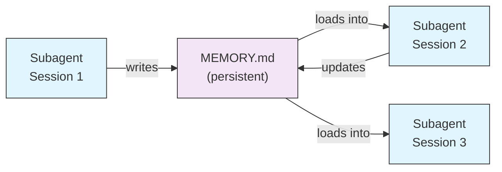
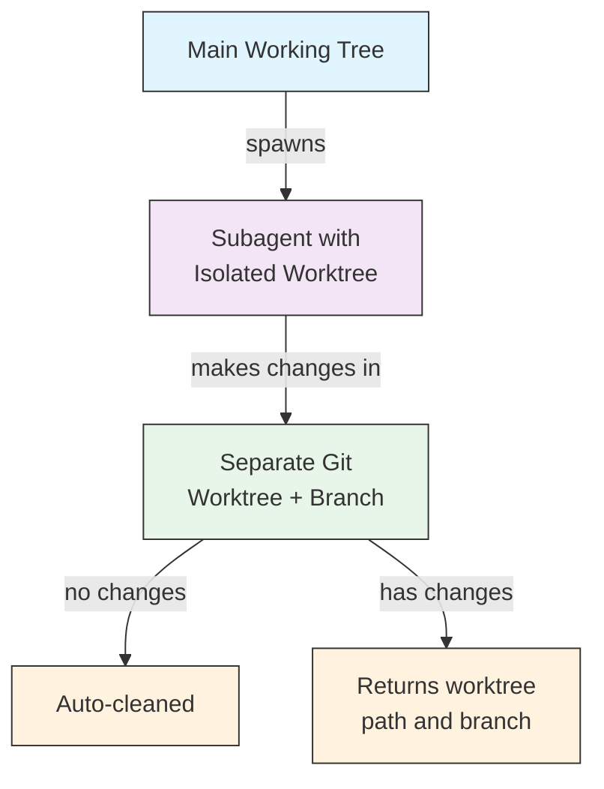
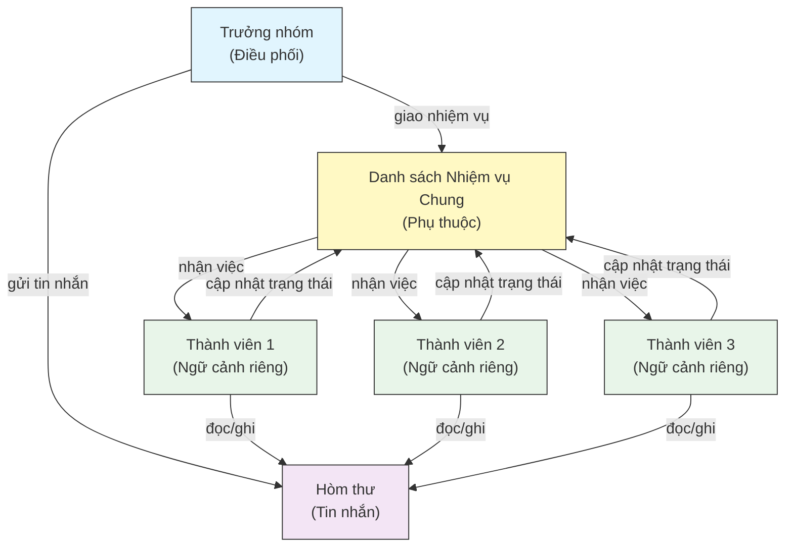
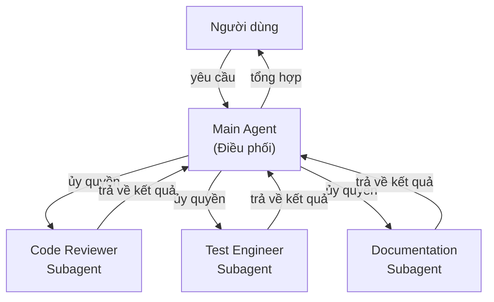
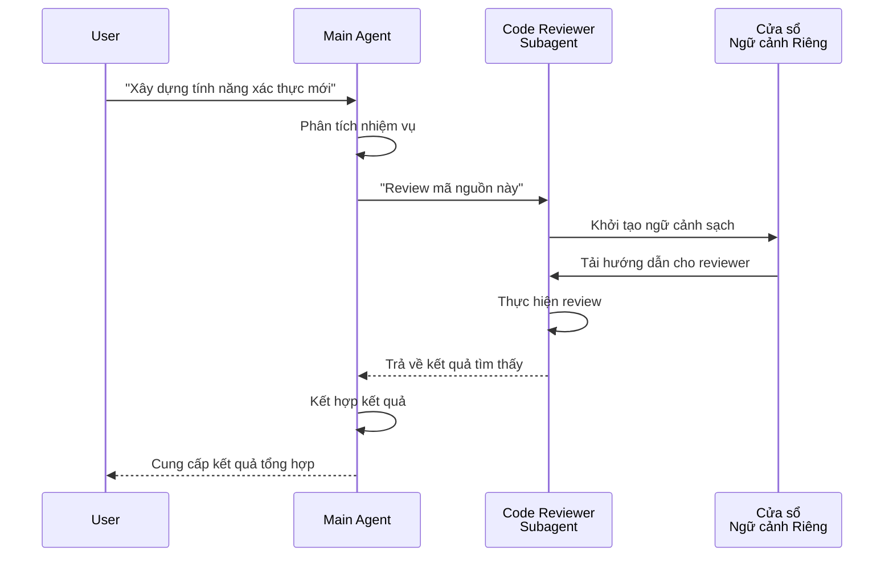
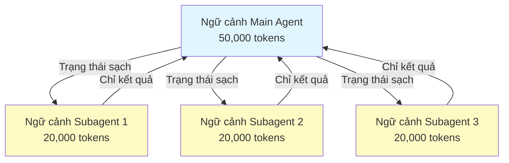
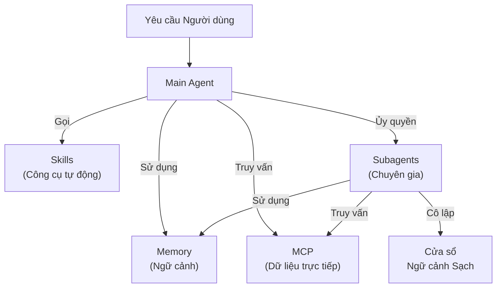

<picture>
  <source media="(prefers-color-scheme: dark)" srcset="../resources/logos/claude-howto-logo-dark.svg">
  
</picture>

# Subagents - Hướng dẫn Tham chiếu Đầy đủ

Subagents là các trợ lý AI chuyên biệt mà Claude Code có thể ủy quyền thực hiện các nhiệm vụ. Mỗi subagent có một mục đích cụ thể, sử dụng cửa sổ ngữ cảnh riêng biệt với hội thoại chính, và có thể được cấu hình với các công cụ cụ thể cũng như prompt hệ thống tùy chỉnh.

## Mục lục

1. [Tổng quan](#tổng-quan)
2. [Lợi ích Chính](#lợi-ích-chính)
3. [Vị trí Tệp](#vị-trí-tệp)
4. [Cấu hình](#cấu-hình)
5. [Subagents Tích hợp](#subagents-tích-hợp)
6. [Quản lý Subagents](#quản-lý-subagents)
7. [Sử dụng Subagents](#sử-dụng-subagents)
8. [Agent có thể Tiếp tục (Resumable Agents)](#agent-có-thể-tiếp-tục-resumable-agents)
9. [Chuỗi Subagents (Chaining Subagents)](#chuỗi-subagents-chaining-subagents)
10. [Bộ nhớ Bền vững cho Subagents](#bộ-nhớ-bền-vững-cho-subagents)
11. [Subagents Chạy nền (Background Subagents)](#subagents-chạy-nền-background-subagents)
12. [Cách ly Worktree (Worktree Isolation)](#cách-ly-worktree-worktree-isolation)
13. [Hạn chế các Subagent có thể Khởi tạo](#hạn-chế-các-subagent-có-thể-khởi-tạo)
14. [Lệnh CLI `claude agents`](#lệnh-cli-claude-agents)
15. [Đội ngũ Agent (Agent Teams - Thử nghiệm)](#đội-ngũ-agent-agent-teams---thử-nghiệm)
16. [Bảo mật Subagent của Plugin](#bảo-mật-subagent-của-plugin)
17. [Kiến trúc](#kiến-trúc)
18. [Quản lý Ngữ cảnh](#quản-lý-ngữ-cảnh)
19. [Khi nào nên Sử dụng Subagents](#khi-nao-nên-sử-dụng-subagents)
20. [Thực hành Tốt nhất](#thực-hành-tốt-nhất)
21. [Các Subagent Ví dụ trong Thư mục này](#các-subagent-ví-dụ-trong-thư-mục-này)
22. [Hướng dẫn Cài đặt](#hướng-dẫn-cài-đặt)
23. [Các Khái niệm Liên quan](#các-khái-niệm-liên quan)

---

## Tổng quan (Overview)

Subagents cho phép ủy quyền thực thi nhiệm vụ trong Claude Code bằng cách:

- Tạo ra các **trợ lý AI biệt lập** với các cửa sổ ngữ cảnh riêng biệt.
- Cung cấp các **prompt hệ thống tùy chỉnh** cho chuyên môn chuyên biệt.
- Áp dụng **kiểm soát truy cập công cụ** để hạn chế các khả năng.
- Ngăn chặn **ô nhiễm ngữ cảnh** từ các nhiệm vụ phức tạp.
- Cho phép **thực thi song song** nhiều nhiệm vụ chuyên biệt.

Mỗi subagent hoạt động độc lập với một trạng thái sạch, chỉ nhận ngữ cảnh cụ thể cần thiết cho nhiệm vụ của chúng, sau đó trả lại kết quả cho agent chính để tổng hợp.

**Bắt đầu nhanh**: Sử dụng lệnh `/agents` để tạo, xem, chỉnh sửa và quản lý các subagent của bạn một cách tương tác.

---

## Lợi ích Chính (Key Benefits)

| Lợi ích | Mô tả |
|---------|-------------|
| **Bảo tồn ngữ cảnh** | Hoạt động trong ngữ cảnh riêng biệt, ngăn chặn sự ô nhiễm của hội thoại chính. |
| **Chuyên môn chuyên biệt** | Được tinh chỉnh cho các lĩnh vực cụ thể với tỷ lệ thành công cao hơn. |
| **Khả năng tái sử dụng** | Sử dụng trên các dự án khác nhau và chia sẻ với đội ngũ. |
| **Quyền hạn linh hoạt** | Các cấp độ truy cập công cụ khác nhau cho các loại subagent khác nhau. |
| **Khả năng mở rộng** | Nhiều agent làm việc trên các khía cạnh khác nhau đồng thời. |

---

## Vị trí Tệp (File Locations)

Các tệp subagent có thể được lưu trữ ở nhiều vị trí với phạm vi khác nhau:

| Ưu tiên | Loại | Vị trí | Phạm vi |
|----------|------|----------|-------|
| 1 (cao nhất) | **Xác định qua CLI** | Qua cờ `--agents` (JSON) | Chỉ trong phiên làm việc |
| 2 | **Subagent dự án** | `.claude/agents/` | Dự án hiện tại |
| 3 | **Subagent người dùng** | `~/.claude/agents/` | Tất cả dự án |
| 4 (thấp nhất) | **Agent của plugin** | Thư mục `agents/` của plugin | Qua plugin |

Khi tồn tại tên trùng lặp, các nguồn có độ ưu tiên cao hơn sẽ được ưu tiên.

---

## Cấu hình (Configuration)

### Định dạng Tệp

Subagents được định nghĩa trong YAML frontmatter theo sau là prompt hệ thống bằng markdown:

```yaml
---
name: ten-sub-agent-cua-ban
description: Mô tả khi nào subagent này nên được gọi
tools: tool1, tool2, tool3  # Tùy chọn - kế thừa tất cả công cụ nếu bỏ qua
disallowedTools: tool4  # Tùy chọn - các công cụ bị từ chối rõ ràng
model: sonnet  # Tùy chọn - sonnet, opus, haiku, hoặc kế thừa
permissionMode: default  # Tùy chọn - chế độ cấp quyền
maxTurns: 20  # Tùy chọn - giới hạn số lượt (turns) của agent
skills: skill1, skill2  # Tùy chọn - các kỹ năng cần tải trước vào ngữ cảnh
mcpServers: server1  # Tùy chọn - các máy chủ MCP cần cung cấp
memory: user  # Tùy chọn - phạm vi bộ nhớ bền vững (user, project, local)
background: false  # Tùy chọn - chạy như một tác vụ nền
effort: high  # Tùy chọn - nỗ lực lập luận (low, medium, high, max)
isolation: worktree  # Tùy chọn - cách ly git worktree
initialPrompt: "Bắt đầu bằng việc phân tích mã nguồn"  # Tùy chọn - lượt đầu tiên tự động gửi
hooks:  # Tùy chọn - các hook trong phạm vi thành phần
  PreToolUse:
    - matcher: "Bash"
      hooks:
        - type: command
          command: "./scripts/security-check.sh"
---

Nội dung prompt hệ thống của subagent nằm ở đây. Đây có thể là nhiều đoạn văn
và nên định nghĩa rõ ràng vai trò, khả năng và cách tiếp cận của subagent
để giải quyết vấn đề.
```

### Các trường Cấu hình

| Trường | Bắt buộc | Mô tả |
|-------|----------|-------------|
| `name` | Có | Định danh duy nhất (chữ cái thường và dấu gạch ngang) |
| `description` | Có | Mô tả mục đích bằng ngôn ngữ tự nhiên. Bao gồm "Sử dụng CHỦ ĐỘNG (PROACTIVELY)" để khuyến khích gọi tự động. |
| `tools` | Không | Danh sách các công cụ cụ thể, phân cách bằng dấu phẩy. Bỏ qua để kế thừa tất cả công cụ. Hỗ trợ cú pháp `Agent(ten_agent)` để hạn chế các subagent có thể khởi tạo. |
| `disallowedTools` | Không | Danh sách các công cụ mà subagent không được phép sử dụng. |
| `model` | Không | Mô hình sử dụng: `sonnet`, `opus`, `haiku`, ID mô hình đầy đủ, hoặc `inherit` (kế thừa). Mặc định theo cấu hình subagent. |
| `permissionMode` | Không | `default`, `acceptEdits`, `dontAsk`, `bypassPermissions`, `plan` |
| `maxTurns` | Không | Số lượt (turns) tối đa mà subagent có thể thực hiện. |
| `skills` | Không | Danh sách các kỹ năng cần tải trước. Chèn toàn bộ nội dung kỹ năng vào ngữ cảnh của subagent khi khởi động. |
| `mcpServers` | Không | Các máy chủ MCP cung cấp cho subagent. |
| `hooks` | Không | Các hook phạm vi thành phần (PreToolUse, PostToolUse, Stop). |
| `memory` | Không | Phạm vi thư mục bộ nhớ bền vững: `user`, `project`, hoặc `local`. |
| `background` | Không | Đặt thành `true` để luôn chạy subagent này như một tác vụ nền. |
| `effort` | Không | Mức độ nỗ lực lập luận: `low`, `medium`, `high`, hoặc `max`. |
| `isolation` | Không | Đặt thành `worktree` để cung cấp cho subagent một git worktree riêng. |
| `initialPrompt` | Không | Lượt đầu tiên tự động gửi khi subagent chạy như một agent chính. |

### Các tùy chọn Cấu hình Công cụ

**Tùy chọn 1: Kế thừa Tất cả Công cụ (bỏ qua trường này)**
```yaml
---
name: full-access-agent
description: Agent có quyền truy cập vào tất cả các công cụ khả dụng
---
```

**Tùy chọn 2: Chỉ định các Công cụ Riêng lẻ**
```yaml
---
name: limited-agent
description: Agent chỉ có các công cụ cụ thể
tools: Read, Grep, Glob, Bash
---
```

**Tùy chọn 3: Truy cập Công cụ có Điều kiện**
```yaml
---
name: conditional-agent
description: Agent với quyền truy cập công cụ đã được lọc
tools: Read, Bash(npm:*), Bash(test:*)
---
```

### Cấu hình dựa trên CLI

Định nghĩa subagents cho một phiên làm việc duy nhất bằng cách sử dụng cờ `--agents` với định dạng JSON:

```bash
claude --agents '{
  "code-reviewer": {
    "description": "Chuyên gia review mã nguồn. Sử dụng chủ động sau khi thay đổi mã nguồn.",
    "prompt": "Bạn là một senior code reviewer. Tập trung vào chất lượng mã nguồn, bảo mật và các thực hành tốt nhất.",
    "tools": ["Read", "Grep", "Glob", "Bash"],
    "model": "sonnet"
  }
}'
```

**Định dạng JSON cho cờ `--agents`:**

```json
{
  "ten-agent": {
    "description": "Bắt buộc: khi nào nên gọi agent này",
    "prompt": "Bắt buộc: prompt hệ thống cho agent",
    "tools": ["Tùy chọn", "mảng", "các", "công cụ"],
    "model": "tùy chọn: sonnet|opus|haiku"
  }
}
```

**Độ ưu tiên của các Định nghĩa Agent:**

Các định nghĩa agent được tải theo thứ tự ưu tiên này (khớp đầu tiên sẽ thắng):
1. **Xác định qua CLI** - cờ `--agents` (chỉ trong phiên làm việc, JSON)
2. **Cấp độ Dự án** - `.claude/agents/` (dự án hiện tại)
3. **Cấp độ Người dùng** - `~/.claude/agents/` (tất cả dự án)
4. **Cấp độ Plugin** - Thư mục `agents/` của plugin

Điều này cho phép các định nghĩa CLI ghi đè tất cả các nguồn khác trong một phiên làm việc duy nhất.

---

## Subagents Tích hợp (Built-in Subagents)

Claude Code bao gồm một số subagent tích hợp luôn sẵn sàng:

| Agent | Mô hình | Mục đích |
|-------|-------|---------|
| **general-purpose** | Kế thừa | Các nhiệm vụ phức tạp, nhiều bước. |
| **Plan** | Kế thừa | Nghiên cứu cho chế độ lập kế hoạch (plan mode). |
| **Explore** | Haiku | Khám phá mã nguồn ở chế độ chỉ đọc (nhanh/vừa/rất kỹ). |
| **Bash** | Kế thừa | Các lệnh terminal trong ngữ cảnh riêng biệt. |
| **statusline-setup** | Sonnet | Cấu hình dòng trạng thái (status line). |
| **Claude Code Guide** | Haiku | Trả lời các câu hỏi về tính năng của Claude Code. |

### Subagent Đa năng (General-Purpose Subagent)

| Thuộc tính | Giá trị |
|----------|-------|
| **Mô hình** | Kế thừa từ agent cha |
| **Công cụ** | Tất cả các công cụ |
| **Mục đích** | Các nhiệm vụ nghiên cứu phức tạp, các hoạt động nhiều bước, sửa đổi mã nguồn. |

**Khi nào sử dụng**: Các nhiệm vụ yêu cầu cả khám phá và sửa đổi với lập luận phức tạp.

### Subagent Lập kế hoạch (Plan Subagent)

| Thuộc tính | Giá trị |
|----------|-------|
| **Mô hình** | Kế thừa từ agent cha |
| **Công cụ** | Read, Glob, Grep, Bash |
| **Mục đích** | Được sử dụng tự động trong chế độ lập kế hoạch để nghiên cứu mã nguồn. |

**Khi nào sử dụng**: Khi Claude cần hiểu mã nguồn trước khi đưa ra bản kế hoạch.

### Subagent Khám phá (Explore Subagent)

| Thuộc tính | Giá trị |
|----------|-------|
| **Mô hình** | Haiku (nhanh, độ trễ thấp) |
| **Chế độ** | Nghiêm ngặt chỉ đọc |
| **Công cụ** | Glob, Grep, Read, Bash (chỉ các lệnh chỉ đọc) |
| **Mục đích** | Tìm kiếm và phân tích mã nguồn một cách nhanh chóng. |

**Khi nào sử dụng**: Khi tìm kiếm/tìm hiểu mã nguồn mà không thực hiện thay đổi.

**Các mức độ kỹ lưỡng** - Chỉ định độ sâu của việc khám phá:
- **"quick"** (nhanh) - Tìm kiếm nhanh với mức độ khám phá tối thiểu, tốt để tìm các mẫu hình cụ thể.
- **"medium"** (vừa) - Khám phá vừa phải, cân bằng giữa tốc độ và sự kỹ lưỡng, là cách tiếp cận mặc định.
- **"very thorough"** (rất kỹ lưỡng) - Phân tích toàn diện trên nhiều vị trí và quy ước đặt tên, có thể mất nhiều thời gian hơn.

### Subagent Bash

| Thuộc tính | Giá trị |
|----------|-------|
| **Mô hình** | Kế thừa từ agent cha |
| **Công cụ** | Bash |
| **Mục đích** | Thực thi các lệnh terminal trong một cửa sổ ngữ cảnh riêng biệt. |

**Khi nào sử dụng**: Khi chạy các lệnh shell hưởng lợi từ ngữ cảnh biệt lập.

### Subagent Thiết lập Dòng trạng thái (Statusline Setup Subagent)

| Thuộc tính | Giá trị |
|----------|-------|
| **Mô hình** | Sonnet |
| **Công cụ** | Read, Write, Bash |
| **Mục đích** | Cấu hình hiển thị dòng trạng thái của Claude Code. |

**Khi nào sử dụng**: Khi thiết lập hoặc tùy chỉnh dòng trạng thái.

### Subagent Hướng dẫn Claude Code (Claude Code Guide Subagent)

| Thuộc tính | Giá trị |
|----------|-------|
| **Mô hình** | Haiku (nhanh, độ trễ thấp) |
| **Công cụ** | Chỉ đọc |
| **Mục đích** | Trả lời các câu hỏi về tính năng và cách sử dụng Claude Code. |

**Khi nào sử dụng**: Khi người dùng đặt câu hỏi về cách Claude Code hoạt động hoặc cách sử dụng các tính năng cụ thể.

---

## Quản lý Subagents (Managing Subagents)

### Sử dụng Lệnh `/agents` (Khuyến nghị)

```bash
/agents
```

Lệnh này cung cấp một menu tương tác để:
- Xem tất cả các subagent khả dụng (tích hợp, người dùng và dự án).
- Tạo subagent mới với hướng dẫn thiết lập.
- Chỉnh sửa các subagent tùy chỉnh hiện có và quyền truy cập công cụ.
- Xóa các subagent tùy chỉnh.
- Xem subagent nào đang hoạt động khi có sự trùng lặp.

### Direct File Management

```bash
# Create a project subagent
mkdir -p .claude/agents
cat > .claude/agents/test-runner.md << 'EOF'
```

---

## Using Subagents

### Automatic Delegation

Claude proactively delegates tasks based on:
- Task description in your request
- The `description` field in subagent configurations
- Current context and available tools

To encourage proactive use, include "use PROACTIVELY" or "MUST BE USED" in your `description` field:

```yaml
---
name: code-reviewer
description: Expert code review specialist. Use PROACTIVELY after writing or modifying code.
---
```

### Explicit Invocation

You can explicitly request a specific subagent:

```
> Use the test-runner subagent to fix failing tests
> Have the code-reviewer subagent look at my recent changes
> Ask the debugger subagent to investigate this error
```

### @-Mention Invocation

Use the `@` prefix to guarantee a specific subagent is invoked (bypasses automatic delegation heuristics):

```
> @"code-reviewer (agent)" review the auth module
```

### Session-Wide Agent

Run an entire session using a specific agent as the main agent:

```bash
# Via CLI flag
claude --agent code-reviewer

# Via settings.json
{
  "agent": "code-reviewer"
}
```

### Listing Available Agents

Use the `claude agents` command to list all configured agents from all sources:

```bash
claude agents
```

---

## Resumable Agents

Subagents can continue previous conversations with full context preserved:

```bash
# Initial invocation
> Use the code-analyzer agent to start reviewing the authentication module
# Returns agentId: "abc123"

# Resume the agent later
> Resume agent abc123 and now analyze the authorization logic as well
```

**Use cases**:
- Long-running research across multiple sessions
- Iterative refinement without losing context
- Multi-step workflows maintaining context

---

## Chaining Subagents

Execute multiple subagents in sequence:

```bash
> First use the code-analyzer subagent to find performance issues,
  then use the optimizer subagent to fix them
```

This enables complex workflows where the output of one subagent feeds into another.

---

## Persistent Memory for Subagents

The `memory` field gives subagents a persistent directory that survives across conversations. This allows subagents to build up knowledge over time, storing notes, findings, and context that persist between sessions.

### Memory Scopes

| Scope | Directory | Use Case |
|-------|-----------|----------|
| `user` | `~/.claude/agent-memory/<name>/` | Personal notes and preferences across all projects |
| `project` | `.claude/agent-memory/<name>/` | Project-specific knowledge shared with the team |
| `local` | `.claude/agent-memory-local/<name>/` | Local project knowledge not committed to version control |

### How It Works

- The first 200 lines of `MEMORY.md` in the memory directory are automatically loaded into the subagent's system prompt
- The `Read`, `Write`, and `Edit` tools are automatically enabled for the subagent to manage its memory files
- The subagent can create additional files in its memory directory as needed

### Example Configuration

```yaml
---
name: researcher
memory: user
---

You are a research assistant. Use your memory directory to store findings,
track progress across sessions, and build up knowledge over time.

Check your MEMORY.md file at the start of each session to recall previous context.
```



---

## Background Subagents

Subagents can run in the background, freeing up the main conversation for other tasks.

### Configuration

Set `background: true` in the frontmatter to always run the subagent as a background task:

```yaml
---
name: long-runner
background: true
description: Performs long-running analysis tasks in the background
---
```

### Keyboard Shortcuts

| Shortcut | Action |
|----------|--------|
| `Ctrl+B` | Background a currently running subagent task |
| `Ctrl+F` | Kill all background agents (press twice to confirm) |

### Disabling Background Tasks

Set the environment variable to disable background task support entirely:

```bash
export CLAUDE_CODE_DISABLE_BACKGROUND_TASKS=1
```

---

## Worktree Isolation

The `isolation: worktree` setting gives a subagent its own git worktree, allowing it to make changes independently without affecting the main working tree.

### Configuration

```yaml
---
name: feature-builder
isolation: worktree
description: Implements features in an isolated git worktree
tools: Read, Write, Edit, Bash, Grep, Glob
---
```

### How It Works



- The subagent operates in its own git worktree on a separate branch
- If the subagent makes no changes, the worktree is automatically cleaned up
- If changes exist, the worktree path and branch name are returned to the main agent for review or merging

---

## Restrict Spawnable Subagents

You can control which subagents a given subagent is allowed to spawn by using the `Agent(agent_type)` syntax in the `tools` field. This provides a way to allowlist specific subagents for delegation.

> **Note**: In v2.1.63, the `Task` tool was renamed to `Agent`. Existing `Task(...)` references still work as aliases.

### Example

```yaml
---
name: coordinator
description: Coordinates work between specialized agents
tools: Agent(worker, researcher), Read, Bash
---

You are a coordinator agent. You can delegate work to the "worker" and
"researcher" subagents only. Use Read and Bash for your own exploration.
```

In this example, the `coordinator` subagent can only spawn the `worker` and `researcher` subagents. It cannot spawn any other subagents, even if they are defined elsewhere.

---

## `claude agents` CLI Command

The `claude agents` command lists all configured agents grouped by source (built-in, user-level, project-level):

```bash
claude agents
```

This command:
- Shows all available agents from all sources
- Groups agents by their source location
- Indicates **overrides** when an agent at a higher priority level shadows one at a lower level (e.g., a project-level agent with the same name as a user-level agent)

---

## Agent Teams (Experimental)

Agent Teams coordinate multiple Claude Code instances working together on complex tasks. Unlike subagents (which are delegated subtasks returning results), teammates work independently with their own context and communicate directly through a shared mailbox system.

> **Note**: Agent Teams is experimental and requires Claude Code v2.1.32+. Enable it before use.

### Subagents vs Agent Teams

| Aspect | Subagents | Agent Teams |
|--------|-----------|-------------|
| **Delegation model** | Parent delegates subtask, waits for result | Team lead assigns work, teammates execute independently |
| **Context** | Fresh context per subtask, results distilled back | Each teammate maintains its own persistent context |
| **Coordination** | Sequential or parallel, managed by parent | Shared task list with automatic dependency management |
| **Communication** | Return values only | Inter-agent messaging via mailbox |
| **Session resumption** | Supported | Not supported with in-process teammates |
| **Best for** | Focused, well-defined subtasks | Large multi-file projects requiring parallel work |

### Enabling Agent Teams

Set the environment variable or add it to your `settings.json`:

```bash
export CLAUDE_CODE_EXPERIMENTAL_AGENT_TEAMS=1
```

Or in `settings.json`:

```json
{
  "env": {
    "CLAUDE_CODE_EXPERIMENTAL_AGENT_TEAMS": "1"
  }
}
```

### Starting a team

Once enabled, ask Claude to work with teammates in your prompt:

```
User: Build the authentication module. Use a team — one teammate for the API endpoints,
      one for the database schema, and one for the test suite.
```

Claude sẽ tự động tạo nhóm, giao nhiệm vụ và điều phối công việc.

### Chế độ Hiển thị (Display modes)

Kiểm soát cách hiển thị hoạt động của các thành viên trong nhóm (teammate):

| Chế độ | Cờ (Flag) | Mô tả |
|------|------|-------------|
| **Auto** | `--teammate-mode auto` | Tự động chọn chế độ hiển thị tốt nhất cho terminal của bạn. |
| **In-process** | `--teammate-mode in-process` | Hiển thị đầu ra của teammate ngay trong terminal hiện tại (mặc định). |
| **Split-panes** | `--teammate-mode tmux` | Mở mỗi teammate trong một khung (pane) tmux hoặc iTerm2 riêng biệt. |

```bash
claude --teammate-mode tmux
```

Bạn cũng có thể thiết lập chế độ hiển thị trong `settings.json`:

```json
{
  "teammateMode": "tmux"
}
```

> **Lưu ý**: Chế độ Split-pane yêu cầu tmux hoặc iTerm2. Nó không khả dụng trong terminal của VS Code, Windows Terminal, hoặc Ghostty.

### Điều hướng (Navigation)

Sử dụng `Shift+Down` để điều hướng giữa các teammate trong chế độ split-pane.

### Cấu hình Nhóm (Team Configuration)

Cấu hình nhóm được lưu trữ tại `~/.claude/teams/{team-name}/config.json`.

---

### Kiến trúc (Architecture)



**Các thành phần chính**:

- **Trưởng nhóm (Team Lead)**: Phiên làm việc Claude Code chính giúp tạo nhóm, giao nhiệm vụ và điều phối.
- **Danh sách Nhiệm vụ Chung (Shared Task List)**: Một danh sách các nhiệm vụ được đồng bộ hóa với tính năng theo dõi phụ thuộc tự động.
- **Hòm thư (Mailbox)**: Hệ thống tin nhắn giữa các agent để các thành viên trao đổi trạng thái và điều phối.
- **Thành viên (Teammates)**: Các phiên bản Claude Code độc lập, mỗi phiên bản có cửa sổ ngữ cảnh riêng.

### Giao nhiệm vụ và Nhắn tin

Trưởng nhóm chia nhỏ công việc thành các nhiệm vụ và giao cho các thành viên. Danh sách nhiệm vụ chung xử lý:

- **Quản lý phụ thuộc tự động** — các nhiệm vụ chờ đợi các phần phụ thuộc của chúng hoàn thành.
- **Theo dõi trạng thái** — các thành viên cập nhật trạng thái nhiệm vụ khi họ làm việc.
- **Nhắn tin giữa các agent** — các thành viên gửi tin nhắn qua hòm thư để điều phối (ví dụ: "Schema cơ sở dữ liệu đã sẵn sàng, bạn có thể bắt đầu viết truy vấn").

### Quy trình Phê duyệt Kế hoạch

Đối với các nhiệm vụ phức tạp, trưởng nhóm tạo một kế hoạch thực thi trước khi các thành viên bắt đầu làm việc. Người dùng xem xét và phê duyệt kế hoạch, đảm bảo cách tiếp cận của nhóm phù hợp với mong đợi trước khi thực hiện bất kỳ thay đổi mã nguồn nào.

### Các sự kiện Hook cho Nhóm

Agent Teams giới thiệu thêm hai [sự kiện hook](../06-hooks/):

| Sự kiện | Kích hoạt khi | Trường hợp sử dụng |
|-------|-----------|----------|
| `TeammateIdle` | Một thành viên hoàn thành nhiệm vụ hiện tại và không còn việc đang chờ | Kích hoạt thông báo, giao nhiệm vụ tiếp theo |
| `TaskCompleted` | Một nhiệm vụ trong danh sách chung được đánh dấu hoàn thành | Chạy xác minh, cập nhật dashboard, chuỗi công việc phụ thuộc |

### Thực hành tốt nhất

- **Quy mô nhóm**: Giữ nhóm ở mức 3-5 thành viên để điều phối tối ưu.
- **Kích thước nhiệm vụ**: Chia nhỏ công việc thành các nhiệm vụ mất khoảng 5-15 phút mỗi nhiệm vụ — đủ nhỏ để chạy song song, đủ lớn để có ý nghĩa.
- **Tránh xung đột tệp**: Giao các tệp hoặc thư mục khác nhau cho các thành viên khác nhau để ngăn ngừa xung đột gộp (merge conflicts).
- **Bắt đầu đơn giản**: Sử dụng chế độ in-process cho nhóm đầu tiên của bạn; chuyển sang split-panes khi đã quen thuộc.
- **Mô tả nhiệm vụ rõ ràng**: Cung cấp mô tả nhiệm vụ cụ thể, có thể thực hiện được để các thành viên có thể làm việc độc lập.

### Hạn chế

- **Thử nghiệm**: Hành vi của tính năng có thể thay đổi trong các bản phát hành tương lai.
- **Không phục hồi phiên**: Các thành viên in-process không thể được tiếp tục sau khi phiên làm việc kết thúc.
- **Một nhóm mỗi phiên**: Không thể tạo các nhóm lồng nhau hoặc nhiều nhóm trong một phiên làm việc duy nhất.
- **Lãnh đạo cố định**: Vai trò trưởng nhóm không thể chuyển nhượng cho thành viên khác.
- **Hạn chế Split-pane**: Yêu cầu tmux/iTerm2; không khả dụng trong terminal VS Code, Windows Terminal, hoặc Ghostty.
- **Không hỗ trợ liên phiên**: Các thành viên chỉ tồn tại trong phiên làm việc hiện tại.

> **Cảnh báo**: Agent Teams là tính năng thử nghiệm. Hãy thử với các công việc không quan trọng trước và theo dõi sự điều phối của các thành viên để tránh các hành vi không mong muốn.

---

## Bảo mật Subagent của Plugin (Plugin Subagent Security)

Các subagent do plugin cung cấp có các khả năng frontmatter bị hạn chế để đảm bảo bảo mật. Các trường sau đây **không được phép** trong định nghĩa subagent của plugin:

- `hooks` - Không thể định nghĩa các hook vòng đời.
- `mcpServers` - Không thể cấu hình các máy chủ MCP.
- `permissionMode` - Không thể ghi đè các thiết lập quyền hạn.

Điều này ngăn chặn các plugin leo thang đặc quyền hoặc thực thi các lệnh tùy ý thông qua các hook của subagent.

---

## Kiến trúc (Architecture)

### Kiến trúc Cấp cao



### Vòng đời Subagent



---

## Quản lý Ngữ cảnh (Context Management)



### Điểm mấu chốt

- Mỗi subagent nhận được một **cửa sổ ngữ cảnh mới** mà không có lịch sử hội thoại chính.
- Chỉ **ngữ cảnh liên quan** mới được chuyển cho subagent cho nhiệm vụ cụ thể của chúng.
- Kết quả được **chắt lọc** (distilled) trở lại agent chính.
- Điều này giúp ngăn chặn việc **cạn kiệt token ngữ cảnh** trong các dự án dài.

### Cân nhắc về Hiệu suất

- **Hiệu quả ngữ cảnh** - Các agent bảo tồn ngữ cảnh chính, cho phép các phiên làm việc dài hơn.
- **Độ trễ (Latency)** - Các subagent bắt đầu với trạng thái sạch và có thể gây thêm độ trễ khi thu thập ngữ cảnh ban đầu.

### Các Hành vi Chính

- **Không tạo lồng nhau** - Các subagent không thể tạo ra các subagent khác.
- **Quyền hạn chạy nền** - Các subagent chạy nền tự động từ chối bất kỳ quyền nào chưa được phê duyệt trước.
- **Chuyển vào nền** - Nhấn `Ctrl+B` để chuyển một tác vụ đang chạy vào chế độ nền.
- **Bản ghi (Transcripts)** - Bản ghi của subagent được lưu trữ tại `~/.claude/projects/{project}/{sessionId}/subagents/agent-{agentId}.jsonl`.
- **Tự động nén (Auto-compaction)** - Ngữ cảnh của subagent tự động nén khi đạt ~95% dung lượng (ghi đè bằng biến môi trường `CLAUDE_AUTOCOMPACT_PCT_OVERRIDE`).

---

## Khi nào nên Sử dụng Subagents (When to Use Subagents)

| Kịch bản | Sử dụng Subagent | Tại sao |
|----------|--------------|-----|
| Tính năng phức tạp với nhiều bước | Có | Tách biệt các mối quan tâm, ngăn ngừa ô nhiễm ngữ cảnh |
| Review mã nguồn nhanh | Không | Chi phí vận hành không cần thiết |
| Thực thi tác vụ song song | Có | Mỗi subagent có ngữ cảnh riêng |
| Cần chuyên môn chuyên biệt | Có | Prompt hệ thống tùy chỉnh |
| Phân tích chạy dài | Có | Ngăn chặn việc cạn kiệt ngữ cảnh chính |
| Tác vụ đơn lẻ | Không | Gây thêm độ trễ không cần thiết |

---

## Thực hành Tốt nhất (Best Practices)

### Nguyên tắc Thiết kế

**Nên (Do):**
- **Bắt đầu với agent do Claude tạo ra** - Tạo subagent ban đầu với Claude, sau đó lặp lại để tùy chỉnh.
- **Thiết kế subagent tập trung** - Trách nhiệm đơn lẻ, rõ ràng thay vì một agent làm mọi việc.
- **Viết prompt chi tiết** - Bao gồm các hướng dẫn cụ thể, ví dụ và các ràng buộc.
- **Giới hạn truy cập công cụ** - Chỉ cấp các công cụ cần thiết cho mục đích của subagent.
- **Kiểm soát phiên bản** - Đưa các subagent của dự án vào hệ thống kiểm soát phiên bản để cộng tác nhóm.

**Không nên (Don't):**
- Tạo các subagent chồng chéo với cùng một vai trò.
- Cấp quyền truy cập công cụ không cần thiết cho subagent.
- Sử dụng subagent cho các tác vụ đơn giản, một bước.
- Trộn lẫn các mối quan tâm trong prompt của một subagent.
- Quên cung cấp ngữ cảnh cần thiết.

### Thực hành Tốt nhất cho System Prompt

1. **Nêu cụ thể vai trò (Role)**
   ```
   Bạn là một chuyên gia review mã nguồn chuyên về [lĩnh vực cụ thể]
   ```

2. **Xác định Thứ tự Ưu tiên Rõ ràng**
   ```
   Thứ tự ưu tiên review (theo thứ tự):
   1. Các vấn đề Bảo mật
   2. Các vấn đề Hiệu suất
   3. Chất lượng Mã nguồn
   ```

3. **Chỉ định Định dạng Đầu ra (Output Format)**
   ```
   Đối với mỗi vấn đề, hãy cung cấp: Mức độ nghiêm trọng, Danh mục, Vị trí, Mô tả, Cách khắc phục, Tác động
   ```

4. **Bao gồm các Bước Hành động (Action Steps)**
   ```
   Khi được gọi:
   1. Chạy git diff để xem các thay đổi gần đây
   2. Tập trung vào các tệp đã sửa đổi
   3. Bắt đầu review ngay lập tức
   ```

### Chiến lược Truy cập Công cụ

1. **Bắt đầu hạn chế**: Bắt đầu chỉ với các công cụ thiết yếu.
2. **Mở rộng chỉ khi cần thiết**: Thêm công cụ khi yêu cầu đòi hỏi.
3. **Chỉ đọc khi có thể**: Sử dụng Read/Grep cho các agent phân tích.
4. **Thực thi trong Sandbox**: Giới hạn các lệnh Bash theo các mẫu cụ thể.

---

## Các Subagent Ví dụ trong Thư mục này (Example Subagents in This Folder)

Thư mục này chứa các subagent ví dụ sẵn sàng sử dụng:

### 1. Code Reviewer (`code-reviewer.md`)

**Mục đích**: Phân tích chất lượng mã nguồn và khả năng bảo trì toàn diện.

**Công cụ**: Read, Grep, Glob, Bash

**Chuyên môn**:
- Phát hiện lỗ hổng bảo mật
- Xác định các cơ hội tối ưu hóa hiệu suất
- Đánh giá khả năng bảo trì mã nguồn
- Phân tích độ bao phủ kiểm thử (test coverage)

**Sử dụng khi**: Bạn cần review mã nguồn tự động tập trung vào chất lượng và bảo mật.

---

### 2. Test Engineer (`test-engineer.md`)

**Mục đích**: Chiến lược kiểm thử, phân tích độ bao phủ và kiểm thử tự động.

**Công cụ**: Read, Write, Bash, Grep

**Chuyên môn**:
- Tạo các bài kiểm thử đơn vị (unit tests)
- Thiết kế các bài kiểm thử tích hợp (integration tests)
- Xác định các trường hợp biên (edge cases)
- Phân tích độ bao phủ (mục tiêu >80%)

**Sử dụng khi**: Bạn cần tạo bộ kiểm thử toàn diện hoặc phân tích độ bao phủ.

---

### 3. Documentation Writer (`documentation-writer.md`)

**Mục đích**: Tài liệu kỹ thuật, tài liệu API và hướng dẫn người dùng.

**Công cụ**: Read, Write, Grep

**Chuyên môn**:
- Viết tài liệu cho các điểm cuối (endpoints) API
- Tạo hướng dẫn người dùng
- Viết tài liệu kiến trúc
- Cải thiện các chú thích (comments) trong mã nguồn

**Sử dụng khi**: Bạn cần tạo hoặc cập nhật tài liệu dự án.

---

### 4. Secure Reviewer (`secure-reviewer.md`)

**Mục đích**: Review mã nguồn tập trung vào bảo mật với quyền hạn tối thiểu.

**Công cụ**: Read, Grep

**Chuyên môn**:
- Phát hiện lỗ hổng bảo mật
- Các vấn đề xác thực/phân quyền (authentication/authorization)
- Rủi ro lộ dữ liệu
- Xác định tấn công tiêm nhiễm (injection attacks)

**Sử dụng khi**: Bạn cần kiểm tra bảo mật mà không cần khả năng sửa đổi mã nguồn.

---

### 5. Implementation Agent (`implementation-agent.md`)

**Mục đích**: Khả năng triển khai đầy đủ cho việc phát triển tính năng.

**Công cụ**: Read, Write, Edit, Bash, Grep, Glob

**Chuyên môn**:
- Triển khai tính năng
- Tạo mã nguồn
- Thực thi build và kiểm thử
- Sửa đổi cơ sở mã nguồn (codebase)

**Sử dụng khi**: Bạn cần một subagent để triển khai các tính năng từ đầu đến cuối.

---

### 6. Debugger (`debugger.md`)

**Mục đích**: Chuyên gia sửa lỗi cho các lỗi, bài kiểm thử thất bại và các hành vi không mong muốn.

**Công cụ**: Read, Edit, Bash, Grep, Glob

**Chuyên môn**:
- Phân tích nguyên nhân gốc rễ (root cause analysis)
- Điều tra lỗi
- Giải quyết các bài kiểm thử thất bại
- Triển khai các bản sửa lỗi tối thiểu

**Sử dụng khi**: Bạn gặp phải bug, lỗi hoặc hành vi không mong muốn.

---

### 7. Data Scientist (`data-scientist.md`)

**Mục đích**: Chuyên gia phân tích dữ liệu cho các truy vấn SQL và thông tin chi tiết về dữ liệu.

**Công cụ**: Bash, Read, Write

**Chuyên môn**:
- Tối ưu hóa truy vấn SQL
- Các hoạt động BigQuery
- Phân tích dữ liệu và trực quan hóa
- Thông tin chi tiết về thống kê

**Sử dụng khi**: Bạn cần phân tích dữ liệu, truy vấn SQL hoặc các hoạt động BigQuery.

---

## Hướng dẫn Cài đặt (Installation Instructions)

### Cách 1: Sử dụng Lệnh /agents (Khuyến nghị)

```bash
/agents
```

Sau đó:
1. Chọn 'Create New Agent'
2. Chọn cấp độ dự án (project-level) hoặc cấp độ người dùng (user-level)
3. Mô tả subagent của bạn một cách chi tiết
4. Chọn các công cụ để cấp quyền (hoặc để trống để kế thừa tất cả)
5. Lưu và sử dụng

### Cách 2: Sao chép vào Dự án

Sao chép các tệp agent vào thư mục `.claude/agents/` của dự án bạn:

```bash
# Di chuyển đến dự án của bạn
cd /path/to/your/project

# Tạo thư mục agents nếu chưa tồn tại
mkdir -p .claude/agents

# Sao chép tất cả các tệp agent từ thư mục này
cp /path/to/04-subagents/*.md .claude/agents/

# Xóa tệp README (không cần thiết trong .claude/agents)
rm .claude/agents/README.md
```

### Cách 3: Sao chép vào Thư mục Người dùng

Đối với các agent khả dụng trong tất cả các dự án của bạn:

```bash
# Tạo thư mục agents cho người dùng
mkdir -p ~/.claude/agents

# Sao chép các agent
cp /path/to/04-subagents/code-reviewer.md ~/.claude/agents/
cp /path/to/04-subagents/debugger.md ~/.claude/agents/
# ... sao chép các agent khác nếu cần
```

### Xác minh (Verification)

Sau khi cài đặt, hãy xác minh các agent đã được nhận diện chưa:

```bash
/agents
```

Bạn sẽ thấy các agent đã cài đặt được liệt kê cùng với các agent tích hợp sẵn.

---

## Cấu trúc Tệp (File Structure)

```
project/
├── .claude/
│   └── agents/
│       ├── code-reviewer.md
│       ├── test-engineer.md
│       ├── documentation-writer.md
│       ├── secure-reviewer.md
│       ├── implementation-agent.md
│       ├── debugger.md
│       └── data-scientist.md
└── ...
```

---

## Các Khái niệm Liên quan (Related Concepts)

### Các Tính năng Liên quan

- **[Slash Commands](../01-slash-commands/)** - Các phím tắt nhanh do người dùng gọi
- **[Memory](../02-memory/)** - Ngữ cảnh bền vững xuyên suốt các phiên làm việc
- **[Skills](../03-skills/)** - Các khả năng tự trị có thể tái sử dụng
- **[MCP Protocol](../05-mcp/)** - Truy cập dữ liệu bên ngoài theo thời gian thực
- **[Hooks](../06-hooks/)** - Tự động hóa lệnh shell theo sự kiện
- **[Plugins](../07-plugins/)** - Các gói mở rộng được đóng gói

### So sánh với các Tính năng khác

| Tính năng | Người dùng gọi | Tự động gọi | Bền vững | Truy cập Bên ngoài | Ngữ cảnh Cô lập |
|---------|--------------|--------------|-----------|------------------|------------------|
| **Slash Commands** | Có | Không | Không | Không | Không |
| **Subagents** | Có | Có | Không | Không | Có |
| **Memory** | Tự động | Tự động | Có | Không | Không |
| **MCP** | Tự động | Có | Không | Có | Không |
| **Skills** | Có | Có | Không | Không | Không |

### Mô hình Tích hợp



---

## Tài liệu Bổ sung (Additional Resources)

- [Tài liệu Subagents Chính thức](https://code.claude.com/docs/en/sub-agents)
- [Tham khảo CLI](https://code.claude.com/docs/en/cli-reference) - cờ `--agents` và các tùy chọn CLI khác
- [Hướng dẫn Plugins](../07-plugins/) - Để đóng gói agent với các tính năng khác
- [Hướng dẫn Skills](../03-skills/) - Cho các khả năng tự động gọi
- [Hướng dẫn Memory](../02-memory/) - Cho ngữ cảnh bền vững
- [Hướng dẫn Hooks](../06-hooks/) - Cho tự động hóa theo sự kiện

---

*Cập nhật lần cuối: Tháng 3 năm 2026*

*Hướng dẫn này bao gồm cấu hình subagent đầy đủ, các mô hình ủy quyền và các thực hành tốt nhất cho Claude Code.*
