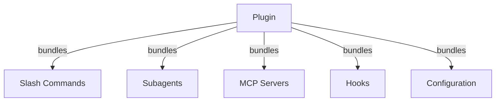
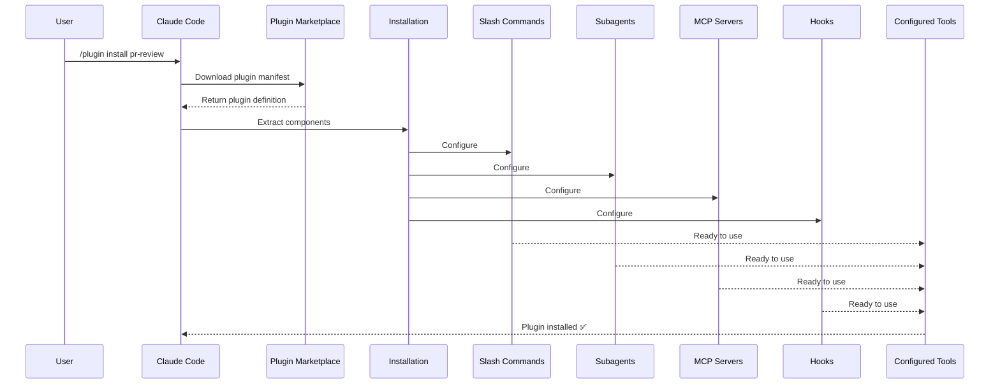
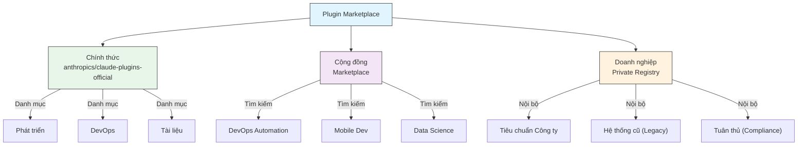
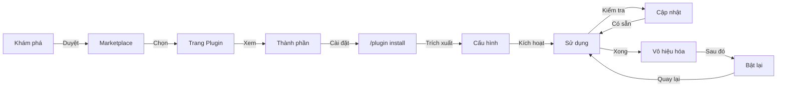
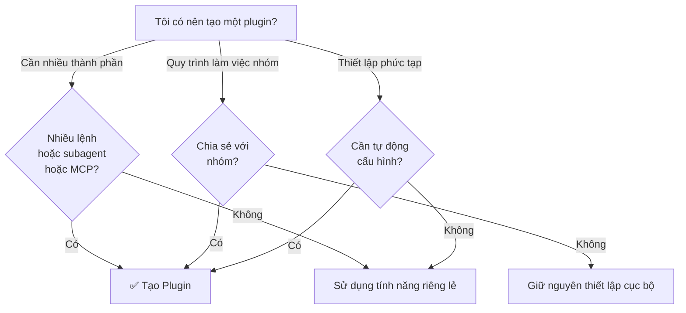

<picture>
  <source media="(prefers-color-scheme: dark)" srcset="../resources/logos/claude-howto-logo-dark.svg">
  
</picture>

# Claude Code Plugins

Thư mục này chứa các ví dụ plugin hoàn chỉnh, đóng gói nhiều tính năng của Claude Code thành các gói có thể cài đặt và hoạt động thống nhất.

## Tổng quan

Claude Code Plugins là các bộ sưu tập tùy chỉnh (slash command, subagent, MCP server và hook) được đóng gói để cài đặt chỉ với một lệnh duy nhất. Chúng đại diện cho cơ chế mở rộng cấp cao nhất—kết hợp nhiều tính năng thành các gói thống nhất và có thể chia sẻ.

## Kiến trúc Plugin



## Quy trình tải Plugin



## Các loại Plugin & Phân phối

| Loại | Phạm vi | Chia sẻ | Thẩm quyền | Ví dụ |
|------|---------|---------|------------|-------|
| Chính thức (Official) | Toàn cầu | Mọi người dùng | Anthropic | PR Review, Security Guidance |
| Cộng đồng (Community) | Công khai | Mọi người dùng | Cộng đồng | DevOps, Data Science |
| Tổ chức (Organization) | Nội bộ | Thành viên nhóm | Công ty | Tiêu chuẩn nội bộ, công cụ |
| Cá nhân (Personal) | Cá nhân | Một người dùng | Nhà phát triển | Workflow tùy chỉnh |

## Cấu trúc định nghĩa Plugin

Manifest của plugin sử dụng định dạng JSON trong tệp `.claude-plugin/plugin.json`:

```json
{
  "name": "my-first-plugin",
  "description": "A greeting plugin",
  "version": "1.0.0",
  "author": {
    "name": "Your Name"
  },
  "homepage": "https://example.com",
  "repository": "https://github.com/user/repo",
  "license": "MIT"
}
```

## Ví dụ cấu trúc Plugin

```
my-plugin/
├── .claude-plugin/
│   └── plugin.json       # Manifest (tên, mô tả, phiên bản, tác giả)
├── commands/             # Các Skill dưới dạng tệp Markdown
│   ├── task-1.md
│   ├── task-2.md
│   └── workflows/
├── agents/               # Các định nghĩa agent tùy chỉnh
│   ├── specialist-1.md
│   ├── specialist-2.md
│   └── configs/
├── skills/               # Agent Skill với các tệp SKILL.md
│   ├── skill-1.md
│   └── skill-2.md
├── hooks/                # Các trình xử lý sự kiện trong hooks.json
│   └── hooks.json
├── .mcp.json             # Cấu hình MCP server
├── .lsp.json             # Cấu hình LSP server
├── settings.json         # Các cài đặt mặc định
├── templates/
│   └── issue-template.md
├── scripts/
│   ├── helper-1.sh
│   └── helper-2.py
├── docs/
│   ├── README.md
│   └── USAGE.md
└── tests/
    └── plugin.test.js
```

### Cấu hình LSP server

Các plugin có thể bao gồm hỗ trợ Giao thức Máy chủ Ngôn ngữ (Language Server Protocol - LSP) để cung cấp trí tuệ mã nguồn theo thời gian thực. Các máy chủ LSP cung cấp chẩn đoán lỗi, điều hướng mã và thông tin biểu tượng khi bạn làm việc.

**Vị trí cấu hình**:
- Tệp `.lsp.json` trong thư mục gốc của plugin
- Khóa `lsp` nội tuyến trong `plugin.json`

#### Tham chiếu các trường

| Trường | Bắt buộc | Mô tả |
|-------|----------|-------------|
| `command` | Có | Tệp nhị phân của LSP server (phải nằm trong PATH) |
| `extensionToLanguage` | Có | Ánh xạ phần mở rộng tệp sang ID ngôn ngữ |
| `args` | Không | Các đối số dòng lệnh cho server |
| `transport` | Không | Phương thức giao tiếp: `stdio` (mặc định) hoặc `socket` |
| `env` | Không | Các biến môi trường cho tiến trình server |
| `initializationOptions` | Không | Các tùy chọn được gửi trong lúc khởi tạo LSP |
| `settings` | Không | Cấu hình workspace được chuyển cho server |
| `workspaceFolder` | Không | Ghi đè đường dẫn thư mục workspace |
| `startupTimeout` | Không | Thời gian tối đa (ms) chờ server khởi động |
| `shutdownTimeout` | Không | Thời gian tối đa (ms) để tắt server một cách an toàn |
| `restartOnCrash` | Không | Tự động khởi động lại nếu server bị treo |
| `maxRestarts` | Không | Số lần thử khởi động lại tối đa trước khi từ bỏ |

#### Ví dụ cấu hình

**Go (gopls)**:

```json
{
  "go": {
    "command": "gopls",
    "args": ["serve"],
    "extensionToLanguage": {
      ".go": "go"
    }
  }
}
```

**Python (pyright)**:

```json
{
  "python": {
    "command": "pyright-langserver",
    "args": ["--stdio"],
    "extensionToLanguage": {
      ".py": "python",
      ".pyi": "python"
    }
  }
}
```

**TypeScript**:

```json
{
  "typescript": {
    "command": "typescript-language-server",
    "args": ["--stdio"],
    "extensionToLanguage": {
      ".ts": "typescript",
      ".tsx": "typescriptreact",
      ".js": "javascript",
      ".jsx": "javascriptreact"
    }
  }
}
```

#### Các LSP plugin có sẵn

Marketplace chính thức bao gồm các LSP plugin đã được cấu hình sẵn:

| Plugin | Ngôn ngữ | Tệp nhị phân Server | Lệnh cài đặt |
|--------|----------|---------------|----------------|
| `pyright-lsp` | Python | `pyright-langserver` | `pip install pyright` |
| `typescript-lsp` | TypeScript/JavaScript | `typescript-language-server` | `npm install -g typescript-language-server typescript` |
| `rust-lsp` | Rust | `rust-analyzer` | Cài đặt qua `rustup component add rust-analyzer` |

#### Khả năng của LSP

Sau khi được cấu hình, các LSP server cung cấp:

- **Chẩn đoán tức thì** — các lỗi và cảnh báo xuất hiện ngay sau khi chỉnh sửa
- **Điều hướng mã** — đi đến định nghĩa (go to definition), tìm tham chiếu, bản thực thi
- **Thông tin khi di chuột (Hover)** — chữ ký kiểu (type signatures) và tài liệu khi di chuột qua
- **Liệt kê biểu tượng** — duyệt các biểu tượng trong tệp hiện tại hoặc workspace

## Tùy chọn Plugin (v2.1.83+)

Các plugin có thể khai báo các tùy chọn mà người dùng có thể cấu hình trong manifest thông qua `userConfig`. Các giá trị được đánh dấu `sensitive: true` sẽ được lưu trữ trong keychain của hệ thống thay vì các tệp cài đặt dạng văn bản thuần túy:

```json
{
  "name": "my-plugin",
  "version": "1.0.0",
  "userConfig": {
    "apiKey": {
      "description": "API key cho dịch vụ",
      "sensitive": true
    },
    "region": {
      "description": "Vùng triển khai (Region)",
      "default": "us-east-1"
    }
  }
}
```

## Dữ liệu Plugin bền vững (`${CLAUDE_PLUGIN_DATA}`) (v2.1.78+)

Các plugin có quyền truy cập vào một thư mục trạng thái bền vững thông qua biến môi trường `${CLAUDE_PLUGIN_DATA}`. Thư mục này là duy nhất cho mỗi plugin và tồn tại qua các phiên làm việc, phù hợp để lưu trữ bộ nhớ đệm (cache), cơ sở dữ liệu và các trạng thái bền vững khác:

```json
{
  "hooks": {
    "PostToolUse": [
      {
        "command": "node ${CLAUDE_PLUGIN_DATA}/track-usage.js"
      }
    ]
  }
}
```

Thư mục này được tạo tự động khi plugin được cài đặt. Các tệp được lưu trữ ở đây sẽ tồn tại cho đến khi plugin bị gỡ cài đặt.

## Plugin nội tuyến qua Cài đặt (`source: 'settings'`) (v2.1.80+)

Các plugin có thể được định nghĩa nội tuyến (inline) trong các tệp cài đặt như các mục marketplace bằng cách sử dụng trường `source: 'settings'`. Điều này cho phép nhúng định nghĩa plugin trực tiếp mà không yêu cầu một kho lưu trữ riêng biệt hoặc marketplace:

```json
{
  "pluginMarketplaces": [
    {
      "name": "inline-tools",
      "source": "settings",
      "plugins": [
        {
          "name": "quick-lint",
          "source": "./local-plugins/quick-lint"
        }
      ]
    }
  ]
}
```

## Cài đặt Plugin

Các plugin có thể đi kèm một tệp `settings.json` để cung cấp cấu hình mặc định. Hiện tại tệp này hỗ trợ khóa `agent`, dùng để thiết lập agent luồng chính cho plugin:

```json
{
  "agent": "agents/specialist-1.md"
}
```

Khi một plugin bao gồm `settings.json`, các giá trị mặc định của nó sẽ được áp dụng khi cài đặt. Người dùng có thể ghi đè các cài đặt này trong cấu hình dự án hoặc cấu hình người dùng của riêng họ.

## So sánh phương pháp Standalone và Plugin

| Phương pháp | Tên lệnh | Cấu hình | Phù hợp nhất cho |
|----------|---------------|---|---|
| **Standalone** | `/hello` | Thiết lập thủ cấu hình trong CLAUDE.md | Cá nhân, dự án cụ thể |
| **Plugins** | `/plugin-name:hello` | Tự động hóa qua plugin.json | Chia sẻ, phân phối, sử dụng trong nhóm |

Sử dụng **standalone slash commands** cho các quy trình làm việc cá nhân nhanh chóng. Sử dụng **plugins** khi bạn muốn đóng gói nhiều tính năng, chia sẻ với nhóm hoặc công bố để phân phối rộng rãi.

## Các ví dụ thực tế

### Ví dụ 1: Plugin PR Review (Đánh giá PR)

**Tệp:** `.claude-plugin/plugin.json`

```json
{
  "name": "pr-review",
  "version": "1.0.0",
  "description": "Toàn bộ quy trình đánh giá PR với bảo mật, kiểm thử và tài liệu",
  "author": {
    "name": "Anthropic"
  },
  "repository": "https://github.com/anthropic/pr-review",
  "license": "MIT"
}
```

**Tệp:** `commands/review-pr.md`

```markdown
---
name: Review PR
description: Bắt đầu đánh giá PR toàn diện với các kiểm tra bảo mật và kiểm thử
---

# PR Review

Lệnh này khởi động một quy trình đánh giá pull request đầy đủ bao gồm:

1. Phân tích bảo mật
2. Xác minh độ bao phủ kiểm thử (test coverage)
3. Cập nhật tài liệu
4. Kiểm tra chất lượng mã nguồn
5. Đánh giá tác động hiệu năng
```

**Tệp:** `agents/security-reviewer.md`

```yaml
---
name: security-reviewer
description: Đánh giá mã nguồn tập trung vào bảo mật
tools: read, grep, diff
---

# Security Reviewer

Chuyên tìm kiếm các lỗ hổng bảo mật:
- Các vấn đề xác thực/phân quyền (AuthN/AuthZ)
- Rò rỉ dữ liệu
- Các cuộc tấn công Injection
- Cấu hình bảo mật
```

**Cài đặt:**

```bash
/plugin install pr-review

# Kết quả:
# ✅ 3 slash command đã được cài đặt
# ✅ 3 subagent đã được cấu hình
# ✅ 2 MCP server đã được kết nối
# ✅ 4 hook đã được đăng ký
# ✅ Sẵn sàng sử dụng!
```

### Ví dụ 2: Plugin DevOps

**Các thành phần:**

```
devops-automation/
├── commands/
│   ├── deploy.md
│   ├── rollback.md
│   ├── status.md
│   └── incident.md
├── agents/
│   ├── deployment-specialist.md
│   ├── incident-commander.md
│   └── alert-analyzer.md
├── mcp/
│   ├── github-config.json
│   ├── kubernetes-config.json
│   └── prometheus-config.json
├── hooks/
│   ├── pre-deploy.js
│   ├── post-deploy.js
│   └── on-error.js
└── scripts/
    ├── deploy.sh
    ├── rollback.sh
    └── health-check.sh
```

### Ví dụ 3: Plugin Tài liệu (Documentation)

**Các thành phần đóng gói:**

```
documentation/
├── commands/
│   ├── generate-api-docs.md
│   ├── generate-readme.md
│   ├── sync-docs.md
│   └── validate-docs.md
├── agents/
│   ├── api-documenter.md
│   ├── code-commentator.md
│   └── example-generator.md
├── mcp/
│   ├── github-docs-config.json
│   └── slack-announce-config.json
└── templates/
    ├── api-endpoint.md
    ├── function-docs.md
    └── adr-template.md
```

## Plugin Marketplace (Chợ Plugin)

Thư mục plugin chính thức do Anthropic quản lý là `anthropics/claude-plugins-official`. Quản trị viên doanh nghiệp cũng có thể tạo các marketplace plugin riêng để phân phối nội bộ.



### Cấu hình Marketplace

Người dùng doanh nghiệp và người dùng nâng cao có thể kiểm soát hành vi của marketplace thông qua các cài đặt:

| Cài đặt | Mô tả |
|---------|-------------|
| `extraKnownMarketplaces` | Thêm các nguồn marketplace bổ sung ngoài các nguồn mặc định |
| `strictKnownMarketplaces` | Kiểm soát những marketplace nào người dùng được phép thêm vào |
| `deniedPlugins` | Danh sách chặn do quản trị viên quản lý để ngăn cài đặt các plugin cụ thể |

### Các tính năng bổ sung của Marketplace

- **Thời gian chờ git mặc định**: Tăng từ 30 giây lên 120 giây cho các kho lưu trữ plugin lớn.
- **npm registry tùy chỉnh**: Các plugin có thể chỉ định URL npm registry tùy chỉnh để giải quyết các phụ thuộc (dependencies).
- **Ghim phiên bản (Version pinning)**: Khóa các plugin ở các phiên bản cụ thể để đảm bảo môi trường có thể tái lập.

### Schema định nghĩa Marketplace

Các marketplace plugin được định nghĩa trong `.claude-plugin/marketplace.json`:

```json
{
  "name": "my-team-plugins",
  "owner": "my-org",
  "plugins": [
    {
      "name": "code-standards",
      "source": "./plugins/code-standards",
      "description": "Áp dụng các tiêu chuẩn mã nguồn của nhóm",
      "version": "1.2.0",
      "author": "platform-team"
    },
    {
      "name": "deploy-helper",
      "source": {
        "source": "github",
        "repo": "my-org/deploy-helper",
        "ref": "v2.0.0"
      },
      "description": "Các workflow tự động hóa triển khai"
    }
  ]
}
```

| Trường | Bắt buộc | Mô tả |
|-------|----------|-------------|
| `name` | Có | Tên marketplace ở dạng kebab-case |
| `owner` | Có | Tổ chức hoặc người dùng duy trì marketplace |
| `plugins` | Có | Mảng các mục plugin |
| `plugins[].name` | Có | Tên plugin (kebab-case) |
| `plugins[].source` | Có | Nguồn plugin (chuỗi đường dẫn hoặc đối tượng nguồn) |
| `plugins[].description` | Không | Mô tả ngắn gọn về plugin |
| `plugins[].version` | Không | Chuỗi phiên bản semantic (semver) |
| `plugins[].author` | Không | Tên tác giả plugin |

### Các loại nguồn Plugin

Plugin có thể được lấy từ nhiều vị trí khác nhau:

| Nguồn | Cú pháp | Ví dụ |
|--------|--------|---------|
| **Đường dẫn tương đối** | Chuỗi đường dẫn | `"./plugins/my-plugin"` |
| **GitHub** | `{ "source": "github", "repo": "owner/repo" }` | `{ "source": "github", "repo": "acme/lint-plugin", "ref": "v1.0" }` |
| **Git URL** | `{ "source": "url", "url": "..." }` | `{ "source": "url", "url": "https://git.internal/plugin.git" }` |
| **Thư mục con Git** | `{ "source": "git-subdir", "url": "...", "path": "..." }` | `{ "source": "git-subdir", "url": "https://github.com/org/monorepo.git", "path": "packages/plugin" }` |
| **npm** | `{ "source": "npm", "package": "..." }` | `{ "source": "npm", "package": "@acme/claude-plugin", "version": "^2.0" }` |
| **pip** | `{ "source": "pip", "package": "..." }` | `{ "source": "pip", "package": "claude-data-plugin", "version": ">=1.0" }` |

Các nguồn GitHub và git hỗ trợ các trường tùy chọn `ref` (nhánh/tag) và `sha` (mã băm commit) để ghim phiên bản.

### Phương thức phân phối

**GitHub (khuyến nghị)**:
```bash
# Người dùng thêm marketplace của bạn
/plugin marketplace add owner/repo-name
```

**Các dịch vụ git khác** (yêu cầu URL đầy đủ):
```bash
/plugin marketplace add https://gitlab.com/org/marketplace-repo.git
```

**Kho lưu trữ riêng tư (Private repositories)**: Được hỗ trợ thông qua git credential helpers hoặc token môi trường. Người dùng phải có quyền đọc kho lưu trữ.

**Gửi lên marketplace chính thức**: Gửi các plugin lên marketplace do Anthropic tuyển chọn để phân phối rộng rãi hơn.

### Chế độ Strict (Nghiêm ngặt)

Kiểm soát cách các định nghĩa marketplace tương tác với các tệp `plugin.json` cục bộ:

| Cài đặt | Hành vi |
|---------|----------|
| `strict: true` (mặc định) | Tệp `plugin.json` cục bộ là nguồn thẩm quyền chính; mục marketplace sẽ bổ sung cho nó |
| `strict: false` | Mục marketplace là toàn bộ định nghĩa của plugin |

**Hạn chế của tổ chức** với `strictKnownMarketplaces`:

| Giá trị | Hiệu quả |
|-------|--------|
| Không thiết lập | Không hạn chế — người dùng có thể thêm bất kỳ marketplace nào |
| Mảng rỗng `[]` | Khóa hoàn toàn — không cho phép thêm bất kỳ marketplace nào |
| Mảng các mẫu | Danh sách trắng (Allowlist) — chỉ những marketplace khớp mẫu mới được phép thêm |

```json
{
  "strictKnownMarketplaces": [
    "my-org/*",
    "github.com/trusted-vendor/*"
  ]
}
```

> **Cảnh báo**: Trong chế độ strict với `strictKnownMarketplaces`, người dùng chỉ có thể cài đặt các plugin từ những marketplace nằm trong danh sách trắng. Điều này hữu ích cho các môi trường doanh nghiệp yêu cầu kiểm soát việc phân phối plugin.

## Cài đặt Plugin & Vòng đời



## So sánh các tính năng Plugin

| Tính năng | Slash Command | Skill | Subagent | Plugin |
|---------|---------------|-------|----------|--------|
| **Cài đặt** | Sao chép thủ công | Sao chép thủ công | Cấu hình thủ công | Một lệnh duy nhất |
| **Thời gian thiết lập** | 5 phút | 10 phút | 15 phút | 2 phút |
| **Đóng gói** | Tệp đơn lẻ | Tệp đơn lẻ | Tệp đơn lẻ | Nhiều tệp |
| **Quản lý phiên bản** | Thủ công | Thủ công | Thủ công | Tự động |
| **Chia sẻ trong nhóm** | Sao chép tệp | Sao chép tệp | Sao chép tệp | ID Cài đặt |
| **Cập nhật** | Thủ công | Thủ công | Thủ công | Tự động có sẵn |
| **Phụ thuộc** | Không có | Không có | Không có | Có thể bao gồm |
| **Marketplace** | Không | Không | Không | Có |
| **Phân phối** | Kho lưu trữ | Kho lưu trữ | Kho lưu trữ | Marketplace |

## Các lệnh Plugin trong CLI

Tất cả các thao tác với plugin đều có sẵn dưới dạng các lệnh CLI:

```bash
claude plugin install <tên>@<marketplace>   # Cài đặt từ một marketplace
claude plugin uninstall <tên>               # Gỡ bỏ một plugin
claude plugin list                           # Liệt kê các plugin đã cài đặt
claude plugin enable <tên>                  # Bật một plugin đã bị vô hiệu hóa
claude plugin disable <tên>                 # Vô hiệu hóa một plugin
claude plugin validate                       # Kiểm tra cấu trúc plugin
```

## Các phương thức cài đặt

### Từ Marketplace
```bash
/plugin install tên-plugin
# hoặc từ CLI:
claude plugin install tên-plugin@tên-marketplace
```

### Bật / Vô hiệu hóa (với phạm vi tự động phát hiện)
```bash
/plugin enable tên-plugin
/plugin disable tên-plugin
```

### Plugin cục bộ (để phát triển)
```bash
# Cờ CLI để thử nghiệm cục bộ (có thể lặp lại cho nhiều plugin)
claude --plugin-dir ./đường/dẫn/đến/thư-mục-plugin
claude --plugin-dir ./plugin-a --plugin-dir ./plugin-b
```

### Từ Kho lưu trữ Git
```bash
/plugin install github:tên-người-dùng/tên-kho
```

## Khi nào nên tạo một Plugin



### Các trường hợp sử dụng Plugin

| Trường hợp sử dụng | Khuyến nghị | Tại sao |
|----------|-----------------|-----|
| **Onboarding cho nhóm** | ✅ Sử dụng Plugin | Thiết lập tức thì, đầy đủ cấu hình |
| **Thiết lập Framework** | ✅ Sử dụng Plugin | Đóng gói các lệnh dành riêng cho framework |
| **Tiêu chuẩn doanh nghiệp** | ✅ Sử dụng Plugin | Phân phối tập trung, kiểm soát phiên bản |
| **Tự động hóa tác vụ nhanh** | ❌ Sử dụng Lệnh | Quá phức tạp mức cần thiết |
| **Chuyên môn hóa một lĩnh vực** | ❌ Sử dụng Skill | Quá nặng nề, hãy sử dụng skill |
| **Phân tích chuyên sâu** | ❌ Sử dụng Subagent | Tạo thủ công hoặc sử dụng skill |
| **Truy cập dữ liệu trực tiếp** | ❌ Sử dụng MCP | Hoạt động độc lập, không cần đóng gói |

## Thử nghiệm Plugin

Trước khi công bố, hãy thử nghiệm plugin của bạn cục bộ bằng cách sử dụng cờ CLI `--plugin-dir` (có thể lặp lại cho nhiều plugin):

```bash
claude --plugin-dir ./my-plugin
claude --plugin-dir ./my-plugin --plugin-dir ./another-plugin
```

Điều này sẽ khởi chạy Claude Code với plugin của bạn đã được tải, cho phép bạn:
- Xác minh tất cả các slash command có sẵn
- Kiểm tra các subagent và agent hoạt động chính xác
- Xác nhận các MCP server kết nối đúng cách
- Kiểm tra việc thực thi hook
- Kiểm tra các cấu hình LSP server
- Kiểm tra bất kỳ lỗi cấu hình nào

## Hot-Reload (Tải lại nóng)

Các plugin hỗ trợ hot-reload trong quá trình phát triển. Khi bạn chỉnh sửa các tệp plugin, Claude Code có thể tự động phát hiện các thay đổi. Bạn cũng có thể ép buộc tải lại bằng lệnh:

```bash
/reload-plugins
```

4. Test locally with `claude --plugin-dir ./my-plugin`
5. Submit to plugin marketplace
6. Get reviewed and approved
7. Published on marketplace
8. Users can install with one command

**Example submission:**

```markdown
# PR Review Plugin

## Description
Complete PR review workflow with security, testing, and documentation checks.

## What's Included
- 3 slash commands for different review types
- 3 specialized subagents
- GitHub and CodeQL MCP integration
- Automated security scanning hooks

## Installation
```bash
/plugin install pr-review
```

## Features
✅ Security analysis
✅ Test coverage checking
✅ Documentation verification
✅ Code quality assessment
✅ Performance impact analysis

## Usage
```bash
/review-pr
/check-security
/check-tests
```

## Requirements
- Claude Code 1.0+
- GitHub access
- CodeQL (optional)
```

## Plugin vs Manual Configuration

**Manual Setup (2+ hours):**
- Tag appropriately for discovery
- Maintain backward compatibility
- Keep plugins focused and cohesive
- Include comprehensive tests
- Document all dependencies

### Don'ts ❌
- Don't bundle unrelated features
- Don't hardcode credentials
- Don't skip testing
- Don't forget documentation
- Don't create redundant plugins
- Don't ignore versioning
- Don't overcomplicate component dependencies
- Don't forget to handle errors gracefully

## Installation Instructions

### Installing from Marketplace

1. **Browse available plugins:**
   ```bash
   /plugin list
   ```

2. **View plugin details:**
   ```bash
   /plugin info plugin-name
   ```

3. **Install a plugin:**
   ```bash
   /plugin install plugin-name
   ```

### Installing from Local Path

```bash
/plugin install ./path/to/plugin-directory
```

### Installing from GitHub

```bash
/plugin install github:username/repo
```

### Listing Installed Plugins

```bash
/plugin list --installed
```

### Updating a Plugin

```bash
/plugin update plugin-name
```

### Disabling/Enabling a Plugin

```bash
# Temporarily disable
/plugin disable plugin-name

# Re-enable
/plugin enable plugin-name
```

### Uninstalling a Plugin

```bash
/plugin uninstall plugin-name
```

## Related Concepts

The following Claude Code features work together with plugins:

- **[Slash Commands](../01-slash-commands/)** - Individual commands bundled in plugins
- **[Memory](../02-memory/)** - Persistent context for plugins
- **[Skills](../03-skills/)** - Domain expertise that can be wrapped into plugins
- **[Subagents](../04-subagents/)** - Specialized agents included as plugin components
- **[MCP Servers](../05-mcp/)** - Model Context Protocol integrations bundled in plugins
- **[Hooks](../06-hooks/)** - Event handlers that trigger plugin workflows

## Complete Example Workflow

### PR Review Plugin Full Workflow

```
1. User: /review-pr

2. Plugin executes:
   ├── pre-review.js hook validates git repo
   ├── GitHub MCP fetches PR data
   ├── security-reviewer subagent analyzes security
   ├── test-checker subagent verifies coverage
   └── performance-analyzer subagent checks performance

3. Results synthesized and presented:
   ✅ Security: No critical issues
   ⚠️  Testing: Coverage 65% (recommend 80%+)
   ✅ Performance: No significant impact
   📝 12 recommendations provided
```

## Troubleshooting

### Plugin Won't Install
- Check Claude Code version compatibility: `/version`
- Verify `plugin.json` syntax with a JSON validator
- Check internet connection (for remote plugins)
- Review permissions: `ls -la plugin/`

### Components Not Loading
- Verify paths in `plugin.json` match actual directory structure
- Check file permissions: `chmod +x scripts/`
- Review component file syntax
- Check logs: `/plugin debug plugin-name`

### MCP Connection Failed
- Verify environment variables are set correctly
- Check MCP server installation and health
- Test MCP connection independently with `/mcp test`
- Review MCP configuration in `mcp/` directory

### Commands Not Available After Install
- Ensure plugin was installed successfully: `/plugin list --installed`
- Check if plugin is enabled: `/plugin status plugin-name`
- Restart Claude Code: `exit` and reopen
- Check for naming conflicts with existing commands

### Hook Execution Issues
- Verify hook files have correct permissions
- Check hook syntax and event names
- Review hook logs for error details
- Test hooks manually if possible

## Additional Resources

- [Official Plugins Documentation](https://code.claude.com/docs/en/plugins)
- [Discover Plugins](https://code.claude.com/docs/en/discover-plugins)
- [Plugin Marketplaces](https://code.claude.com/docs/en/plugin-marketplaces)
- [Plugins Reference](https://code.claude.com/docs/en/plugins-reference)
- [MCP Server Reference](https://modelcontextprotocol.io/)
- [Subagent Configuration Guide](../04-subagents/README.md)
- [Hook System Reference](../06-hooks/README.md)
