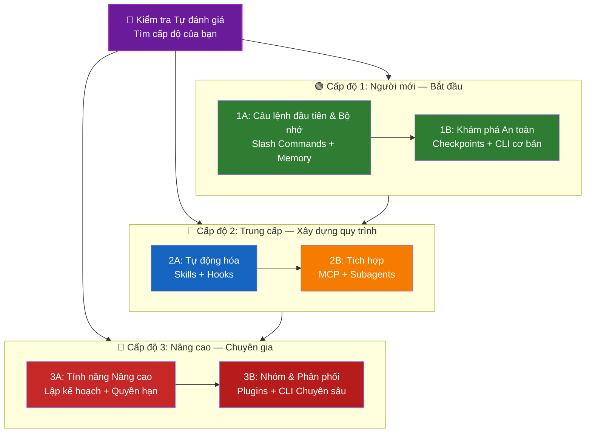

<picture>
  <source media="(prefers-color-scheme: dark)" srcset="resources/logos/claude-howto-logo-dark.svg">
  
</picture>

# 📚 Lộ trình học tập Claude Code

**Bạn mới sử dụng Claude Code?** Hướng dẫn này giúp bạn làm chủ các tính năng của Claude Code theo tốc độ của riêng mình. Dù bạn là người mới bắt đầu hay một nhà phát triển dày dạn kinh nghiệm, hãy bắt đầu với bài kiểm tra tự đánh giá dưới đây để tìm ra con đường phù hợp nhất với bạn.

---

## 🧭 Xác định cấp độ của bạn

Không phải ai cũng bắt đầu từ cùng một điểm. Hãy thực hiện bài tự đánh giá nhanh này để tìm điểm xuất phát phù hợp.

**Trả lời các câu hỏi sau một cách trung thực:**

- [ ] Tôi có thể khởi động Claude Code và thực hiện một cuộc hội thoại (`claude`)
- [ ] Tôi đã tạo hoặc chỉnh sửa tệp CLAUDE.md
- [ ] Tôi đã sử dụng ít nhất 3 slash commands có sẵn (ví dụ: /help, /compact, /model)
- [ ] Tôi đã tạo một slash command tùy chỉnh hoặc skill (SKILL.md)
- [ ] Tôi đã cấu hình một máy chủ MCP (ví dụ: GitHub, database)
- [ ] Tôi đã thiết lập hooks trong ~/.claude/settings.json
- [ ] Tôi đã tạo hoặc sử dụng subagents tùy chỉnh (.claude/agents/)
- [ ] Tôi đã sử dụng chế độ in (`claude -p`) cho kịch bản (scripting) hoặc CI/CD

**Cấp độ của bạn:**

| Số câu chọn | Cấp độ | Bắt đầu từ | Thời gian hoàn thành |
|--------|-------|----------|------------------|
| 0-2 | **Cấp độ 1: Người mới (Beginner)** — Bắt đầu | [Cột mốc 1A](#cột-mốc-1a-các-câu-lệnh-đầu-tiên--bộ-nhớ) | ~3 giờ |
| 3-5 | **Cấp độ 2: Trung cấp (Intermediate)** — Xây dựng quy trình | [Cột mốc 2A](#cột-mốc-2a-tự-động-hóa-skills--hooks) | ~5 giờ |
| 6-8 | **Cấp độ 3: Nâng cao (Advanced)** — Chuyên gia & Trưởng nhóm | [Cột mốc 3A](#cột-mốc-3a-các-tính-năng-nâng-cao) | ~5 giờ |

> **Mẹo**: Nếu bạn không chắc chắn, hãy bắt đầu thấp hơn một cấp độ. Xem lại tài liệu đã biết nhanh chóng vẫn tốt hơn là bỏ lỡ các khái niệm nền tảng.

> **Phiên bản tương tác**: Chạy `/self-assessment` trong Claude Code để thực hiện bài kiểm tra có hướng dẫn, tính điểm mức độ thành thạo của bạn trên cả 10 lĩnh vực tính năng và tạo ra một lộ trình học tập được cá nhân hóa.

---

## 🎯 Triết lý học tập

Các thư mục trong kho lưu trữ này được đánh số theo **thứ tự học tập khuyến nghị** dựa trên ba nguyên tắc chính:

1. **Sự phụ thuộc (Dependencies)** - Các khái niệm nền tảng được ưu tiên trước
2. **Độ phức tạp (Complexity)** - Các tính năng dễ học trước các tính năng nâng cao
3. **Tần suất sử dụng (Frequency of Use)** - Các tính năng phổ biến nhất được dạy sớm

Cách tiếp cận này đảm bảo bạn xây dựng được nền tảng vững chắc trong khi vẫn nhận được lợi ích về năng suất ngay lập tức.

---

## 🗺️ Lộ trình của bạn



**Chú giải màu sắc:**
- 💜 Tím: Bài kiểm tra Tự đánh giá
- 🟢 Xanh lá: Cấp độ 1 — Đường cho người mới
- 🔵 Xanh dương / 🟡 Vàng: Cấp độ 2 — Đường trung cấp
- 🔴 Đỏ: Cấp độ 3 — Đường nâng cao

---

## 📊 Bảng lộ trình chi tiết

| Bước | Tính năng | Độ phức tạp | Thời gian | Cấp độ | Phụ thuộc | Tại sao nên học | Lợi ích chính |
|------|---------|-----------|------|-------|--------------|----------------|--------------|
| **1** | [Slash Commands](01-slash-commands/) | ⭐ Mới bắt đầu | 30 phút | Cấp độ 1 | Không | Tăng năng suất nhanh chóng | Tự động hóa tức thì, tiêu chuẩn nhóm |
| **2** | [Memory](02-memory/) | ⭐⭐ Cơ bản+ | 45 phút | Cấp độ 1 | Không | Thiết yếu cho mọi tính năng | Ngữ cảnh bền vững, tùy chỉnh cá nhân |
| **3** | [Checkpoints](08-checkpoints/) | ⭐⭐ Trung cấp | 45 phút | Cấp độ 1 | Quản lý phiên | Khám phá an toàn | Thử nghiệm, khôi phục |
| **4** | [CLI cơ bản](10-cli/) | ⭐⭐ Cơ bản+ | 30 phút | Cấp độ 1 | Không | Cách dùng CLI cốt lõi | Chế độ tương tác & chế độ in |
| **5** | [Skills](03-skills/) | ⭐⭐ Trung cấp | 1 giờ | Cấp độ 2 | Slash Commands | Chuyên môn tự động | Khả năng tái sử dụng, tính nhất quán |
| **6** | [Hooks](06-hooks/) | ⭐⭐ Trung cấp | 1 giờ | Cấp độ 2 | Tools, Commands | Tự động hóa quy trình | Xác thực, kiểm soát chất lượng |
| **7** | [MCP](05-mcp/) | ⭐⭐⭐ Trung cấp+ | 1 giờ | Cấp độ 2 | Cấu hình | Truy cập dữ liệu thời gian thực | Tích hợp ngoại vi, APIs |
| **8** | [Subagents](04-subagents/) | ⭐⭐⭐ Trung cấp+ | 1.5 giờ | Cấp độ 2 | Memory, Commands | Xử lý tác vụ phức tạp | Ủy quyền, chuyên môn hóa |
| **9** | [Advanced Features](09-advanced-features/) | ⭐⭐⭐⭐⭐ Nâng cao | 2-3 giờ | Cấp độ 3 | Tất cả trước đó | Công cụ cho chuyên gia | Lập kế hoạch, Auto Mode, Channels, Voice, Quyền hạn |
| **10** | [Plugins](07-plugins/) | ⭐⭐⭐⭐ Nâng cao | 2 giờ | Cấp độ 3 | Tất cả trước đó | Giải pháp hoàn chỉnh | Triển khai cho nhóm, phân phối |
| **11** | [CLI chuyên sâu](10-cli/) | ⭐⭐⭐ Nâng cao | 1 giờ | Cấp độ 3 | Khuyến nghị: Tất cả | Làm chủ dòng lệnh | Scripting, CI/CD, tự động hóa |

**Tổng thời gian học tập**: ~11-13 giờ (hoặc nhảy đến cấp độ của bạn để tiết kiệm thời gian)

---

## 🟢 Cấp độ 1: Người mới (Beginner) — Bắt đầu

**Dành cho**: Người dùng chọn 0-2 câu trong bài kiểm tra
**Thời gian**: ~3 giờ
**Tập trung**: Hiệu quả tức thì, hiểu các kiến thức cơ bản
**Kết quả**: Người dùng hàng ngày thoải mái, sẵn sàng cho Cấp độ 2

### Cột mốc 1A: Các câu lệnh đầu tiên & Bộ nhớ

**Chủ đề**: Slash Commands + Memory
**Thời gian**: 1-2 giờ
**Độ phức tạp**: ⭐ Mới bắt đầu
**Mục tiêu**: Tăng năng suất ngay lập tức với các câu lệnh tùy chỉnh và ngữ cảnh bền vững

#### Những gì bạn sẽ đạt được
✅ Tạo các slash command tùy chỉnh cho các tác vụ lặp đi lặp lại
✅ Thiết lập bộ nhớ dự án cho các tiêu chuẩn nhóm
✅ Cấu hình các tùy chỉnh cá nhân
✅ Hiểu cách Claude tự động tải ngữ cảnh

#### Bài thực hành
```bash
# Bài 1: Cài đặt slash command đầu tiên
mkdir -p .claude/commands
cp 01-slash-commands/optimize.md .claude/commands/

# Bài 2: Tạo bộ nhớ dự án
cp 02-memory/project-CLAUDE.md ./CLAUDE.md

# Bài 3: Thử nghiệm
# Trong Claude Code, nhập: /optimize
```

#### Tiêu chí thành công
- [ ] Gọi thành công câu lệnh `/optimize`
- [ ] Claude nhớ các tiêu chuẩn dự án của bạn từ CLAUDE.md
- [ ] Bạn hiểu khi nào nên dùng slash command so với memory

#### Bước tiếp theo
Sau khi đã thoải mái, hãy đọc:
- [01-slash-commands/README.md](01-slash-commands/README.md)
- [02-memory/README.md](02-memory/README.md)

---

### Cột mốc 1B: Khám phá An toàn

**Chủ đề**: Checkpoints + CLI cơ bản
**Thời gian**: 1 giờ
**Độ phức tạp**: ⭐⭐ Cơ bản+
**Mục tiêu**: Học cách thử nghiệm an toàn và sử dụng các lệnh CLI cốt lõi

#### Những gì bạn sẽ đạt được
✅ Tạo và khôi phục checkpoint để thử nghiệm an toàn
✅ Hiểu sự khác biệt giữa chế độ tương tác (interactive) và chế độ in (print)
✅ Sử dụng các cờ (flags) và tùy chọn CLI cơ bản
✅ Xử lý tệp thông qua đường ống (piping)

#### Bài thực hành
```bash
# Bài 1: Thử quy trình checkpoint
# Trong Claude Code:
# Thực hiện một số thay đổi thử nghiệm, sau đó nhấn Esc+Esc hoặc dùng /rewind
# Chọn checkpoint trước khi thử nghiệm
# Chọn "Restore code and conversation" để quay lại

# Bài 2: Chế độ Interactive vs Print
claude "explain this project"           # Chế độ tương tác
claude -p "explain this function"       # Chế độ in (không tương tác)

# Bài 3: Xử lý nội dung tệp qua piping
cat error.log | claude -p "explain this error"
```

#### Tiêu chí thành công
- [ ] Đã tạo và quay lại một checkpoint
- [ ] Đã sử dụng cả chế độ tương tác và chế độ in
- [ ] Đã pipe nội dung tệp vào Claude để phân tích
- [ ] Hiểu khi nào nên dùng checkpoint để thử nghiệm an toàn

#### Bước tiếp theo
- Đọc: [08-checkpoints/README.md](08-checkpoints/README.md)
- Đọc: [10-cli/README.md](10-cli/README.md)
- **Sẵn sàng cho Cấp độ 2!** Tiến tới [Cột mốc 2A](#cột-mốc-2a-tự-động-hóa-skills--hooks)

---

## 🔵 Cấp độ 2: Trung cấp — Xây dựng quy trình

**Dành cho**: Người dùng chọn 3-5 câu trong bài kiểm tra
**Thời gian**: ~5 giờ
**Tập trung**: Tự động hóa, tích hợp, ủy quyền tác vụ
**Kết quả**: Các quy trình làm việc tự động, tích hợp bên ngoài, sẵn sàng cho Cấp độ 3

### Kiểm tra điều kiện tiên quyết
Trước khi bắt đầu Cấp độ 2, hãy đảm bảo bạn đã nắm vững các khái niệm Cấp độ 1:
- [ ] Có thể tạo và dùng slash commands ([01-slash-commands/](01-slash-commands/))
- [ ] Đã thiết lập bộ nhớ dự án qua CLAUDE.md ([02-memory/](02-memory/))
- [ ] Biết cách tạo và khôi phục checkpoint ([08-checkpoints/](08-checkpoints/))
- [ ] Có thể dùng `claude` và `claude -p` từ dòng lệnh ([10-cli/](10-cli/))

---

### Cột mốc 2A: Tự động hóa (Skills + Hooks)

**Chủ đề**: Skills + Hooks
**Thời gian**: 2-3 giờ
**Độ phức tạp**: ⭐⭐ Trung cấp
**Mục tiêu**: Tự động hóa các quy trình chung và kiểm tra chất lượng

#### Những gì bạn sẽ đạt được
✅ Tự động gọi các khả năng chuyên biệt với YAML frontmatter
✅ Thiết lập tự động hóa dựa trên sự kiện qua 25 sự kiện hook
✅ Sử dụng cả 4 loại hook (command, http, prompt, agent)
✅ Áp đặt các tiêu chuẩn chất lượng mã nguồn
✅ Tạo các hook tùy chỉnh cho quy trình của bạn

#### Bài thực hành
```bash
# Bài 1: Cài đặt một skill
cp -r 03-skills/code-review ~/.claude/skills/

# Bài 2: Thiết lập hooks
mkdir -p ~/.claude/hooks
cp 06-hooks/pre-tool-check.sh ~/.claude/hooks/
chmod +x ~/.claude/hooks/pre-tool-check.sh

# Bài 3: Cấu hình hooks trong cài đặt
# Thêm vào ~/.claude/settings.json:
{
  "hooks": {
    "PreToolUse": [
      {
        "matcher": "Bash",
        "hooks": [
          {
            "type": "command",
            "command": "~/.claude/hooks/pre-tool-check.sh"
          }
        ]
      }
    ]
  }
}
```

#### Tiêu chí thành công
- [ ] Skill review mã nguồn tự động được gọi khi phù hợp
- [ ] Hook PreToolUse chạy trước khi thực thi công cụ
- [ ] Bạn hiểu sự khác biệt giữa tự động gọi skill vs kích hoạt hook theo sự kiện

#### Bước tiếp theo
- Tạo skill tùy chỉnh của riêng bạn
- Thiết lập thêm các hook cho quy trình làm việc
- Đọc: [03-skills/README.md](03-skills/README.md)
- Đọc: [06-hooks/README.md](06-hooks/README.md)

---

### Cột mốc 2B: Tích hợp (MCP + Subagents)

**Chủ đề**: MCP + Subagents
**Thời gian**: 2-3 giờ
**Độ phức tạp**: ⭐⭐⭐ Trung cấp+
**Mục tiêu**: Tích hợp các dịch vụ bên ngoài và ủy quyền các tác vụ phức tạp

#### Những gì bạn sẽ đạt được
✅ Truy cập dữ liệu thời gian thực từ GitHub, cơ sở dữ liệu, v.v.
✅ Ủy quyền công việc cho các AI agents chuyên biệt
✅ Hiểu khi nào dùng MCP so với subagents
✅ Xây dựng các quy trình tích hợp

#### Bài thực hành
```bash
# Bài 1: Thiết lập GitHub MCP
export GITHUB_TOKEN="your_github_token"
claude mcp add github -- npx -y @modelcontextprotocol/server-github

# Bài 2: Kiểm tra tích hợp MCP
# Trong Claude Code: /mcp__github__list_prs

# Bài 3: Cài đặt subagents
mkdir -p .claude/agents
cp 04-subagents/*.md .claude/agents/
```

#### Bài tập tích hợp
Thử quy trình hoàn chỉnh này:
1. Dùng MCP để lấy một PR từ GitHub
2. Để Claude ủy quyền việc review cho subagent code-reviewer
3. Dùng hooks để chạy các bài test tự động

#### Tiêu chí thành công
- [ ] Truy vấn thành công dữ liệu GitHub qua MCP
- [ ] Claude ủy quyền các tác vụ phức tạp cho subagents
- [ ] Hiểu sự khác biệt giữa MCP và subagents
- [ ] Kết hợp được MCP + subagents + hooks trong một quy trình

#### Bước tiếp theo
- Thiết lập thêm các máy chủ MCP (database, Slack, v.v.)
- Tạo subagents tùy chỉnh cho lĩnh vực của bạn
- Đọc: [05-mcp/README.md](05-mcp/README.md)
- Đọc: [04-subagents/README.md](04-subagents/README.md)
- **Sẵn sàng cho Cấp độ 3!** Tiến tới [Cột mốc 3A](#cột-mốc-3a-các-tính-năng-nâng-cao)

---

## 🔴 Cấp độ 3: Nâng cao — Chuyên gia & Trưởng nhóm

**Dành cho**: Người dùng chọn 6-8 câu trong bài kiểm tra
**Thời gian**: ~5 giờ
**Tập trung**: Công cụ cho nhóm, CI/CD, tính năng doanh nghiệp, phát triển plugin
**Kết quả**: Chuyên gia sử dụng, có thể thiết lập quy trình cho nhóm và CI/CD

### Kiểm tra điều kiện tiên quyết
Trước khi bắt đầu cấp độ 3, hãy đảm bảo bạn đã nắm vững các khái niệm Cấp độ 2:
- [ ] Có thể tạo và dùng skills với tính năng tự động gọi ([03-skills/](03-skills/))
- [ ] Đã thiết lập hooks cho tự động hóa dựa trên sự kiện ([06-hooks/](06-hooks/))
- [ ] Có thể cấu hình máy chủ MCP cho dữ liệu bên ngoài ([05-mcp/](05-mcp/))
- [ ] Biết cách dùng subagents để ủy quyền tác vụ ([04-subagents/](04-subagents/))

---

### Cột mốc 3A: Các tính năng nâng cao

**Chủ đề**: Các tính năng nâng cao (Planning, Permissions, Extended Thinking, Auto Mode, Channels, Voice, Remote/Desktop/Web)
**Thời gian**: 2-3 giờ
**Độ phức tạp**: ⭐⭐⭐⭐⭐ Nâng cao
**Mục tiêu**: Làm chủ các quy trình nâng cao và công cụ cho chuyên gia

#### Những gì bạn sẽ đạt được
✅ Chế độ lập kế hoạch (Planning mode) cho các tính năng phức tạp
✅ Kiểm soát quyền hạn chi tiết với 6 chế độ
✅ Tư duy mở rộng (Extended thinking) qua phím tắt Alt+T / Option+T
✅ Quản lý tác vụ chạy nền
✅ Auto Memory cho các tùy chỉnh đã học được
✅ Auto Mode với bộ phân loại an toàn chạy nền
✅ Channels cho các quy trình làm việc đa phiên có cấu trúc
✅ Đọc chính tả bằng giọng nói (Voice Dictation)
✅ Điều khiển từ xa (Remote control), ứng dụng máy tính và phiên trên web
✅ Đội ngũ Agent (Agent Teams) để cộng tác đa agent

#### Bài thực hành
```bash
# Bài 1: Sử dụng chế độ lập kế hoạch
/plan Triển khai hệ thống xác thực người dùng

# Bài 2: Thử các chế độ quyền hạn (6 chế độ: default, acceptEdits, plan, auto, dontAsk, bypassPermissions)
claude --permission-mode plan "phân tích mã nguồn này"
claude --permission-mode acceptEdits "tái cấu trúc module auth"

# Bài 3: Bật tư duy mở rộng (Extended thinking)
# Nhấn Alt+T (Option+T trên macOS) trong phiên làm việc để bật/tắt

# Bài 4: Chế độ Auto Mode
claude --permission-mode auto "triển khai trang cài đặt người dùng"
```

#### Tiêu chí thành công
- [ ] Đã dùng chế độ lập kế hoạch cho một tính năng phức tạp
- [ ] Đã cấu hình các chế độ quyền hạn phù hợp (plan, acceptEdits, auto...)
- [ ] Đã bật/tắt tư duy mở rộng bằng phím tắt
- [ ] Đã dùng auto mode với bộ phân loại an toàn chạy nền
- [ ] Hiểu về Remote Control, Desktop App, và Web sessions
- [ ] Đã thử nghiệm Đội ngũ Agent cho các tác vụ cộng tác

#### Bước tiếp theo
- Đọc: [09-advanced-features/README.md](09-advanced-features/README.md)

---

### Cột mốc 3B: Nhóm & Phân phối (Plugins + CLI Chuyên sâu)

**Chủ đề**: Plugins + CLI chuyên sâu + CI/CD
**Thời gian**: 2-3 giờ
**Độ phức tạp**: ⭐⭐⭐⭐ Nâng cao
**Mục tiêu**: Xây dựng công cụ cho nhóm, tạo plugins, làm chủ tích hợp CI/CD

#### Những gì bạn sẽ đạt được
✅ Cài đặt và tạo các plugins đóng gói hoàn chỉnh
✅ Làm chủ CLI cho kịch bản và tự động hóa
✅ Thiết lập tích hợp CI/CD với `claude -p`
✅ Đầu ra định dạng JSON cho các pipeline tự động
✅ Quản lý phiên làm việc và xử lý hàng loạt (batch)

#### Bài thực hành
```bash
# Bài 1: Cài đặt một plugin hoàn chỉnh
# Trong Claude Code: /plugin install pr-review

# Bài 2: Chế độ Print cho CI/CD
claude -p "Chạy tất cả test và tạo báo cáo"

# Bài 3: Đầu ra JSON cho các kịch bản
claude -p --output-format json "liệt kê tất cả các hàm"

# Bài 4: Quản lý và tiếp tục phiên làm việc
claude -r "feature-auth" "tiếp tục triển khai"
```

#### Tiêu chí thành công
- [ ] Đã cài đặt và sử dụng thành công một plugin
- [ ] Đã xây dựng hoặc sửa đổi một plugin cho nhóm của bạn
- [ ] Đã dùng chế độ in (`claude -p`) trong CI/CD
- [ ] Đã tạo đầu ra JSON cho lập trình kịch bản
- [ ] Đã tích hợp Claude vào một quy trình CI/CD

#### Bước tiếp theo
- Đọc: [07-plugins/README.md](07-plugins/README.md)
- Đọc: [10-cli/README.md](10-cli/README.md)
- Tạo các phím tắt CLI và plugins dùng chung cho toàn nhóm

---

## 🧪 Kiểm tra kiến thức của bạn

Kho lưu trữ này bao gồm hai skill tương tác mà bạn có thể dùng bất cứ lúc nào trong Claude Code để đánh giá sự hiểu biết của mình:

| Skill | Câu lệnh | Mục đích |
|-------|---------|---------|
| **Self-Assessment** | `/self-assessment` | Đánh giá mức độ thành thạo tổng thể trên cả 10 tính năng. Chọn chế độ Nhanh (2 phút) hoặc Sâu (5 phút) để nhận hồ sơ kỹ năng và lộ trình học tập. |
| **Lesson Quiz** | `/lesson-quiz [lesson]` | Kiểm tra sự hiểu biết của bạn về một bài học cụ thể với 10 câu hỏi. Dùng trước bài học (pre-test), trong lúc học (kiểm tra tiến độ), hoặc sau đó (xác nhận thành thạo). |

---

## ⚡ Các con đường bắt đầu nhanh

### Nếu bạn chỉ có 15 phút
**Mục tiêu**: Có được kết quả đầu tiên
1. Sao chép một slash command: `cp 01-slash-commands/optimize.md .claude/commands/`
2. Thử trong Claude Code: `/optimize`
3. Đọc: [01-slash-commands/README.md](01-slash-commands/README.md)

### Nếu bạn có 1 giờ
**Mục tiêu**: Thiết lập các công cụ năng suất thiết yếu
1. **Slash commands** (15 phút): Sao chép và thử `/optimize` và `/pr`
2. **Project memory** (15 phút): Tạo CLAUDE.md với các tiêu chuẩn dự án của bạn
3. **Cài đặt skill** (15 phút): Thiết lập skill code-review
4. **Thử nghiệm kết hợp** (15 phút): Xem cách chúng hoạt động cùng nhau

---

## 💡 Mẹo học tập

### ✅ Nên làm
- **Làm bài kiểm tra trước** để tìm điểm bắt đầu
- **Hoàn thành các bài tập thực hành** cho mỗi cột mốc
- **Bắt đầu đơn giản** và tăng dần độ phức tạp
- **Thử nghiệm an toàn** bằng cách dùng checkpoints
- **Chia sẻ kiến thức** với nhóm của bạn

### ❌ Không nên
- **Bỏ qua kiểm tra điều kiện tiên quyết** khi nhảy lên cấp độ cao hơn
- **Cố gắng học mọi thứ cùng lúc** - sẽ dễ bị ngợp
- **Sao chép cấu hình mà không hiểu** - bạn sẽ không biết cách gỡ lỗi
- **Quên kiểm tra lại** - luôn xác nhận các tính năng hoạt động đúng

---

## 📈 Theo dõi tiến độ

Dùng các danh sách này để theo dõi tiến độ của bạn.

### 🟢 Cấp độ 1: Người mới
- [ ] Hoàn thành [01-slash-commands](01-slash-commands/)
- [ ] Hoàn thành [02-memory](02-memory/)
- [ ] Tạo được slash command tùy chỉnh đầu tiên
- [ ] Thiết lập được project memory
- [ ] Hoàn thành [08-checkpoints](08-checkpoints/)
- [ ] Hoàn thành kiến thức cơ bản [10-cli](10-cli/)

### 🔵 Cấp độ 2: Trung cấp
- [ ] Hoàn thành [03-skills](03-skills/)
- [ ] Hoàn thành [06-hooks](06-hooks/)
- [ ] Cài đặt được skill đầu tiên
- [ ] Thiết lập được hook PreToolUse
- [ ] Hoàn thành [05-mcp](05-mcp/)
- [ ] Hoàn thành [04-subagents](04-subagents/)

### 🔴 Cấp độ 3: Nâng cao
- [ ] Hoàn thành [09-advanced-features](09-advanced-features/)
- [ ] Sử dụng thành công chế độ lập kế hoạch
- [ ] Cấu hình các chế độ quyền (bao gồm auto)
- [ ] Hoàn thành [07-plugins](07-plugins/)
- [ ] Hoàn thành [10-cli](10-cli/) nâng cao
- [ ] Tích hợp được Claude vào pipeline CI/CD

---

## 🎯 Tiếp theo là gì sau khi hoàn thành?

Khi bạn đã hoàn thành tất cả các cột mốc:
1. **Tạo tài liệu cho nhóm** - Viết hướng dẫn thiết lập Claude Code cho nhóm của bạn
2. **Xây dựng plugins tùy chỉnh** - Đóng gói các quy trình làm việc của nhóm
3. **Khám phá Auto Mode** - Để Claude làm việc tự trị với bộ phân loại an toàn
4. **Chia sẻ ví dụ** - Chia sẻ các cấu hình hữu ích với cộng đồng
5. **Hướng dẫn người khác** - Giúp đồng nghiệp cùng học tập

---

## 📚 Tài nguyên bổ sung
- [Tài liệu Claude Code](https://code.claude.com/docs/en/overview)
- [Tài liệu Anthropic](https://docs.anthropic.com)
- [Đặc tả Giao thức MCP](https://modelcontextprotocol.io)

---

**Cập nhật cuối**: Tháng 3 năm 2026
**Duy trì bởi**: Những người đóng góp Claude How-To
**Giấy phép**: Mục đích giáo dục, tự do sử dụng và điều chỉnh

---

[← Quay lại README chính](README.md)
