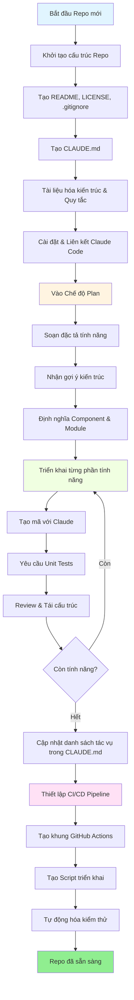
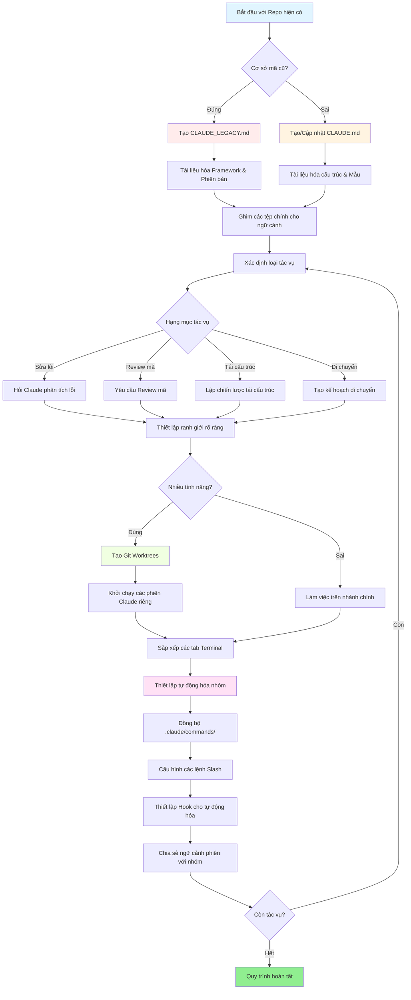

<picture>
  <source media="(prefers-color-scheme: dark)" srcset="resources/logos/claude-howto-logo-dark.svg">
  
</picture>

# Danh sách các tài nguyên hữu ích

## Tài liệu chính thức

| Tài nguyên | Mô tả | Liên kết |
|----------|-------------|------|
| Claude Code Docs | Tài liệu chính thức của Claude Code | [code.claude.com/docs/en/overview](https://code.claude.com/docs/en/overview) |
| Anthropic Docs | Tài liệu đầy đủ của Anthropic | [docs.anthropic.com](https://docs.anthropic.com) |
| MCP Protocol | Đặc tả giao thức Model Context Protocol | [modelcontextprotocol.io](https://modelcontextprotocol.io) |
| MCP Servers | Các triển khai máy chủ MCP chính thức | [github.com/modelcontextprotocol/servers](https://github.com/modelcontextprotocol/servers) |
| Anthropic Cookbook | Ví dụ mã và hướng dẫn | [github.com/anthropics/anthropic-cookbook](https://github.com/anthropics/anthropic-cookbook) |
| Claude Code Skills | Kho lưu trữ skill của cộng đồng | [github.com/anthropics/skills](https://github.com/anthropics/skills) |
| Agent Teams | Điều phối và cộng tác đa agent | [code.claude.com/docs/en/agent-teams](https://code.claude.com/docs/en/agent-teams) |
| Scheduled Tasks | Các tác vụ định kỳ với /loop và cron | [code.claude.com/docs/en/scheduled-tasks](https://code.claude.com/docs/en/scheduled-tasks) |
| Chrome Integration | Tự động hóa trình duyệt | [code.claude.com/docs/en/chrome](https://code.claude.com/docs/en/chrome) |
| Keybindings | Tùy chỉnh phím tắt | [code.claude.com/docs/en/keybindings](https://code.claude.com/docs/en/keybindings) |
| Desktop App | Ứng dụng máy tính bản ngữ | [code.claude.com/docs/en/desktop](https://code.claude.com/docs/en/desktop) |
| Remote Control | Điều khiển phiên làm việc từ xa | [code.claude.com/docs/en/remote-control](https://code.claude.com/docs/en/remote-control) |
| Auto Mode | Quản lý quyền tự động | [code.claude.com/docs/en/auto-mode](https://code.claude.com/docs/en/auto-mode) |
| Channels | Truyền thông đa kênh | [code.claude.com/docs/en/channels](https://code.claude.com/docs/en/channels) |
| Voice Dictation | Nhập liệu bằng giọng nói cho Claude Code | [code.claude.com/docs/en/voice-dictation](https://code.claude.com/docs/en/voice-dictation) |

## Blog kỹ thuật của Anthropic

| Bài viết | Mô tả | Liên kết |
|---------|-------------|------|
| Thực thi mã với MCP | Cách giải quyết vấn đề đầy ngữ cảnh MCP bằng thực thi mã — giảm 98.7% token | [anthropic.com/engineering/code-execution-with-mcp](https://www.anthropic.com/engineering/code-execution-with-mcp) |

---

## Làm chủ Claude Code trong 30 phút

_Video_: https://www.youtube.com/watch?v=6eBSHbLKuN0

_**Tất cả các mẹo**_
- **Khám phá các tính năng nâng cao và phím tắt**
  - Thường xuyên kiểm tra các tính năng chỉnh sửa mã và ngữ cảnh mới của Claude trong ghi chú phát hành của họ.
  - Học các phím tắt để chuyển đổi nhanh giữa các chế độ chat, tệp và trình soạn thảo.

- **Thiết lập hiệu quả**
  - Tạo các phiên làm việc theo từng dự án (project-specific sessions) với tên/mô tả rõ ràng để dễ dàng truy xuất.
  - Ghim (Pin) các tệp hoặc thư mục được sử dụng nhiều nhất để Claude có thể truy cập bất cứ lúc nào.
  - Thiết lập các tích hợp của Claude (ví dụ: GitHub, các IDE phổ biến) để tối ưu hóa quy trình lập trình của bạn.

- **Hỏi đáp hiệu quả về cơ sở mã (Codebase Q&A)**
  - Đặt cho Claude các câu hỏi chi tiết về kiến trúc, các mẫu thiết kế và các module cụ thể.
  - Sử dụng tham chiếu tệp và dòng trong câu hỏi của bạn (ví dụ: "Logic trong `app/models/user.py` làm nhiệm vụ gì?").
  - Đối với các cơ sở mã lớn, hãy cung cấp một bản tóm tắt hoặc manifest để giúp Claude tập trung.
  - **Ví dụ prompt**: _"Bạn có thể giải thích luồng xác thực được triển khai trong src/auth/AuthService.ts:45-120 không? Nó tích hợp như thế nào với middleware trong src/middleware/auth.ts?"_

- **Chỉnh sửa mã & Tái cấu trúc (Refactoring)**
  - Sử dụng các chú thích nội dòng hoặc yêu cầu trong khối mã để nhận được các chỉnh sửa tập trung ("Tái cấu trúc hàm này để rõ ràng hơn").
  - Yêu cầu so sánh song song trước/sau khi thay đổi.
  - Để Claude tạo các bài kiểm thử (tests) hoặc tài liệu sau các chỉnh sửa lớn để đảm bảo chất lượng.
  - **Ví dụ prompt**: _"Tái cấu trúc hàm getUserData trong api/users.js để sử dụng async/await thay vì promises. Cho tôi xem so sánh trước/sau và tạo unit tests cho phiên bản đã tái cấu trúc."_

- **Quản lý ngữ cảnh (Context Management)**
  - Chỉ dán mã/ngữ cảnh liên quan đến tác vụ hiện tại.
  - Sử dụng các prompt có cấu trúc ("Đây là tệp A, đây là hàm B, câu hỏi của tôi là X") để đạt hiệu suất tốt nhất.
  - Loại bỏ hoặc thu gọn các tệp lớn trong cửa sổ prompt để tránh vượt quá giới hạn ngữ cảnh.
  - **Ví dụ prompt**: _"Đây là model User từ models/User.js và hàm validateUser từ utils/validation.js. Câu hỏi của tôi là: làm thế nào tôi có thể thêm xác thực email trong khi vẫn duy trì tính tương thích ngược?"_

- **Tích hợp các công cụ nhóm**
  - Kết nối các phiên làm việc của Claude với kho lưu trữ và tài liệu của nhóm bạn.
  - Sử dụng các mẫu có sẵn hoặc tạo mẫu tùy chỉnh cho các tác vụ kỹ thuật lặp đi lặp lại.
  - Cộng tác bằng cách chia sẻ các bản ghi phiên làm việc và các prompt với đồng đội.

- **Tăng cường hiệu suất**
  - Đưa cho Claude các hướng dẫn rõ ràng, hướng tới mục tiêu (ví dụ: "Tóm tắt lớp này trong năm gạch đầu dòng").
  - Cắt tỉa các chú thích không cần thiết và mã rườm rà khỏi cửa sổ ngữ cảnh.
  - Nếu đầu ra của Claude đi chệch hướng, hãy đặt lại ngữ cảnh hoặc diễn đạt lại câu hỏi để căn chỉnh tốt hơn.

- **Ví dụ sử dụng thực tế**
  - Debugging: Dán các lỗi và stack traces, sau đó hỏi về các nguyên nhân tiềm năng và cách khắc phục.
  - Tạo Test: Yêu cầu các bài kiểm thử dựa trên thuộc tính (property-based), unit test, hoặc integration test cho các logic phức tạp.
  - Review mã: Yêu cầu Claude xác định các thay đổi rủi ro, các trường hợp biên (edge cases) hoặc "mùi" của mã (code smells).

- **Tự động hóa quy trình làm việc**
  - Lập trình các tác vụ lặp đi lặp lại (như định dạng, dọn dẹp và đổi tên hàng loạt) bằng các prompt của Claude.
  - Sử dụng Claude để soạn thảo mô tả PR, ghi chú phát hành hoặc tài liệu dựa trên các thay đổi mã (git diff).

**Mẹo**: Để có kết quả tốt nhất, hãy kết hợp nhiều thực hành này—bắt đầu bằng việc ghim các tệp quan trọng và tóm tắt mục tiêu của bạn, sau đó sử dụng các prompt tập trung và các công cụ tái cấu trúc của Claude để cải thiện dần cơ sở mã và tự động hóa của bạn.

### Quy trình làm việc được khuyến nghị với Claude Code

#### Đối với một kho lưu trữ mới (New Repository)

1. **Khởi tạo Repo & Tích hợp Claude**
   - Thiết lập kho lưu trữ mới với cấu trúc thiết yếu: README, LICENSE, .gitignore, các cấu hình gốc.
   - Tạo tệp `CLAUDE.md` mô tả kiến trúc, các mục tiêu cấp cao và quy tắc lập trình.
   - Cài đặt Claude Code và liên kết nó với kho lưu trữ của bạn để nhận gợi ý mã, khung kiểm thử và tự động hóa quy trình.

2. **Sử dụng Chế độ Plan và Specs**
   - Sử dụng chế độ plan (`shift-tab` hoặc `/plan`) để soạn thảo đặc tả chi tiết trước khi triển khai các tính năng.
   - Hỏi Claude các gợi ý về kiến trúc và bố cục ban đầu của dự án.
   - Duy trì một chuỗi prompt rõ ràng, hướng tới mục tiêu—hỏi về sơ lược các thành phần, các module chính và trách nhiệm của chúng.

3. **Phát triển & Review lặp đi lặp lại**
   - Triển khai các tính năng cốt lõi theo từng phần nhỏ, sử dụng prompt để Claude tạo mã, tái cấu trúc và viết tài liệu.
   - Yêu cầu unit tests và các ví dụ sau mỗi lần hoàn thành một phần.
   - Duy trì danh sách tác vụ đang thực hiện trong `CLAUDE.md`.

4. **Tự động hóa CI/CD và Triển khai**
   - Sử dụng Claude để tạo khung GitHub Actions, npm/yarn scripts, hoặc các quy trình triển khai.
   - Dễ dàng điều chỉnh các pipeline bằng cách cập nhật `CLAUDE.md` và yêu cầu các lệnh/script tương ứng.

#### Đối với một kho lưu trữ hiện có (Existing Repository)

1. **Thiết lập Repo & Ngữ cảnh**
   - Thêm hoặc cập nhật `CLAUDE.md` để tài liệu hóa cấu trúc repo, các mẫu lập trình và các tệp quan trọng. Đối với các repo cũ (legacy), hãy sử dụng `CLAUDE_LEGACY.md` bao gồm các framework, bản đồ phiên bản, hướng dẫn, lỗi và ghi chú nâng cấp.
   - Ghim hoặc làm nổi bật các tệp chính mà Claude nên sử dụng để lấy ngữ cảnh.

2. **Hỏi đáp mã nguồn theo ngữ cảnh**
   - Yêu cầu Claude review mã, giải thích lỗi, tái cấu trúc hoặc lập kế hoạch di chuyển (migration) tham chiếu đến các tệp/hàm cụ thể.
   - Đưa cho Claude các ranh giới rõ ràng (ví dụ: "chỉ chỉnh sửa những tệp này" hoặc "không thêm phụ thuộc mới").

3. **Quản lý Branch, Worktree và Đa phiên làm việc**
   - Sử dụng nhiều git worktrees cho các tính năng hoặc bản sửa lỗi riêng biệt và khởi chạy các phiên làm việc Claude riêng cho mỗi worktree.
   - Giữ các tab/cửa sổ terminal được sắp xếp theo branch hoặc tính năng cho các quy trình làm việc song song.

4. **Công cụ nhóm và Tự động hóa**
   - Đồng bộ hóa các lệnh tùy chỉnh qua `.claude/commands/` để đảm bảo tính nhất quán trong nhóm.
   - Tự động hóa các tác vụ lặp đi lặp lại, tạo PR và định dạng mã qua các lệnh slash hoặc hooks của Claude.

---

## Các tính năng & Khả năng mới (Tháng 3 năm 2026)

### Tài nguyên tính năng chính

| Tính năng | Mô tả | Tìm hiểu thêm |
|---------|-------------|------------|
| **Auto Memory** | Claude tự động học và ghi nhớ các sở thích của bạn qua các phiên làm việc | [Hướng dẫn Memory](02-memory/) |
| **Remote Control** | Điều khiển các phiên làm việc Claude Code bằng lập trình từ các công cụ và script bên ngoài | [Tính năng nâng cao](09-advanced-features/) |
| **Web Sessions** | Truy cập Claude Code thông qua giao diện trình duyệt cho phát triển từ xa | [Tham chiếu CLI](10-cli/) |
| **Desktop App** | Ứng dụng máy tính bản ngữ cho Claude Code với giao diện người dùng cải tiến | [Claude Code Docs](https://code.claude.com/docs/en/desktop) |
| **Extended Thinking** | Bật tắt suy nghĩ sâu qua `Alt+T`/`Option+T` hoặc biến môi trường `MAX_THINKING_TOKENS` | [Tính năng nâng cao](09-advanced-features/) |
| **Permission Modes** | Kiểm soát chi tiết: default, acceptEdits, plan, auto, dontAsk, bypassPermissions | [Tính năng nâng cao](09-advanced-features/) |
| **Memory 7 cấp** | Managed Policy, Project, Project Rules, User, User Rules, Local, Auto Memory | [Hướng dẫn Memory](02-memory/) |
| **Sự kiện Hook** | 25 sự kiện: PreToolUse, PostToolUse, SubagentStart, ConfigChange, và nhiều hơn nữa | [Hướng dẫn Hooks](06-hooks/) |
| **Agent Teams** | Điều phối nhiều agent làm việc cùng nhau trong các tác vụ phức tạp | [Hướng dẫn Subagents](04-subagents/) |
| **Scheduled Tasks** | Thiết lập các tác vụ định kỳ với `/loop` và các công cụ cron | [Tính năng nâng cao](09-advanced-features/) |
| **Chrome Integration** | Tự động hóa trình duyệt với Chromium không giao diện (headless) | [Tính năng nâng cao](09-advanced-features/) |
| **Tùy chỉnh bàn phím** | Tùy chỉnh tổ hợp phím bao gồm cả chuỗi chord | [Tính năng nâng cao](09-advanced-features/) |
